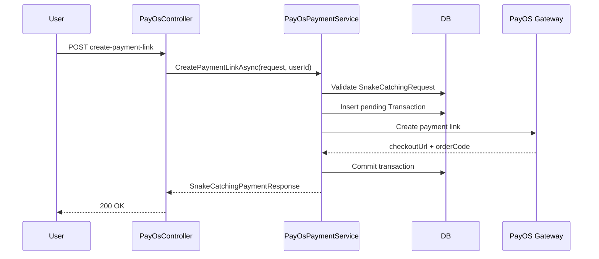
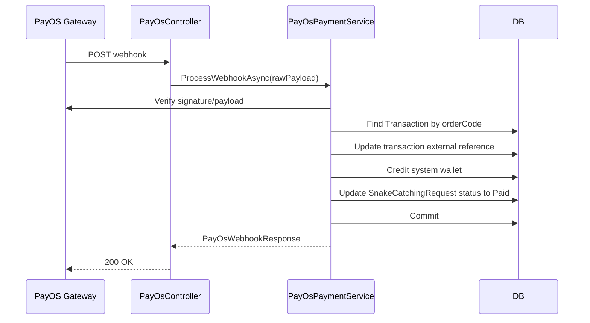
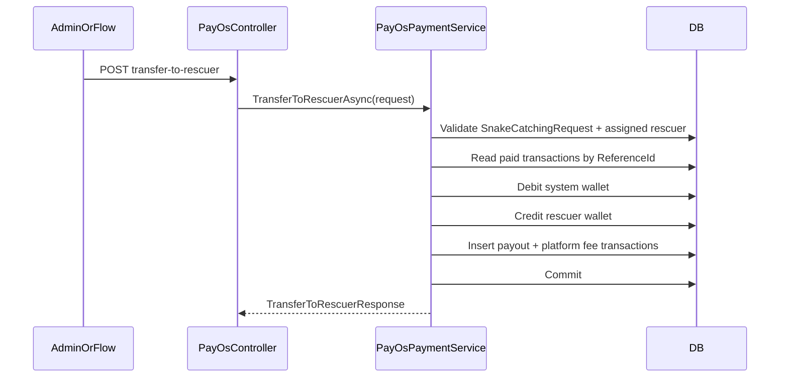

# PayOS Layer Source Code

## Mục tiêu tài liệu

Tài liệu này mô tả **current truth** của PayOS layer trong codebase.

Nó không mô tả kiến trúc mong muốn. Nó mô tả kiến trúc đang tồn tại.

## Current High-Level Shape

The PayOS layer currently consists of:
- provider SDK wrapper
- REST controller
- payment orchestration service
- PayOS-specific DTOs

However, the orchestration service and DTOs are tightly coupled to the snake-catching domain.

## Main Components

### Controller

- `SnakeAid.Api/Controllers/PayOsController.cs`

Public endpoints:
- `POST /api/v1/PayOs/create-payment-link`
- `POST /api/v1/PayOs/cancel-payment-link/{orderCode}`
- `POST /api/v1/PayOs/confirm-payment`
- `GET /api/v1/PayOs/return`
- `GET /api/v1/PayOs/cancel`
- `POST /api/v1/PayOs/webhook`
- `POST /api/v1/PayOs/transfer-to-rescuer`

Note: The `RefundTransactionAsync` method exists in the service but is not exposed as a public API endpoint. It is used internally by business logic (e.g., in `SnakeCatchingMissionService` for refunding failed missions).

### Provider Client

- `SnakeAid.Service/Interfaces/IPayOsClient.cs`
- `SnakeAid.Service/Services/PayOs/PayOsClient.cs`

This is the cleanest part of the layer. It is close to a low-level provider wrapper:
- create payment link
- query payment link
- cancel payment link
- verify webhook

Target terminology for future refactor:
- `IPayOsClient` / `PayOsClient` = low-level provider client
- `IPayOsProvider` / `PayOsProvider` = PayOS-specific but domain-neutral provider façade

### Orchestration Service

- `SnakeAid.Service/Interfaces/IPayOsPaymentService.cs`
- `SnakeAid.Service/Services/PayOs/PayOsPaymentService.cs`

This service is **not provider-only**. It contains:
- snake-catching request validation
- snake-catching status validation
- system wallet accounting
- webhook confirmation
- rescuer payout logic
- refund logic

### PayOS DTOs

Requests:
- `SnakeAid.Core/Requests/PayOS/CreateSnakeCatchingPaymentRequest.cs`
- `SnakeAid.Core/Requests/PayOS/CancelPaymentLinkRequest.cs`
- `SnakeAid.Core/Requests/PayOS/ConfirmPaymentRequest.cs`
- `SnakeAid.Core/Requests/PayOS/TransferToRescuerRequest.cs`
- `SnakeAid.Core/Requests/PayOS/RefundTransactionRequest.cs`

Responses:
- `SnakeAid.Core/Responses/PayOS/SnakeCatchingPaymentResponse.cs`
- `SnakeAid.Core/Responses/PayOS/CancelPaymentLinkResponse.cs`
- `SnakeAid.Core/Responses/PayOS/PayOsWebhookResponse.cs`
- `SnakeAid.Core/Responses/PayOS/TransferToRescuerResponse.cs`
- `SnakeAid.Core/Responses/PayOS/RefundTransactionResponse.cs`

## Tight-Coupling Evidence in Code

### Interface-Level Coupling

`IPayOsPaymentService` is coupled to snake catching by contract:
- `CreatePaymentLinkAsync(CreateSnakeCatchingPaymentRequest ...)`
- `TransferToRescuerAsync(TransferToRescuerRequest ...)`

This means consumers cannot call PayOS through a reusable `PayOsProvider` contract.

### DTO-Level Coupling

`CreateSnakeCatchingPaymentRequest` contains:
- `SnakeCatchingRequestId`
- `TransactionType` defaulting to `CatchingPayment`

`SnakeCatchingPaymentResponse` returns:
- `SnakeCatchingRequestId`

This hardcodes snake-catching semantics into the PayOS layer contract.

### Service-Level Coupling

`PayOsPaymentService` directly performs:
- `SnakeCatchingRequest` lookup
- catching request status validation
- status update to `RequestStatus.Paid`
- payout transfer to rescuer
- platform commission calculation

This is domain orchestration, not just provider orchestration.

### Controller-Level Coupling

Swagger descriptions in `PayOsController` explicitly describe snake-catching payment behavior.

The endpoint `transfer-to-rescuer` is also domain-specific and would not belong in a reusable `PayOsProvider` façade.

## Payment Persistence Model

The PayOS layer persists into shared wallet/transaction infrastructure:

- `Transaction`
- `Wallet`

Current transaction patterns:
- gateway-created payment transaction
- system wallet top-up mirror transaction
- wallet withdrawal for payout/refund
- rescuer payout transaction
- platform fee transaction

`ReferenceId` is interpreted according to snake-catching business semantics.

## Runtime Interaction Flows

### 1. Create Snake-Catching Payment Link

### 2. Confirm Payment via Webhook

### 3. Transfer to Rescuer

## Current API/Domain Boundary Problem

The current boundary is inverted:

- The PayOS provider client is infrastructure.
- The payment orchestration service is snake-catching business logic.
- Both are packaged inside the same `payos` layer.

As a result, the module boundary currently mixes:
- provider integration
- payment session orchestration
- domain settlement

## Current Limits

- No `PayOsProvider` façade exists yet.
- No consultation-facing PayOS integration exists.
- No wallet top-up-facing PayOS integration exists.
- Reusing current PayOS service for another domain would require:
  - DTO duplication
  - service duplication
  - or contract corruption

## Current Truth Summary

The PayOS layer is currently:
- technically reusable at the `IPayOsClient` level
- not reusable at the `IPayOsPaymentService` level
- strongly coupled to snake-catching workflow and terminology

This is the main architectural risk that future operations in this module are intended to address.
