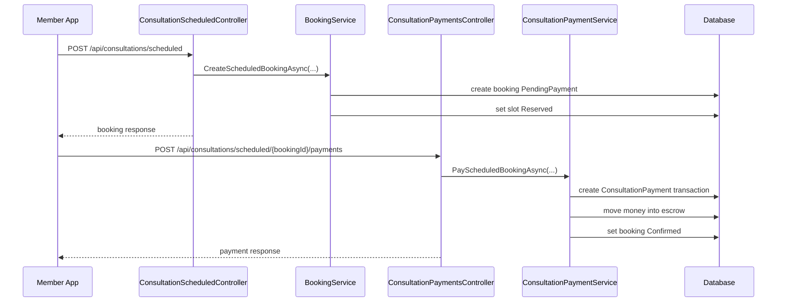
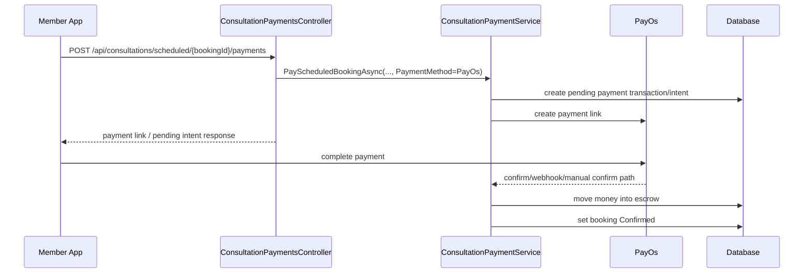
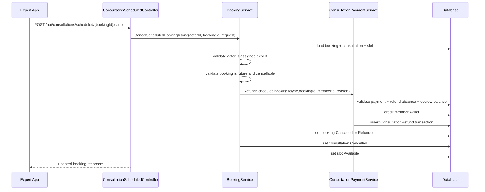
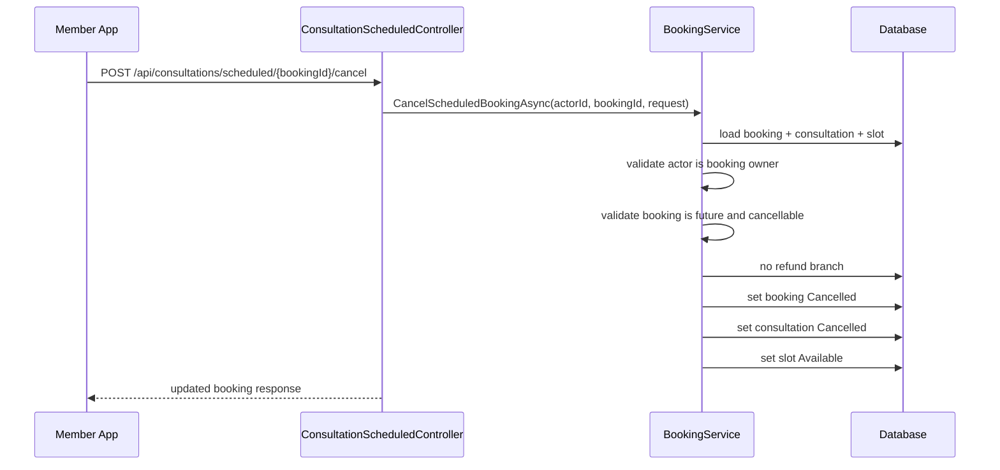

# Scheduled Booking Cancel Sourcecode

## 1. Relevant Classes

### Current backend surface

- `ConsultationScheduledController`
- `ConsultationPaymentsController`
- `BookingService`
- `ConsultationPaymentService`
- `ConsultationService`
- `ConsultationBooking`
- `Consultation`
- `ExpertTimeSlot`
- `Transaction`

### Proposed additions

- `CancelScheduledBookingRequest`
- `IBookingService.CancelScheduledBookingAsync(...)`
- `BookingService.CancelScheduledBookingAsync(...)`
- `IConsultationPaymentService.RefundScheduledBookingAsync(...)`
- `ConsultationPaymentService.RefundScheduledBookingAsync(...)`

## 2. Code-Verified Current Surface

### HTTP

- `POST /api/consultations/scheduled`
- `GET /api/users/me/consultations/scheduled`
- `GET /api/experts/me/consultations/scheduled`
- `POST /api/consultations/scheduled/{bookingId}/payments`
- `POST /api/consultations/payments/confirm`

### Booking lifecycle today

- create booking -> `PendingPayment`
- pay booking -> `Confirmed`
- end/elapsed booking -> `Completed`

### Refund lifecycle today

- emergency consultation rejection can call `RefundEmergencyEscrowAsync(...)`
- refund uses existing escrow balance checks
- refund credits the receiver wallet
- refund creates `TransactionType.ConsultationRefund`

## 3. Current Gap In Class Responsibilities

### `ConsultationScheduledController`

Current role:

- create booking
- list bookings for member
- list bookings for expert

Current gap:

- no cancel endpoint

### `BookingService`

Current role:

- create scheduled booking
- read member/expert booking lists
- auto-complete elapsed scheduled bookings

Current gap:

- no scheduled booking cancellation orchestration

### `ConsultationPaymentService`

Current role:

- move scheduled booking payment into escrow
- create scheduled booking PayOs intent
- confirm scheduled booking PayOs payment
- confirm PayOS payment
- settle consultation escrow
- refund emergency escrow

Current gap:

- no scheduled booking refund by booking id

## 4. Proposed Design Notes

Recommended orchestration split:

- `BookingService.CancelScheduledBookingAsync(...)`
  - validate actor and booking state
  - decide whether refund is needed
  - update booking, consultation, and slot
  - call payment service only for the refund branch

- `ConsultationPaymentService.RefundScheduledBookingAsync(...)`
  - locate the successful consultation payment by `bookingId`
  - block duplicate refund
  - reuse escrow refund helper to restore wallet balance
  - create refund transaction with clear description

## 5. Class Diagram

```mermaid
classDiagram
    class ConsultationScheduledController {
        +CreateBooking(request)
        +GetMyBookings()
        +GetExpertBookings()
        +CancelScheduledBooking(bookingId, request)
    }

    class IBookingService {
        +CreateScheduledBookingAsync(userId, request)
        +GetMyBookingsAsync(userId)
        +GetExpertBookingsAsync(expertId)
        +CancelScheduledBookingAsync(actorId, bookingId, request)
    }

    class BookingService {
        +CreateScheduledBookingAsync(userId, request)
        +GetMyBookingsAsync(userId)
        +GetExpertBookingsAsync(expertId)
        +CancelScheduledBookingAsync(actorId, bookingId, request)
        +AutoCompleteElapsedScheduledConsultationsAsync()
    }

    class IConsultationPaymentService {
        +PayScheduledBookingAsync(userId, bookingId, request)
        +ConfirmConsultationPaymentAsync(transactionId)
        +ConfirmConsultationPaymentByOrderCodeAsync(orderCode)
        +RefundScheduledBookingAsync(bookingId, receiverId, reason)
        +SettleConsultationEscrowAsync(consultationId)
    }

    class ConsultationPaymentService {
        +PayScheduledBookingAsync(userId, bookingId, request)
        +CreateScheduledBookingPayOsIntentAsync(userId, bookingId, request, cancellationToken)
        +RefundScheduledBookingAsync(bookingId, receiverId, reason)
        -RefundFromEscrowAsync(receiverId, referenceId, amount, description, cancellationToken)
    }

    class ConsultationBooking {
        +Id
        +UserId
        +ExpertId
        +Status
        +Price
        +TimeSlotId
        +ConsultationId
    }

    class Consultation {
        +Id
        +Status
        +Type
        +StartTime
        +EndTime
    }

    class ExpertTimeSlot {
        +Id
        +ExpertId
        +Status
        +StartTime
        +EndTime
    }

    class Transaction {
        +ReferenceId
        +TransactionType
        +Amount
        +Description
    }

    ConsultationScheduledController --> IBookingService
    BookingService --> IConsultationPaymentService
    BookingService --> ConsultationBooking
    BookingService --> Consultation
    BookingService --> ExpertTimeSlot
    ConsultationPaymentService --> Transaction
```

## 6. Sequence Diagram: Current Paid Booking Path

## 7. Sequence Diagram: Current PayOs Booking Path

## 8. Sequence Diagram: Proposed Expert Cancel With Refund

## 9. Sequence Diagram: Proposed Member Cancel Without Refund

## 10. Test Focus

- `PendingPayment` cancellation releases slot and updates state
- expert-cancel of paid booking creates one refund transaction
- member-cancel of paid booking creates no refund transaction
- paid booking cancelled after PayOs confirmation follows the same refund rule as wallet payment
- pending PayOs intent cancellation is handled explicitly and does not produce accidental escrow refund
- duplicate cancel or duplicate refund is blocked
- started or completed booking cancellation is rejected
