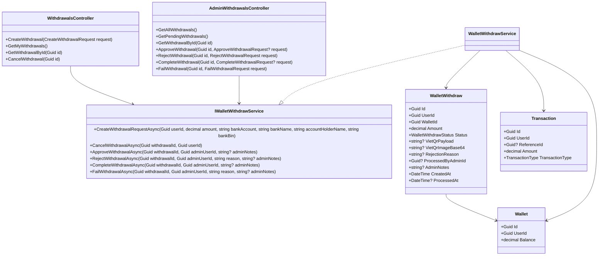
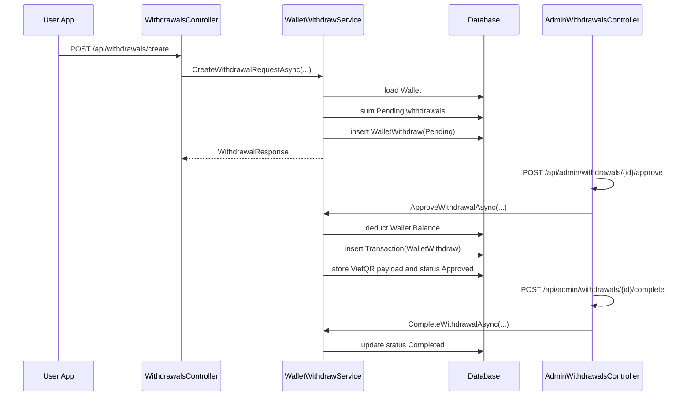
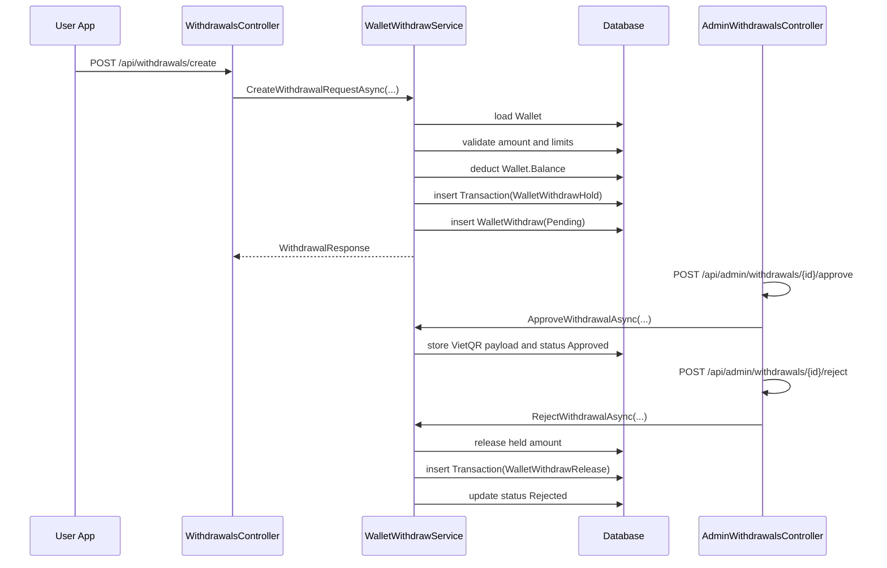

# Wallet Withdrawal Processing Sourcecode

## Relevant Classes

- `WithdrawalsController`
- `AdminWithdrawalsController`
- `WalletController`
- `IWalletWithdrawService`
- `WalletWithdrawService`
- `WalletWithdraw`
- `Wallet`
- `Transaction`
- `CreateWithdrawalRequest`
- `WithdrawalResponse`
- `AdminWithdrawalResponse`

## Code-Verified Current Backend Surface

### User Routes

- `GET /api/wallet/me`
- `GET /api/wallet/banks`
- `POST /api/withdrawals/create`
- `GET /api/withdrawals/me`
- `GET /api/withdrawals/{id}`
- `POST /api/withdrawals/{id}/cancel`

### Admin Routes

- `GET /api/admin/withdrawals`
- `GET /api/admin/withdrawals/pending`
- `GET /api/admin/withdrawals/{id}`
- `POST /api/admin/withdrawals/{id}/approve`
- `POST /api/admin/withdrawals/{id}/reject`
- `POST /api/admin/withdrawals/{id}/complete`
- `POST /api/admin/withdrawals/{id}/fail`

## Current Financial Lifecycle

Current verified lifecycle:

1. `CreateWithdrawalRequestAsync(...)`
2. insert `WalletWithdraw` with status `Pending`
3. do not mutate `Wallet.Balance`
4. validate available amount by subtracting current pending-withdrawal sum
5. `ApproveWithdrawalAsync(...)` deducts wallet balance and inserts `TransactionType.WalletWithdraw`
6. `CompleteWithdrawalAsync(...)` only marks `Completed`
7. `RejectWithdrawalAsync(...)` refunds only when the source status is `Approved`
8. `FailWithdrawalAsync(...)` refunds and inserts `TransactionType.AdminAdjustment`
9. `CancelWithdrawalAsync(...)` marks `Rejected` without wallet mutation

## Target Financial Lifecycle

Planned target lifecycle:

1. `CreateWithdrawalRequestAsync(...)` inserts `Pending` withdrawal
2. the same create transaction also holds funds by reducing `Wallet.Balance`
3. create `TransactionType.WalletWithdrawHold`
4. `ApproveWithdrawalAsync(...)` generates QR and marks `Approved`
5. `CompleteWithdrawalAsync(...)` marks `Completed`
6. `RejectWithdrawalAsync(...)` releases held funds through `TransactionType.WalletWithdrawRelease`
7. `CancelWithdrawalAsync(...)` releases held funds through `TransactionType.WalletWithdrawRelease`
8. `FailWithdrawalAsync(...)` releases held funds through `TransactionType.WalletWithdrawRelease`

## Class Diagram

## Sequence Diagram

### Current Verified Flow

### Planned Target Flow

## Test Focus

- create now mutates wallet balance
- approve no longer mutates wallet balance
- complete no longer mutates wallet balance
- reject from pending releases funds
- cancel from pending releases funds
- fail from approved releases funds once
- no path can double-deduct or double-refund
