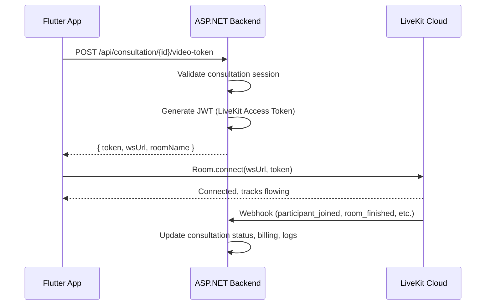

# LiveKit Cloud Video Call — Multi-Agent Brainstorming & Implementation Plan

---

## Understanding Lock ✅

| Item | Value |
|------|-------|
| **Domain** | SnakeAid Expert Consultation (video call between Patient↔Expert, Rescuer↔Expert) |
| **Backend** | ASP.NET Core (C#), no official LiveKit .NET SDK |
| **Mobile** | Flutter, official `livekit_client` SDK available |
| **Docs Protocol** | Backend: baseline+operations (AGENTS.md), Flutter: integration-driven (AGENTS.md) |
| **Target** | Create baseline introduction documents — NOT implementation code |
| **LiveKit Model** | WebRTC SFU, JWT auth, Rooms/Participants/Tracks, Webhooks |

---

# Phase 1 — Primary Designer

## 1. Proposed Architecture



## 2. Backend Responsibilities (.NET)

| Responsibility | Approach |
|---|---|
| **Token Generation** | Manual JWT creation using `System.IdentityModel.Tokens.Jwt` — LiveKit tokens are standard JWTs with `video` grant claims |
| **Room Management** | REST API calls to LiveKit Cloud (`POST /twirp/livekit.RoomService/CreateRoom`) |
| **Webhook Handling** | ASP.NET endpoint receiving `application/webhook+json`, JWT signature verification |
| **Session Tracking** | Map consultation ID ↔ LiveKit room name, track duration, billing |
| **No official SDK** | Since no .NET server SDK exists, we implement a thin `LiveKitService` using `HttpClient` + JWT library |

### Token Structure (LiveKit JWT)

```json
{
  "exp": 1621657263,
  "iss": "{{LIVEKIT_API_KEY}}",
  "sub": "user-identity",
  "nbf": 1619065263,
  "video": {
    "room": "consultation-{consultationId}",
    "roomJoin": true,
    "canPublish": true,
    "canSubscribe": true
  }
}
```

### Video Grant Permissions by Role

| Role | canPublish | canSubscribe | canPublishData | canPublishSources |
|------|-----------|-------------|---------------|-------------------|
| Expert | true | true | true | camera, microphone, screen_share |
| Patient | true | true | true | camera, microphone |
| Rescuer | true | true | true | camera, microphone |

## 3. Flutter Responsibilities

| Responsibility | Approach |
|---|---|
| **SDK** | `livekit_client ^2.6.3` from pub.dev |
| **Components** | Optional `livekit_components` for prebuilt UI |
| **Connection** | `Room.connect(wsUrl, token)` after fetching token from backend |
| **State** | Riverpod provider managing `Room` lifecycle, track states |
| **Permissions** | Camera + Microphone + Bluetooth (Android) + Background audio (iOS) |
| **Events** | `EventsListener<RoomEvent>` for participant join/leave, track publish/unpublish |

### Platform-Specific Setup

| Platform | Requirements |
|----------|-------------|
| **Android** | `AndroidManifest.xml`: CAMERA, RECORD_AUDIO, BLUETOOTH, BLUETOOTH_CONNECT permissions |
| **iOS** | `Info.plist`: NSCameraUsageDescription, NSMicrophoneUsageDescription, UIBackgroundModes: audio |

## 4. LiveKit Cloud Configuration

| Config | Value |
|--------|-------|
| **Provider** | LiveKit Cloud (managed) at `cloud.livekit.io` |
| **Credentials** | API Key + API Secret (stored in backend config, never in mobile) |
| **WS URL** | `wss://{{PROJECT_ID}}.livekit.cloud` |
| **Webhooks** | Configured in LiveKit Cloud dashboard → backend endpoint |
| **Webhook Events** | `room_started`, `room_finished`, `participant_joined`, `participant_left` |

## 5. Documents to Create

### Backend (`05-Backend/01-flows/P3-consulting/live-kit-cloud/`)

| File | Purpose |
|------|---------|
| `live-kit-cloud.introduction.md` | WHY: domain context, business rules, scope, NFRs |
| `live-kit-cloud.sourcecode.md` | WHAT: public API surface, service signatures, entities (to be written after implementation) |
| `live-kit-cloud.usageguide.md` | HOW: endpoint specs, request/response, auth requirements (to be written after implementation) |

### Flutter (`06-Flutter/02-Features/video-call/`)

| File | Purpose |
|------|---------|
| `video-call.integration.md` | Integration baseline: backend endpoints consumed, DTO mapping, state flow, error handling |

> [!NOTE]
> Per AGENTS.md protocols: `sourcecode.md` and `usageguide.md` describe current reality only. Since LiveKit code is not yet implemented, only `introduction.md` (backend) and `integration.md` (Flutter) should be fully written now. The `sourcecode.md` and `usageguide.md` files will be created as stubs with planned structure.

---

# Phase 2 — Structured Review

## 🔴 Skeptic / Challenger Review

### Objections Raised:

**O1: No official .NET SDK — Token generation reliability**
> LiveKit requires strict JWT format with `video` grant claims. Manual JWT generation risks: wrong claim names, missing fields, incorrect expiration handling.

**Resolution**: The JWT format is well-documented. LiveKit tokens are standard JWTs — `iss` = API key, `sub` = identity, `video` = grant object. We can validate against LiveKit's published token structure. Additionally, token validation can be tested by connecting a Flutter client with generated tokens.

**O2: Room name collision**
> If room names are not unique per consultation session, two users could end up in the same room.

**Resolution**: Room naming convention: `consultation-{consultationId}-{timestamp}` ensures uniqueness. ConsultationId is a UUID from the database.

**O3: Webhook reliability — push-based, no delivery guarantee**
> LiveKit webhooks are HTTP POSTs with retries but no guarantee. If the webhook for `room_finished` is lost, billing/duration may not be recorded.

**Resolution**: Dual tracking — (1) webhook captures events, (2) client-side also reports session end to backend. Use reconciliation logic: if webhook missed, client-reported end-time is used as fallback. Add a scheduled job to reconcile orphaned rooms via LiveKit Room Service API (`ListRooms`).

**O4: What if Expert drops connection?**
> WebRTC connections can drop. What's the reconnection strategy?

**Resolution**: LiveKit SDK has built-in reconnection. The `Room` object emits `RoomDisconnectedEvent` with a reason. Client can display reconnecting UI. If reconnection fails after timeout, session is marked as interrupted with partial billing.

## 🟡 Constraint Guardian Review

### Constraint Analysis:

**C1: Performance — Video latency requirements**
> Healthcare consultation demands low latency. What are the SLA guarantees?

**Assessment**: LiveKit Cloud provides globally distributed SFU infrastructure with typical latency <100ms for same-region connections. Vietnam region availability should be verified with LiveKit Cloud dashboard. **Accepted** — LiveKit's WebRTC stack is designed for low-latency real-time communication.

**C2: Scalability — Concurrent sessions**
> How many concurrent video consultations can run?

**Assessment**: LiveKit Cloud scales horizontally. Each consultation is a separate room with 2-3 participants (low load). The bottleneck is backend token generation, which is stateless JWT creation — trivially scalable. **Accepted**.

**C3: Security — Token exposure, MITM**
> JWT tokens must not be leaked. WebRTC media encryption.

**Assessment**: (1) Tokens are short-lived (TTL: 5-10 minutes), room-scoped, identity-bound. (2) LiveKit uses DTLS-SRTP for media encryption (standard WebRTC). (3) API key/secret never leaves the backend. (4) Webhook payloads are JWT-signed for verification. **Accepted** — standard WebRTC security model.

**C4: Maintainability — No official .NET SDK**
> Future LiveKit API changes could break our custom implementation.

**Assessment**: Risk is moderate. Mitigation: (1) Isolate all LiveKit interactions in a single `ILiveKitService` interface with DI. (2) Pin the JWT structure to documented format. (3) Monitor LiveKit changelog. If an official .NET SDK emerges, swap implementation behind the interface. **Accepted with mitigation**.

**C5: Cost — LiveKit Cloud pricing**
> Video minutes are metered. Cost per consultation must be tracked.

**Assessment**: LiveKit Cloud bills per participant-minute. Backend must track room duration and participant count for internal cost tracking and billing to users (escrow model from consultation flow). **Accepted** — aligns with existing escrow billing system.

## 🟢 User Advocate Review

### UX Analysis:

**U1: Permission prompts**
> First-time video call will trigger camera/microphone permission dialogs. Users may deny.

**Assessment**: Pre-check permissions before joining the call. Show a "preparation screen" explaining why permissions are needed. If denied, show clear error with retry option. **Noted** — will be documented in Flutter integration doc.

**U2: Poor network indicator**
> Users in remote areas may have poor connectivity.

**Assessment**: LiveKit provides adaptive bitrate and simulcast. The SDK emits connection quality events that can be displayed as a quality indicator in UI. **Noted** — will be documented as UI requirement.

**U3: Call end clarity**
> When Expert marks consultation as "completed", both parties should clearly see the call has ended.

**Assessment**: Room closure is propagated via `RoomDisconnectedEvent`. Both sides receive notification. Backend webhook confirms. **Accepted** — clear end-of-call flow.

---

# Phase 3 — Integration & Arbitration

## Arbiter Decision

| Objection | Disposition | Rationale |
|-----------|------------|-----------|
| O1: No .NET SDK | **Accepted with mitigation** | JWT format is standard; interface isolation prevents lock-in |
| O2: Room name collision | **Accepted** | UUID-based naming eliminates collision |
| O3: Webhook reliability | **Accepted with dual tracking** | Client + webhook + reconciliation job |
| O4: Reconnection | **Accepted** | SDK built-in + UI feedback |
| C1-C5: All constraints | **Accepted** | Standard mitigations documented |
| U1-U3: UX concerns | **Noted** | To be documented in Flutter integration |

### Final Disposition: **APPROVED**

> All reviewers have been invoked. All objections resolved with explicit mitigations. Decision Log is complete. Design proceeds to document creation.

---

# Decision Log

| # | Decision | Alternatives Considered | Objections | Resolution |
|---|----------|------------------------|-----------|------------|
| D1 | Use LiveKit Cloud (managed) | Self-hosted LiveKit, Twilio, Agora | Cost, control trade-off | Managed = less ops overhead, fits project scale |
| D2 | Manual JWT in .NET | Use Node.js sidecar for token gen, Use unofficial NuGet | Complexity, extra service | JWT is standard; thin service in C# is simpler than adding Node.js |
| D3 | Room name = `consultation-{id}` | Random UUID rooms | Traceability | Consultation-bound naming enables webhook correlation |
| D4 | Dual event tracking (webhook + client) | Webhook only | Reliability | Prevents missed billing events |
| D5 | `ILiveKitService` interface isolation | Direct HttpClient calls | Maintainability | Enables future SDK swap |
| D6 | Documents scope: introduction + integration now | Write all docs including sourcecode/usageguide | Premature | Code doesn't exist yet; baseline docs should reflect reality |

---

## Proposed Changes (Document Creation)

### Backend Docs

#### [NEW] [live-kit-cloud.introduction.md](file:///d:/SourceCode/Snake_AID/SnakeAid.Docs/Docs/05-Backend/01-flows/P3-consulting/live-kit-cloud/live-kit-cloud.introduction.md)
- Domain context for video call in expert consultation
- Business rules (who can call whom, session lifecycle, billing tie-in)
- Technical architecture overview (LiveKit Cloud + ASP.NET integration pattern)
- SDK landscape analysis (no .NET SDK, JWT approach)
- Scope and out-of-scope definitions
- NFRs (latency, security, cost tracking)

#### [NEW] [live-kit-cloud.sourcecode.md](file:///d:/SourceCode/Snake_AID/SnakeAid.Docs/Docs/05-Backend/01-flows/P3-consulting/live-kit-cloud/live-kit-cloud.sourcecode.md)
- Stub with planned API surface (to be filled after implementation)

#### [NEW] [live-kit-cloud.usageguide.md](file:///d:/SourceCode/Snake_AID/SnakeAid.Docs/Docs/05-Backend/01-flows/P3-consulting/live-kit-cloud/live-kit-cloud.usageguide.md)
- Stub with planned endpoint documentation (to be filled after implementation)

---

### Flutter Docs

#### [NEW] [video-call.integration.md](file:///d:/SourceCode/Snake_AID/SnakeAid.Docs/Docs/06-Flutter/02-Features/video-call/video-call.integration.md)
- Backend endpoints consumed (token generation)
- SDK setup requirements (livekit_client, platform permissions)
- State flow (UI → Provider → Room → LiveKit Cloud)
- DTO mapping for token response
- Error handling strategy
- Platform-specific setup guide (iOS/Android)

---

## Verification Plan

### Manual Verification
1. Open each created file and confirm frontmatter follows AGENTS.md protocol
2. Verify backend docs live in `05-Backend/01-flows/P3-consulting/live-kit-cloud/`
3. Verify flutter docs live in `06-Flutter/02-Features/video-call/`
4. Cross-check that Flutter `video-call.integration.md` references backend endpoints correctly
5. Confirm no secrets, no future plans in baseline docs, UTF-8 encoding
