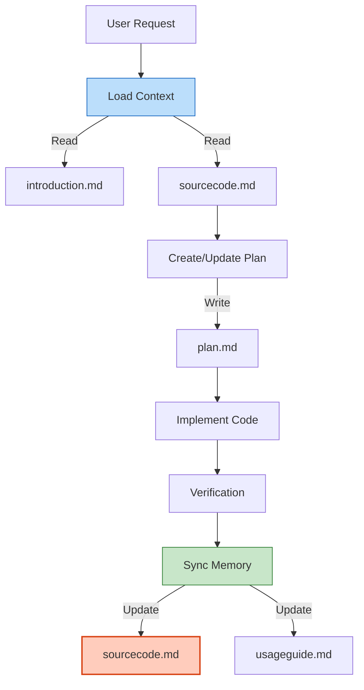

# 🤖 AGENT MEMORY: Backend Documentation Protocol

> **SYSTEM INSTRUCTION**: This document defines the **STRICT STANDARD** for SnakeAid Backend documentation. As an AI Agent, you **MUST** follow this protocol when referencing, creating, or updating documentation. This structure is designed to be your **External Memory**, allowing you to load context efficiently without re-reading the entire codebase.

## 🧠 The 5-Document Standard

Every technical component (Layer) or functional feature (Flow) in this project consists of exactly **5 document types**. You must maintain these files to ensure data consistency.

| ID | File Type | Purpose | Agent Action | Tokens |
|----|-----------|---------|--------------|--------|
| **1** | `*.introduction.md` | **Context & Requirements**. High-level overview, business rules, and use cases. | **READ** to understand "What" and "Why" before planning. | Low |
| **2** | `*.plan.md` | **Architecture & Design**. Technical approach, implementation steps, and validatation strategy. | **WRITE** during Planning Phase. **READ** to understand the roadmap. | Medium |
| **3** | `*.prompt.md` | **Implementation Instructions**. The exact prompts used to generate the code. Use this to re-generate or understand the intent. | **WRITE** before coding. **READ** to understand specific implementation directives. | Medium |
| **4** | `*.sourcecode.md` | **Codebase State (Source of Truth)**. A detailed summary of functions, classes, schemas, and logic *after* implementation. | **WRITE/UPDATE** immediately after coding. **READ** this instead of raw source files to save context. | High |
| **5** | `*.usageguide.md` | **Integration Manual**. API contracts, endpoints, request/response examples for Consumers (Frontend/Mobile). | **WRITE** after coding/verification. **READ** to assist Frontend devs. | Medium |

---

## 📂 Context Loading Protocol

**Directive**: When you are asked to work on a feature (e.g., `ASP.NET Identity`), do **NOT** blindly read all source files. Follow this efficient context-loading sequence:

1.  **Locate the Layer/Flow**: Check `02-layers/` or `01-flows/`.
2.  **Read `*.introduction.md`**: Quickly grasp the domain and requirements.
3.  **Read `*.sourcecode.md`**: Load the current technical state (Class structure, DB schema, key functions).
    *   *Note: This file contains the compressed "knowledge" of the module.*
4.  **Read `*.plan.md`**: (Optional) Only if you are resuming a task or checking pending items.

**Result**: You now have full context with minimal token usage.

---

## 📝 Documentation Maintenance Protocol

**Directive**: You are responsible for keeping the "External Memory" user-sync with the Codebase.

### When Implementing New Features:
1.  **Draft `introduction.md`**: Summarize what you are about to do.
2.  **Create `plan.md`**: Outline your technical steps. Get User Approval.
3.  **Create `prompt.md`**: (Optional) Save your implementation strategy instructions.
4.  **Implement Code**: Write the actual C# code.
5.  **Generate `sourcecode.md`**:
    *   List all Controllers, Services, DTOs, and Entities created.
    *   Include signatures and Key Logic (do not dump entire boilerplate files).
    *   Include DB Diagrams (Mermaid) or Schema definitions.
6.  **Create `usageguide.md`**:
    *   Document the API Endpoints (Method, URL, Body).
    *   Provide explicit Request/Response JSON examples.
    *   Explain Status Codes.

### When Modifying Existing Code:
1.  **Identify Impact**: Which Layer/Flow is affected?
2.  **Update `sourcecode.md`**: **CRITICAL**. Reflect changes in logic, signatures, or schema immediately. If you skip this, your "memory" becomes corrupted.
3.  **Update `usageguide.md`**: If the API contract changed (Breaking Changes).

---

## 🗂️ Folder Structure Reference

### 1. Vertical Flows (`01-flows/`)
*   **Concept**: User Journeys spanning multiple layers.
*   **Naming Convention**: `P{Priority}-{FlowName} / S{Sequence}-{SubFlowName}`.
*   **Example**: `01-flows/P1-emergency/S1-identified/`

### 2. Horizontal Layers (`02-layers/`)
*   **Concept**: Technical infrastructure shared across flows.
*   **Naming Convention**: Lowercase, kebab-case.
*   **Example**: `02-layers/aspnet-identity/`

## 🚦 Naming Convention

| File Type | Pattern | Example |
|-----------|---------|---------|
| Introduction | `{name}.introduction.md` | `aspnet-identity.introduction.md` |
| Plan | `{name}.plan.md` | `aspnet-identity.plan.md` |
| Prompt | `{name}.prompt.md` | `aspnet-identity.prompt.md` |
| Source Code | `{name}.sourcecode.md` | `aspnet-identity.sourcecode.md` |
| Usage Guide | `{name}.usageguide.md` | `aspnet-identity.usageguide.md` |

---

## 🛠️ Workflow Diagram

**Last Updated**: 2026-02-03
**Maintained By**: AI Agents & Backend Team