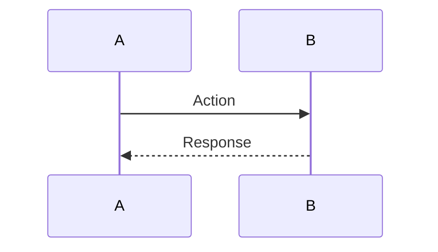

# AGENT MEMORY: Backend Documentation Protocol
# SnakeAid — Baseline + Operations Model

> SYSTEM INSTRUCTION (STRICT)
> This file defines the official documentation standard for SnakeAid Backend.
> You MUST follow this protocol when creating, reading, or updating documentation.
> This system is designed for an AI-generated-first workflow.
> It prevents document drift, context mixing, and historical corruption.

---
# Repo Folder Structure (READ FIRST)
SnakeAid documentation is organized by Flows and Layers:

## 1) Vertical Flows (`01-flows/`)
- Concept: User journeys spanning multiple layers.
- Naming: `P{Priority}-{FlowName} / {FeatureName}`
- Example: `01-flows/P1-emergency/live-tracking/`

## 2) Horizontal Layers (`02-layers/`)
- Concept: Technical infrastructure shared across flows.
- Naming: lowercase, kebab-case
- Example: `02-layers/aspnet-identity/`

---
# Canonical Module Structure (Inside any Flow/Layer)
Every module root MUST follow:

```
<module-root>/
  <module>.introduction.md
  <module>.sourcecode.md
  <module>.usageguide.md

  operations/
    01-INIT-module/
      analysis/            # optional (complex cases only)
      plan.md
      prompt.md

    02-FEAT-short-slug/
      plan.md
      prompt.md
```

Example:
```
02-layers/aspnet-identity/
  aspnet-identity.introduction.md
  aspnet-identity.sourcecode.md
  aspnet-identity.usageguide.md

  operations/
    01-INIT-aspnet-identity/
      analysis/
        01-architecture-decision.md
        02-state-machine.md
        03-sequence-flows.md
        decision-log.md
      plan.md
      prompt.md

    02-FEAT-refresh-token/
      plan.md
      prompt.md
```
INIT is the first operation that creates the module baseline.
There is NO separate genesis layer.

---
# Core Philosophy
Docs are split into Baseline (current truth) and Operations (controlled mutations).

## 1) Baseline (Current System State)
Represents the system as it exists in code right now.
Baseline files:
- `*.introduction.md`
- `*.sourcecode.md` (CRITICAL)
- `*.usageguide.md`

Baseline must NEVER contain future plans.
Baseline is the ONLY authoritative description of the current system.

## 2) Operations (Controlled Mutations)
Represents intentional changes to the baseline.
- Each operation is isolated in its own folder.
- Operations are append-only artifacts.
- Do not merge unrelated changes into one operation.
- Do not overwrite historical operations.
- Baseline always overrides operation reasoning.

Operations are historical events.
Baseline is current truth.

---

# Operation Folder Naming
```
{NN}-{TYPE}-{short-slug}
```
Where `{NN}` is a sequential zero-padded number (01, 02, 03...) within the module.

Allowed TYPE:
- INIT (module creation only, must be first)
- FEAT
- FIX
- REFACTOR
- PERF
- SECURITY
- HOTFIX

Examples:
- `01-INIT-live-tracking`
- `02-FEAT-refresh-token`
- `03-REFACTOR-split-hub`

Do NOT include dates in folder names.
Dates belong in frontmatter.
Always determine the next `{NN}` based on existing operations.

---
# Optional Analysis Layer (For Complex Changes Only)
Inside an operation folder, you MAY include a structured analysis pack when the change involves concurrency, distributed state, complex transitions, or breaking architectural shifts.

```
analysis/
  01-architecture-decision.md       # ADR (mandatory if multiple design options exist)
  02-state-machine.md               # mandatory if stateful or event-driven
  03-sequence-flows.md              # mandatory if async / multi-actor / realtime
  decision-log.md                   # optional stress-test / multi-agent review log
```

## Role of Each Analysis Document

### 01-architecture-decision.md (ADR)
Purpose:
* Define the core architectural problem.
* List alternative solutions.
* Compare trade-offs.
* Record final decision and mitigations.

Rules:
* Must clearly state the chosen option.
* Must record rejected alternatives.
* Must define constraints.

This document captures "why this design".

---
### 02-state-machine.md
Purpose:
* Define valid states for each actor/entity.
* Define allowed transitions.
* Define invariants and forbidden transitions.
* Separate presence state from persistent state (if applicable).

Rules:
* No ambiguous transitions.
* Must handle cancellation, timeout, failure paths.
* Must define edge cases explicitly.

This document prevents logical drift in distributed systems.

---
### 03-sequence-flows.md
Purpose:
* Provide Mermaid sequence diagrams.
* Visualize exact ordering of API calls, events, and hub interactions.
* Highlight race-condition risks.

Rules:
* Must include happy path.
* Must include at least critical edge cases.
* Diagrams must reflect exact interaction timing.

This document prevents async and concurrency bugs.

---
### decision-log.md
Purpose:
* Capture structured challenge/critique.
* Record objections and mitigations.
* Preserve reasoning history for future refactors.

Optional but recommended for high-risk operations.

---
## Analysis Constraints
* analysis documents are NOT baseline.
* analysis may become outdated after further operations.
* Baseline (`*.sourcecode.md`) always overrides analysis artifacts.
* plan.md MUST explicitly reference relevant analysis files.
* prompt.md MUST NOT bypass analysis decisions.

## Lifecycle:
> analysis → plan → prompt → implementation → baseline update

---

# Baseline Documents (State Layer)

## `<module>.introduction.md`
Purpose:
- Domain context
- Business rules / invariants
- Scope / out-of-scope
- Non-functional requirements
  Explains WHY the module exists.

## `<module>.sourcecode.md` (CRITICAL)
Compressed Source of Truth.
Must reflect:
- Public API surface (endpoints / public services)
- Key signatures
- Entities and schema
- Relationships (Mermaid allowed)
- Invariants and guarantees
- Cross-cutting concerns (auth, logging, caching)

Rules:
- No TODOs
- No future plans
- No “about to implement”
- Only what exists in code

### Runtime Interaction Flows (When Applicable)
If the module contains async, event-driven, realtime, or multi-actor behavior, `<module>.sourcecode.md` SHOULD include a `## Runtime Interaction Flows` section.

Purpose:
* Document CURRENT runtime behavior.
* Reflect actual implementation order of calls/events.
* Provide a quick re-read reference of system flow.

#### Structure Template:
````
## Runtime Interaction Flows

### 1. `<Happy Path Name>`



### 2. `<Edge Case Name>`

```mermaid
sequenceDiagram
    ...
```
````

Rules:
- Diagrams MUST reflect implemented behavior only.
- Do NOT include rejected options or trade-offs.
- Must include at least the primary happy path.
- Include critical edge cases if they affect state transitions.
- This section documents WHAT happens, not WHY it was chosen (reasoning belongs in analysis/).

Runtime Interaction Flows are part of baseline and MUST be updated if implementation o

## `<module>.usageguide.md`
External contract for consumers.

Includes:
- Endpoints
- Request/Response examples
- Status codes
- Error catalog
- Auth requirements
  Update whenever contract changes.

---
# Operation Content

Each operation MUST contain:
```
plan.md
prompt.md
```

## plan.md (Strategy Layer)
Written BEFORE implementation.

**REQUIRED STRUCTURE:**
1. As-Is (from `<module>.sourcecode.md`)
2. Gap Analysis
3. To-Be Design
4. Impacted Components
5. Risks & Constraints
6. Validation Plan

If analysis/ exists, plan MUST reference it explicitly.

## prompt.md (Execution Layer)
Generated FROM plan.md.

Purpose:
- Convert plan into precise machine instructions
- Define required outputs
- Define forbidden changes
- Define test requirements

Rules:
- No secrets
- No environment-specific values
- Do not modify unrelated modules
- Do not bypass plan.md

---
# Operation Lifecycle

1. Create operation folder with next sequence number.
2. (Optional) Create analysis/ for complex cases.
3. Write plan.md.
4. Generate prompt.md.
5. Implement code.
6. Update baseline:
   - `<module>.sourcecode.md`
   - `<module>.usageguide.md`
7. Mark operation status as `done`.

Operations are immutable history.
Never delete past operations.

---
# Required Frontmatter

## Baseline files
```yaml
---
doc_role: baseline
module: <module-name>
kind: <layer|flow>
status: active
last_updated: YYYY-MM-DD
owners: [backend-team]
---
```

## Operation plan.md

```yaml
---
doc_role: operation
operation_id: 02-FEAT-refresh-token
type: FEAT
status: draft # draft | approved | in_progress | done
created_at: YYYY-MM-DD
affects:
  - Controllers/AuthController
  - Services/TokenService
---
```

## Operation prompt.md

```yaml
---
doc_role: operation
operation_id: 02-FEAT-refresh-token
generated_from: plan.md
status: draft
created_at: YYYY-MM-DD
---
```

---

# Security & Privacy Rules
Never write secrets into docs:
* API keys, tokens, passwords, private certs, JWT secrets
* Internal IPs/hostnames, production URLs, personal data

Always use placeholders:
> `{{JWT_SECRET}}`, `{{DB_PASSWORD}}`, `https://api.example.com`

---
# Encoding Hygiene (UTF-8 only)
* All markdown files MUST be UTF-8 (no BOM).
* If mojibake occurs, repair once with `ftfy.fix_encoding`.
* Do not keep alternate encodings in the repo.

---
# Context Loading Protocol (For AI Agents)
When working on a module:

1. Locate module under `01-flows/` or `02-layers/`.
2. Read `<module>.introduction.md`.
3. Read `<module>.sourcecode.md`.
4. If changes are required:
   * Create a new `operations/{NN}-{TYPE}-{slug}/`
   * (Optional) Create analysis/ if complexity demands.
   * Write `plan.md` → generate `prompt.md`.
   * Do NOT edit baseline until implementation completes.

This minimizes tokens and prevents drift.

---
# Mental Model
Baseline = Current State
Operation = Controlled Mutation
Analysis = Structured Reasoning (Optional)
Plan = Strategy
Prompt = Execution

System evolves through operations.
Baseline always reflects final truth.

---
# Scalability Rule
Only ONE operation should be `in_progress` per module at a time unless explicitly coordinated.
Parallel operations risk state conflict.