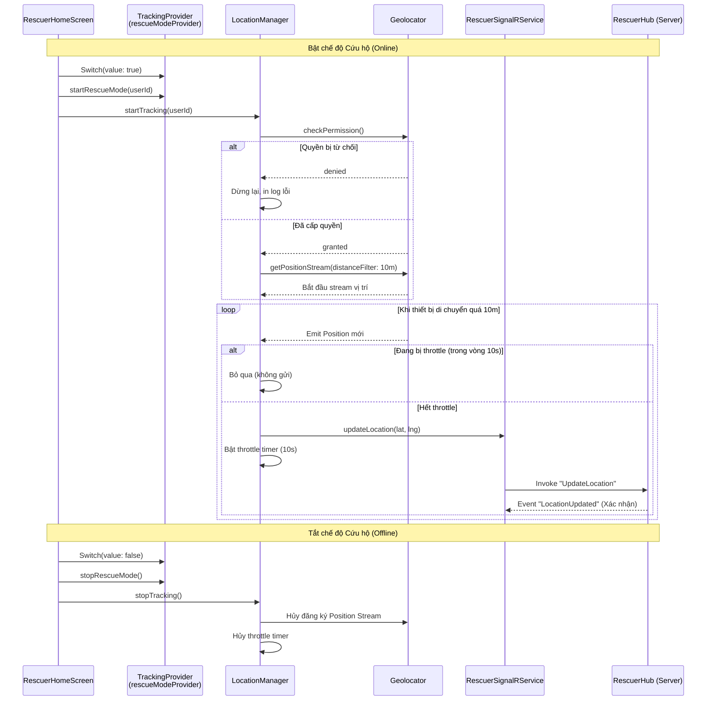

# Live Tracking - Function Graph

Tài liệu này mô tả chi tiết luồng hoạt động (Function Graph) của tính năng Live Tracking (Bật/Tắt chế độ cứu hộ và liên tục gửi vị trí) ở cấp độ code của ứng dụng Flutter.

## 1. Biểu đồ luồng hoạt động (Sequence Diagram)

## 2. Các thành phần chính và luồng logic

### 2.1. Nút Toggle (Kích hoạt - Trigger)

- **File**: `lib/features/rescuer/screens/rescuer_home_screen.dart`
- **Mô tả**: Đây là nút Switch hiển thị ở thẻ trạng thái (Status Card).
- Khi người dùng tương tác:
  - **Bật**: Gọi `rescueModeProvider.notifier.startRescueMode()` để chuyển state sang 'Online', sau đó gọi trực tiếp `locationManagerProvider.startTracking()` để khởi động tracking GPS.
  - **Tắt**: Gọi `stopRescueMode()` và `stopTracking()`.

### 2.2. Điều phối theo dõi vị trí (Service Manager)

- **File**: `lib/features/rescuer/managers/location_manager.dart`
- **Class**: `LocationManager`
- **Mô tả**:
  - `startTracking(...)`: Xử lý quyền truy cập vị trí (location permission) thông qua `geolocator`. Khi có quyền, đăng ký theo dõi thông qua `getPositionStream` với cấu hình `distanceFilter: 10` (yêu cầu di chuyển tối thiểu 10 mét mới kích hoạt lấy vị trí để tiết kiệm pin).
  - **Throttle Logic (Giới hạn ping)**: Khi có tọa độ mới từ GPS, thay vì đẩy ngay, nó gửi 1 lần và bật cờ `_isThrottled`. Một Timer 10 giây được sinh ra. Nếu trong vòng 10 giây đó GPS tiếp tục báo vị trí mới, dữ liệu này sẽ bị bỏ qua. Cơ chế này bảo vệ Server khỏi nghẽn mạng do ping liên tục và trùng khớp giới hạn 10s tại LT-1 Server Threshold.
  - `stopTracking()`: Hủy đăng ký stream listener và xóa bỏ timer đợi.

### 2.3. Lớp Giao tiếp Mạng thời gian thực (SignalR Service)

- **File**: `lib/core/services/rescuer_signalr_service.dart`
- **Class**: `RescuerSignalRService` (Singleton)
- **Mô tả**:
  - Đóng gói toàn bộ logic kết nối bằng thư viện SignalR thông qua WebSockets.
  - Hàm `updateLocation(...)` nhận tọa độ từ `LocationManager` và lập tức đẩy lên Server bằng cách gọi `.invoke('UpdateLocation', ...)` lên API `RescuerHub`.
  - Service này cũng xử lý Auto-reconnect và lắng nghe phản hồi ngược từ server thông qua định nghĩa sự kiện (ví dụ `LocationUpdated`).

## 3. Tổng kết về kiến trúc (Architecture Overview)

Sự phân tách trách nhiệm (Separation of Concerns) trong tính năng này rất rõ ràng:

1. **UI Layer (`rescuer_home_screen.dart`)**: Chịu trách nhiệm hiển thị trạng thái và chuyển giao thao tác (intent) của người dùng xuống lớp logic chuyên dụng.
2. **State Management (`tracking_provider.dart`):** Cập nhật trạng thái hiển thị xuyên suốt ứng dụng (ví dụ: đang Online hay Offline).
3. **Logic Manager (`location_manager.dart`)**: Tách biệt logic phần cứng (GPS) và quản lý luồng dữ liệu thô (Throttle, filter), đóng gói hoàn toàn nền tảng.
4. **Network Service (`rescuer_signalr_service.dart`)**: Nhận dữ liệu sạch đã được xử lý để làm nhiệm vụ duy nhất là gửi đi qua mạng, định dạng đúng với hợp đồng WebSockets (SignalR Contract). Lớp này không cần hiểu về GPS hay UI.
