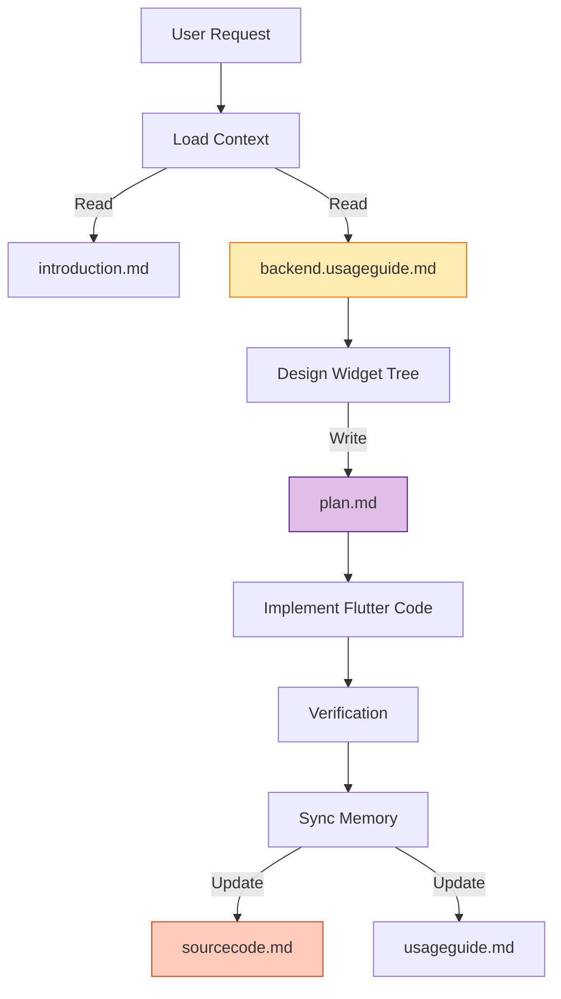

# 🤖 AGENT MEMORY: Flutter Documentation Protocol

> **SYSTEM INSTRUCTION**: This document defines the **STRICT STANDARD** for SnakeAid Flutter documentation. As an AI Agent, you **MUST** follow this protocol when referencing, creating, or updating documentation. This structure is designed to be your **External Memory**, allowing you to load context efficiently without re-reading the entire codebase.

## 📱 The 5-Document Standard (Flutter Edition)

Every Screen or Feature in the Flutter App consists of exactly **5 document types**. You must maintain these files to ensure visual and logic consistency.

| ID | File Type | Purpose | Agent Action | Tokens |
|----|-----------|---------|--------------|--------|
| **1** | `*.introduction.md` | **UI Specification**. Mockups, Wireframes, User Flows, and **Links to Backend Usage Guides**. | **READ** to understand "What to build" and "Where to get data". | Low |
| **2** | `*.plan.md` | **Widget Tree & State**. Component hierarchy, State Management (Bloc/Cubit), and Dependencies. | **WRITE** during Planning Phase. **READ** to understand architecture. | Medium |
| **3** | `*.prompt.md` | **Implementation Instructions**. The exact prompts used to generate the UI code. Use this to re-generate or understand intent. | **WRITE** before coding. **READ** to understand specific implementation directives. | Medium |
| **4** | `*.sourcecode.md` | **Component Registry**. List of created Widgets, Screens, Providers, and their file paths. | **WRITE/UPDATE** immediately after coding. **READ** this instead of raw source files to save context. | High |
| **5** | `*.usageguide.md` | **Navigation & Testing**. Route arguments, Provider requirements, and Manual Test Steps. | **WRITE** after coding/verification. **READ** to integrate this screen elsewhere. | Medium |

---

## 📂 Context Loading Protocol

**Directive**: When you are asked to work on a screen (e.g., `LoginScreen`), do **NOT** blindly read all source files. Follow this efficient context-loading sequence:

1.  **Locate the Feature**: Check `01-flows/` or `02-widgets/`.
2.  **Read `*.introduction.md`**: Grasp the UI/UX and Backend Binding requirements.
3.  **Read `*.sourcecode.md`**: Load the current Widget structure and key logic.
4.  **Read `*.plan.md`**: (Optional) Only if checking state management strategy.

---

## 📝 Documentation Maintenance Protocol

**Directive**: You are responsible for keeping the "External Memory" in sync with the Codebase.

### When Implementing New Screens:
1.  **Draft `introduction.md`**:
    *   Embed UI Mockups/Wireframes.
    *   **CRITICAL**: Link to `backend.usageguide.md` for required APIs.
2.  **Create `plan.md`**:
    *   Outline the **Widget Tree** (to avoid nesting hell).
    *   Define **State Management** (Cubit/Bloc structure).
    *   List external packages needed.
    *   Get User Approval.
3.  **Create `prompt.md`**: (Optional) Save your implementation strategy instructions.
4.  **Implement Code**: Write the actual Dart code.
5.  **Generate `sourcecode.md`**:
    *   List all Widgets, Screens, and Logic files created.
    *   Show folder structure.
6.  **Create `usageguide.md`**:
    *   **Navigation**: Route Name + Arguments.
    *   **Providers**: Required ancestors (e.g., `MultiBlocProvider`).
    *   **Test Data**: JSON mocks for UI testing.

### When Modifying Existing Screens:
1.  **Identify Impact**: Which Screen/Flow is affected?
2.  **Update `sourcecode.md`**: Reflect changes in Widget Tree or Logic immediately.
3.  **Update `usageguide.md`**: If Navigation arguments changed.

---

## 🗂️ Folder Structure Reference

### 1. Vertical Flows (`01-flows/`)
*   **Concept**: User Journeys (Screens).
*   **Naming Convention**: `P{Priority}-{FlowName} / S{Sequence}-{SubFlowName}`.
*   **Example**: `01-flows/P1-auth/S1-login/`

### 2. Horizontal Widgets (`02-widgets/`)
*   **Concept**: Reusable UI Components shared across flows.
*   **Naming Convention**: Lowercase, kebab-case.
*   **Example**: `02-widgets/custom-button/`

## 🚦 Naming Convention

| File Type | Pattern | Example |
|-----------|---------|---------|
| Introduction | `{name}.introduction.md` | `login-screen.introduction.md` |
| Plan | `{name}.plan.md` | `login-screen.plan.md` |
| Prompt | `{name}.prompt.md` | `login-screen.prompt.md` |
| Source Code | `{name}.sourcecode.md` | `login-screen.sourcecode.md` |
| Usage Guide | `{name}.usageguide.md` | `login-screen.usageguide.md` |

---

## 🛠️ Workflow Diagram

**Last Updated**: 2026-02-14
**Maintained By**: AI Agents & Flutter Team
