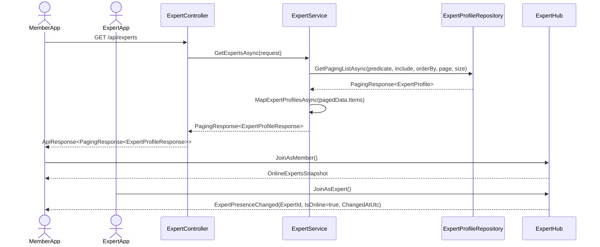
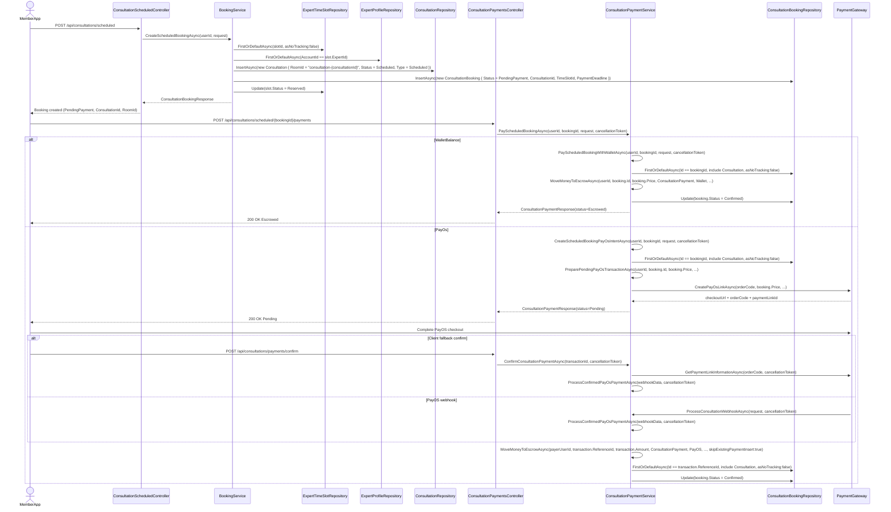
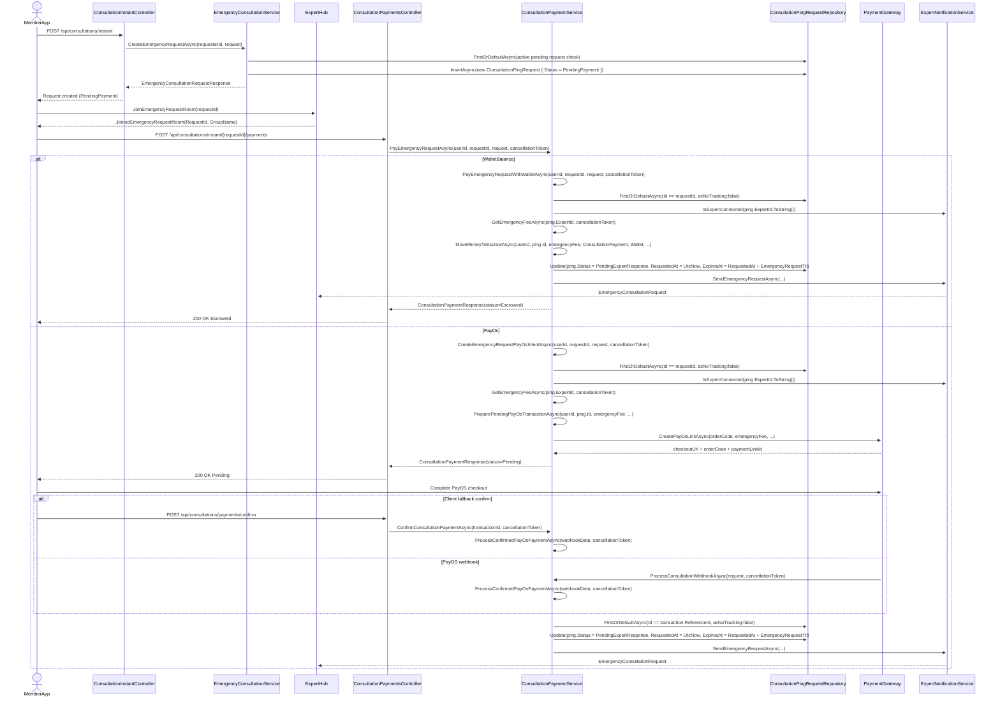
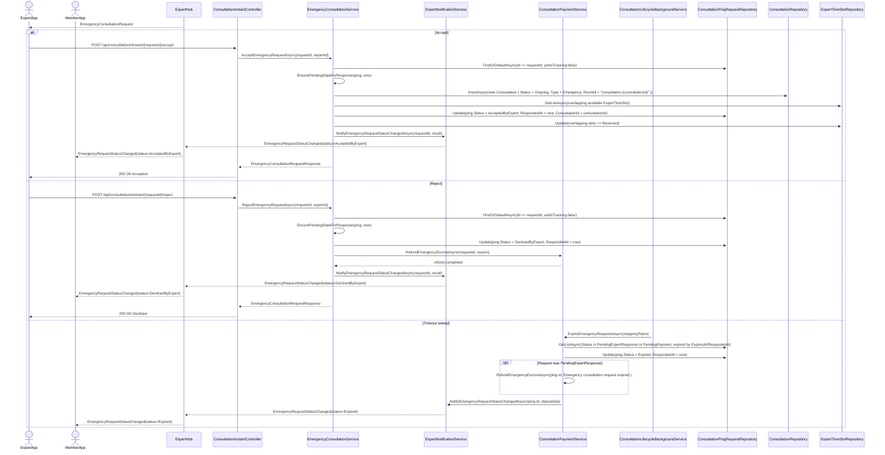
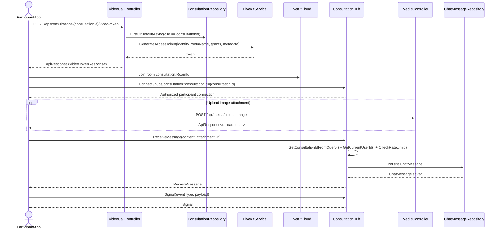
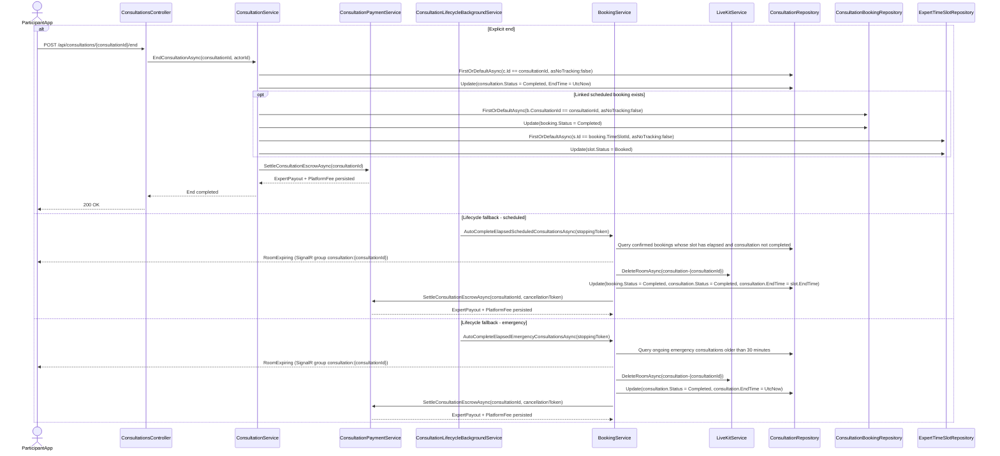
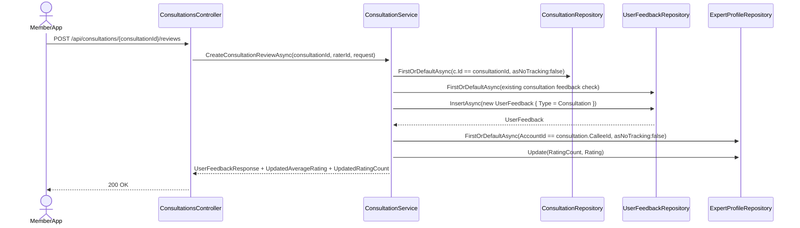

#### ***3.3.2 Sequence Diagram View List Experts and Presence***

#### ***3.3.3 Sequence Diagram Create and Pay Scheduled Booking***

#### ***3.3.4 Sequence Diagram Create, Pay, and Notify Emergency Consultation Request***

#### ***3.3.5 Sequence Diagram Expert Accept or Reject Emergency Request***

#### ***3.3.6 Sequence Diagram Join Consultation Room and In-Room Interaction***

#### ***3.3.7 Sequence Diagram End Consultation and Settlement (Narrative)***

#### ***3.3.8 Sequence Diagram Create Consultation Review (Narrative)***

