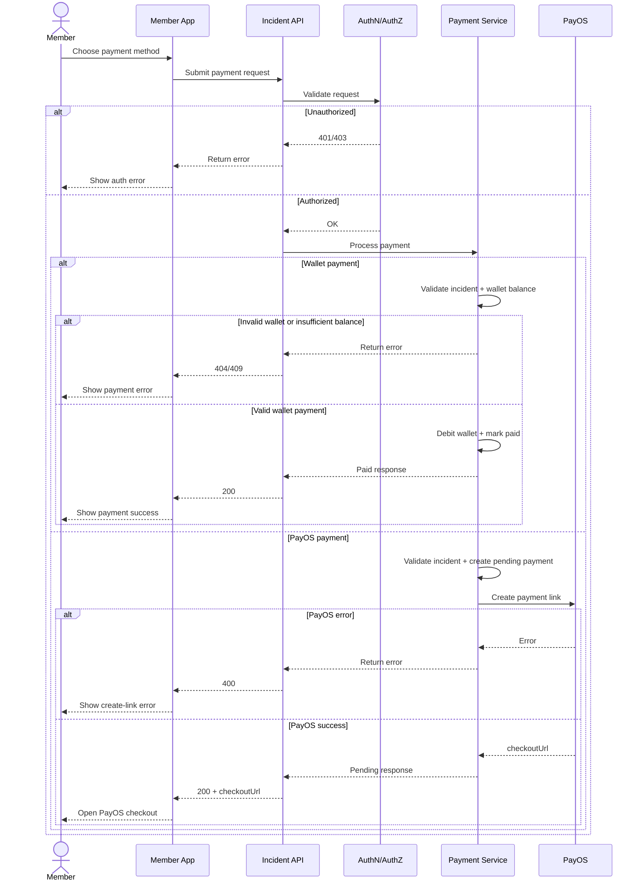
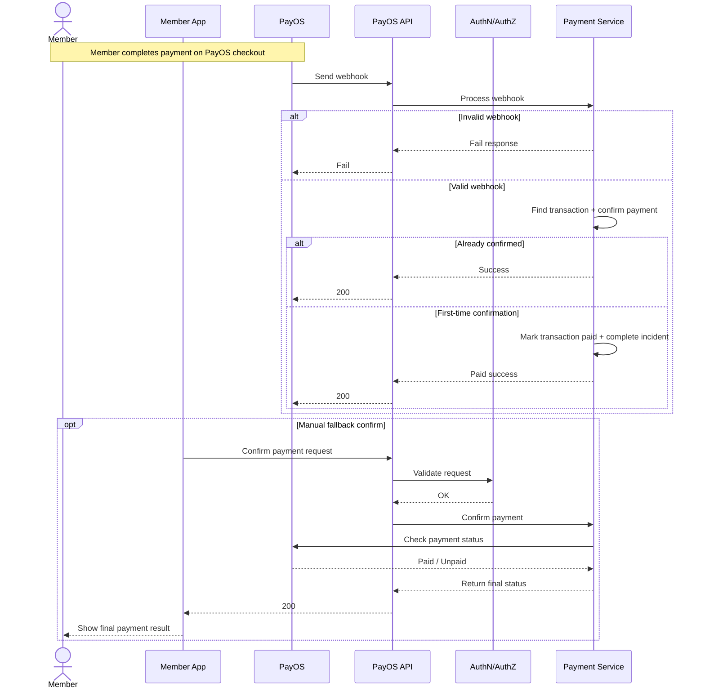

## Incident Payment - Initiate Payment

```mermaid
sequenceDiagram
    actor Member
    participant App as Member App
    participant IncidentAPI as Incident API
    participant Auth as AuthN/AuthZ
    participant PaymentSvc as Payment Service
    participant PayOS

    Member->>App: Choose payment method
    App->>IncidentAPI: Submit payment request
    IncidentAPI->>Auth: Validate request

    alt Unauthorized
        Auth-->>IncidentAPI: 401/403
        IncidentAPI-->>App: Return error
        App-->>Member: Show auth error
    else Authorized
        Auth-->>IncidentAPI: OK
        IncidentAPI->>PaymentSvc: Process payment

        alt Wallet payment
            PaymentSvc->>PaymentSvc: Validate incident + wallet balance
            alt Invalid wallet or insufficient balance
                PaymentSvc-->>IncidentAPI: Return error
                IncidentAPI-->>App: 404/409
                App-->>Member: Show payment error
            else Valid wallet payment
                PaymentSvc->>PaymentSvc: Debit wallet + mark paid
                PaymentSvc-->>IncidentAPI: Paid response
                IncidentAPI-->>App: 200
                App-->>Member: Show payment success
            end

        else PayOS payment
            PaymentSvc->>PaymentSvc: Validate incident + create pending payment
            PaymentSvc->>PayOS: Create payment link
            alt PayOS error
                PayOS-->>PaymentSvc: Error
                PaymentSvc-->>IncidentAPI: Return error
                IncidentAPI-->>App: 400
                App-->>Member: Show create-link error
            else PayOS success
                PayOS-->>PaymentSvc: checkoutUrl
                PaymentSvc-->>IncidentAPI: Pending response
                IncidentAPI-->>App: 200 + checkoutUrl
                App-->>Member: Open PayOS checkout
            end
        end
    end
```

## Incident Payment - Confirm PayOS Payment

```mermaid
sequenceDiagram
    actor Member
    participant App as Member App
    participant PayOS
    participant PayAPI as PayOS API
    participant Auth as AuthN/AuthZ
    participant PaymentSvc as Payment Service

    Note over Member,PayOS: Member completes payment on PayOS checkout

    PayOS->>PayAPI: Send webhook
    PayAPI->>PaymentSvc: Process webhook

    alt Invalid webhook
        PaymentSvc-->>PayAPI: Fail response
        PayAPI-->>PayOS: Fail
    else Valid webhook
        PaymentSvc->>PaymentSvc: Find transaction + confirm payment
        alt Already confirmed
            PaymentSvc-->>PayAPI: Success
            PayAPI-->>PayOS: 200
        else First-time confirmation
            PaymentSvc->>PaymentSvc: Mark transaction paid + complete incident
            PaymentSvc-->>PayAPI: Paid success
            PayAPI-->>PayOS: 200
        end
    end

    opt Manual fallback confirm
        App->>PayAPI: Confirm payment request
        PayAPI->>Auth: Validate request
        Auth-->>PayAPI: OK
        PayAPI->>PaymentSvc: Confirm payment
        PaymentSvc->>PayOS: Check payment status
        PayOS-->>PaymentSvc: Paid / Unpaid
        PaymentSvc-->>PayAPI: Return final status
        PayAPI-->>App: 200
        App-->>Member: Show final payment result
    end
```
