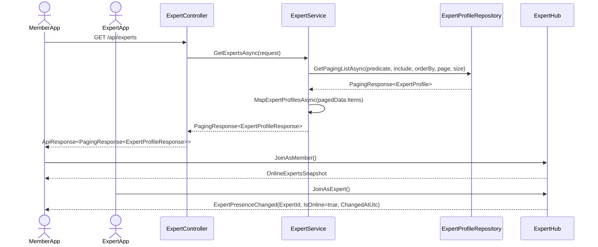
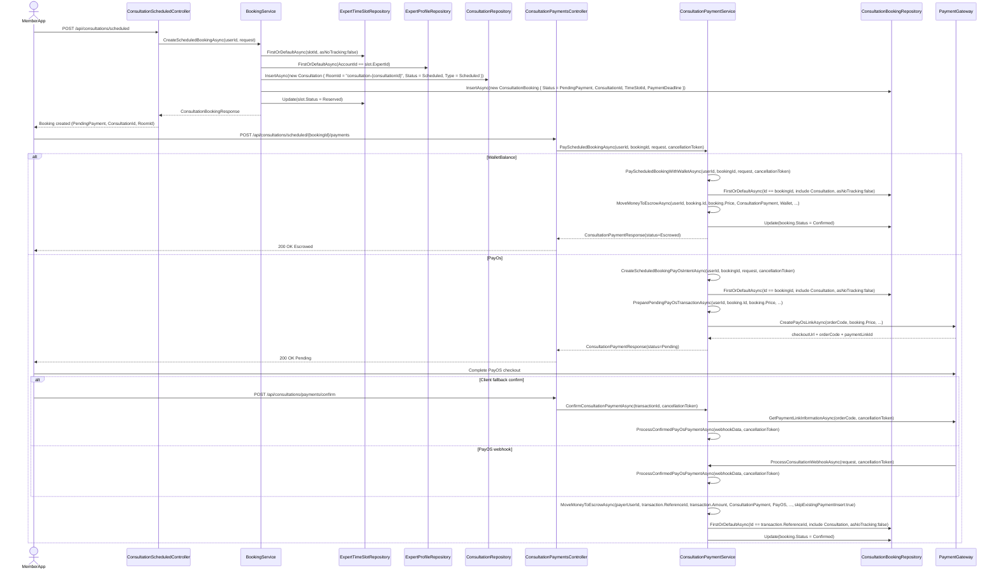
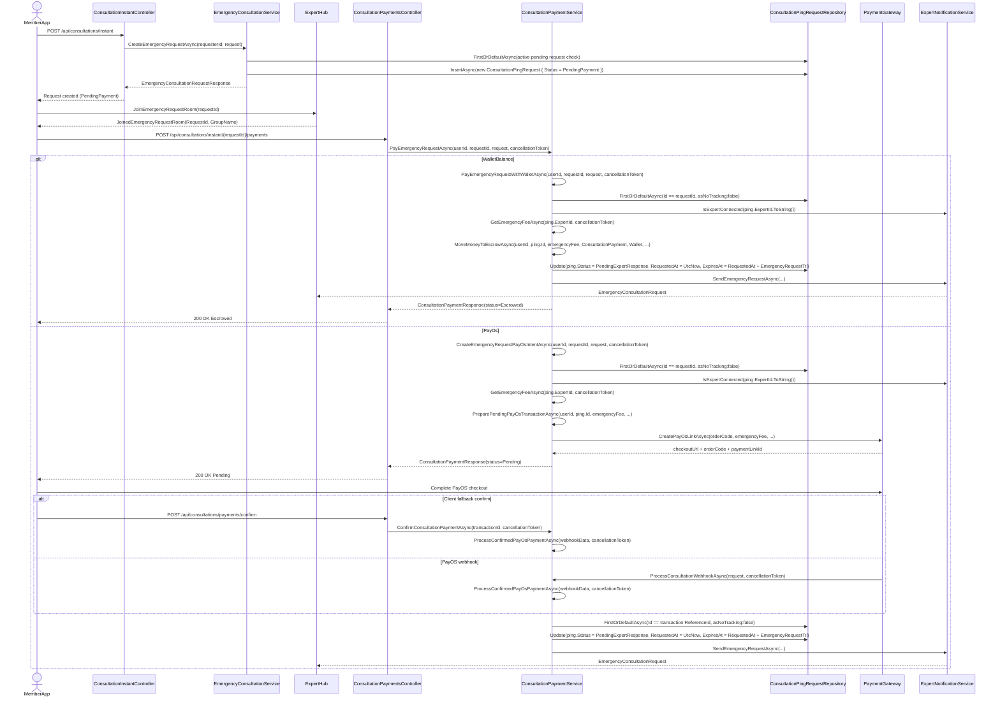
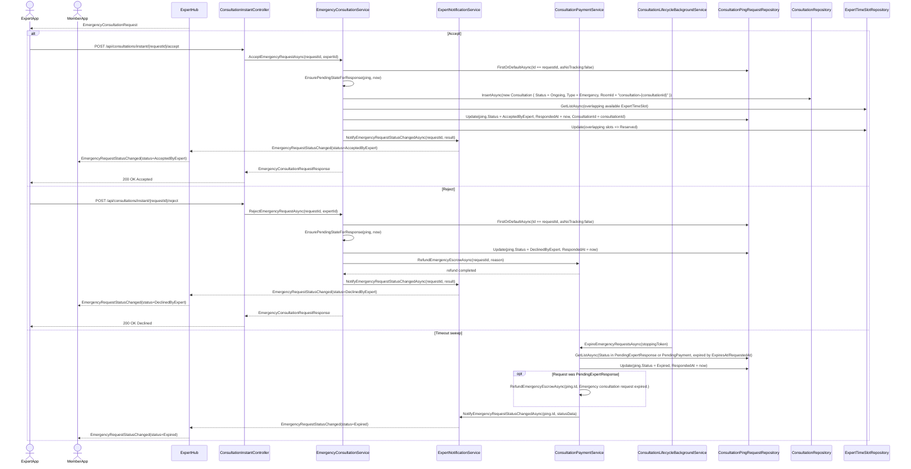
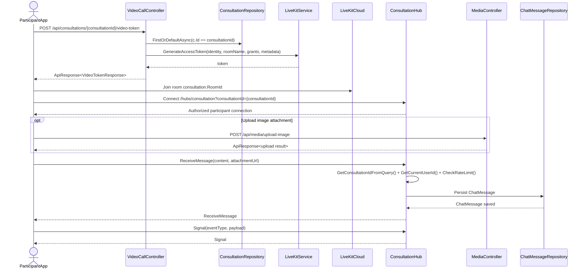
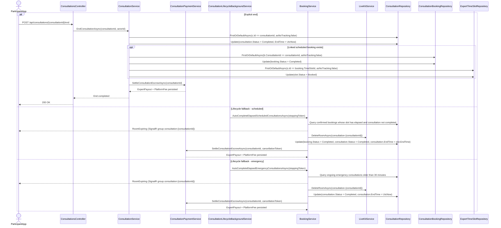
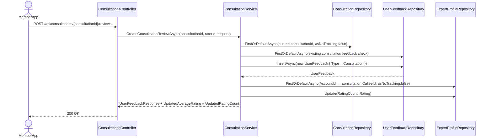

![][image1]

**CAPSTONE PROJECT REPORT**

**Report 4 – Software Design Document**

– Hanoi, August 2019 –

**Table of Contents**
[I. Record of Changes	3](#i.-record-of-changes)

[II. Software Design Document	4](#ii.-software-design-document)

[1\. System Design	4](#1.-system-design)

[1.1 System Architecture	4](#1.1-system-architecture)

[1.2 Package Diagram	4](#1.2-package-diagram)

[2\. Database Design	4](#2.-database-design)

[3\. Detailed Design	5](#3.-detailed-design)

[3.1 \<Feature/Function Name1\>	5](#3.1-\<feature/function-name1\>)

[3.2 \<Feature/Function Name2\>	6](#3.2-snake-capture)

[3.3 Consultation	7](#3.3-consultation)

# **I. Record of Changes**

| Date | A\*
M, D | In charge | Change Description |
| ---- | -------- | --------- | ------------------ |
|      |          |           |                    |
|      |          |           |                    |
|      |          |           |                    |
|      |          |           |                    |
|      |          |           |                    |
|      |          |           |                    |
|      |          |           |                    |
|      |          |           |                    |
|      |          |           |                    |
|      |          |           |                    |
|      |          |           |                    |
|      |          |           |                    |
|      |          |           |                    |

\*A \- Added M \- Modified D \- Deleted

# **II. Software Design Document**

## **1\. System Design**

### **1.1 System Architecture**

*\[The content of this section includes the overall diagram which includes the sub-systems, the external systems, and the relationship/connection among them. You need also provide the explanation for each of the diagram components (modules, sub-systems, external systems, etc.)\].*

### **1.2 Package Diagram**

*\[Provide the package diagram for each sub-system. The content of this section includes overall package diagram(s) and the explanation for each package (or namespace). Please see the sample and description table format below\]*

![][image2]

***Package Descriptions***

| No | Package          | Description                    |
| :-: | ---------------- | ------------------------------ |
| 01 | \<Package name\> | \<Description of the package\> |
| 02 |                  |                                |

## **2\. Database Design**

*\[Provide the files description, database table relationship & table descriptions like example below\]*

***Table Descriptions***

| No     | Table               | Description                                                                                                                              |
| :----- | :------------------ | :--------------------------------------------------------------------------------------------------------------------------------------- |
| *01* | *\<Table name\>*  | *\<Description of the table\> \- Primary keys: \<\<list of primary key fields\>\> \- Foreign keys: \<\<list of foreign key fields\>\>* |
| *02* | *\<Table name2\>* | *…*                                                                                                                                   |

## **3\. Detailed Design**

### **3.1 \<Feature/Function Name1\>**

*\[Provide the detailed design for the feature \<Feature Name1\>. It includes Class Diagram, Class Specifications, and Sequence Diagram(s); **For the features/functions with the same structure of class & sequence diagrams, you need to provide the diagrams once for one feature/function and refer to those diagrams from other features/functions**\]*

#### ***3.1.1 Class Diagram***

*\[This part presents the class diagram for the relevant feature\]*

![][image3]

***3.1.2 \<Sequence Diagram Name1\>***

*\[Provide the sequence diagram(s) for the feature, see the sample below\]*
![][image4]

#### ***3.1.3 \<Sequence Diagram Name2\>***

#### ***3.1.4 …***

### **3.2 Snake Capture**

#### ***3.2.1 Class Diagram***

#### ***3.2.2 Sequence Diagram Create new SnakeCatchingrequest***

#### ***3.2.3 Sequence Diagram Confirm SnakeCatchingRequest***

#### ***3.2.3 Sequence Diagram Assign SnakeCatchingRequest***

#### ***3.2.4 Sequence Diagram Cancel SnakeCatchingRequest***

#### ***3.2.5 Sequence Diagram View List SnakeCatchingRequest***

#### ***3.2.6 Sequence Diagram View Detail SnakeCatchingRequest***

#### ***3.2.6 Sequence Diagram Start SnakeCatchingMission***

#### ***3.2.7 Sequence Diagram Mark as Arrived SnakeCatchingMission***

#### ***3.2.8 Sequence Diagram Complete SnakeCatchingMission***

### **3.3 Consultation**

Consultation module supports two primary business modes:

- Scheduled Consultation: user books a future time slot, pays, joins room at slot time, ends consultation, and leaves review.
- Emergency Consultation: user creates instant request, pays first, waits for expert accept/reject, then joins room if accepted.

The module also includes in-room real-time capabilities (chat, attachment, signal events), LiveKit token generation, and settlement lifecycle handling.

Canonical business states used in this feature:

- Booking: PendingPayment, Confirmed, Completed.
- Emergency Request: PendingPayment, PendingExpertResponse, AcceptedByExpert, DeclinedByExpert, Expired.

#### ***3.3.1 Class Diagram***

```mermaid
classDiagram
        class IExpertService {
            <<interface>>
            +UpdateSettingsAsync(expertId, request)
            +CreateBulkTimeSlotsAsync(expertId, request)
            +GetExpertsAsync(request)
            +GetExpertProfileAsync(expertId)
            +GetExpertReviewsAsync(expertId, request)
            +GetAvailableTimeSlotsAsync(expertId)
        }

        class IBookingService {
            <<interface>>
            +CreateScheduledBookingAsync(userId, request)
            +GetMyBookingsAsync(userId)
            +GetExpertBookingsAsync(expertId)
            +AutoCompleteElapsedScheduledConsultationsAsync(cancellationToken)
            +AutoCompleteElapsedEmergencyConsultationsAsync(cancellationToken)
        }

        class IEmergencyConsultationService {
            <<interface>>
            +CreateEmergencyRequestAsync(requesterId, request)
            +AcceptEmergencyRequestAsync(requestId, expertId)
            +RejectEmergencyRequestAsync(requestId, expertId)
        }

        class IConsultationService {
            <<interface>>
            +EndConsultationAsync(consultationId, actorId)
            +CreateConsultationReviewAsync(consultationId, raterId, request)
            +GetConsultationReviewAsync(consultationId, actorId)
            +GetExpertConsultationsAsync(expertId, query)
            +GetMyConsultationsAsync(userId, query)
        }

        class IConsultationPaymentService {
            <<interface>>
            +PayScheduledBookingAsync(userId, bookingId, request, cancellationToken)
            +PayEmergencyRequestAsync(userId, requestId, request, cancellationToken)
            +ConfirmConsultationPaymentAsync(transactionId, cancellationToken)
            +ConfirmConsultationPaymentByOrderCodeAsync(orderCode, cancellationToken)
            +ProcessConsultationWebhookAsync(request, cancellationToken)
            +IsConsultationPayOsOrderCodeAsync(orderCode, cancellationToken)
            +RefundEmergencyEscrowAsync(requestId, reason, cancellationToken)
            +ExpireEmergencyRequestsAsync(cancellationToken)
            +SettleConsultationEscrowAsync(consultationId, cancellationToken)
        }

        class ILiveKitService {
            <<interface>>
            +GenerateAccessToken(identity, roomName, grants, metadata)
            +CreateRoomAsync(roomName, cancellationToken)
            +DeleteRoomAsync(roomName, cancellationToken)
            +ListRoomsAsync(cancellationToken)
            +ValidateWebhook(rawBody, authHeader)
        }

        class ExpertController {
            +UpdateSettings(request)
            +CreateBulkTimeSlots(request)
            +GetMyConsultations(query)
            +GetExperts(request)
            +GetExpertProfile(id)
            +GetExpertTimeSlots(id)
            +GetExpertReviews(id, request)
        }

        class ConsultationScheduledController {
            +CreateBooking(request)
            +GetMyBookings()
            +GetExpertBookings()
        }

        class ConsultationInstantController {
            +CreateEmergencyConsultationRequest(request)
            +AcceptEmergencyConsultationRequest(requestId)
            +RejectEmergencyConsultationRequest(requestId)
        }

        class ConsultationPaymentsController {
            +PayScheduledBooking(bookingId, request, cancellationToken)
            +PayEmergencyRequest(requestId, request, cancellationToken)
            +ConfirmConsultationPayment(request, cancellationToken)
        }

        class ConsultationsController {
            +EndConsultation(consultationId)
            +GetMyConsultations(query)
            +CreateReview(consultationId, request)
            +GetReview(consultationId)
        }

        class VideoCallController {
            +GenerateVideoToken(consultationId, cancellationToken)
            +GenerateDemoVideoToken(roomname, cancellationToken)
            +Webhook(cancellationToken)
        }

        class ExpertService {
            +UpdateSettingsAsync(expertId, request)
            +CreateBulkTimeSlotsAsync(expertId, request)
            +GetExpertsAsync(request)
            +GetExpertProfileAsync(expertId)
            +GetExpertReviewsAsync(expertId, request)
            +GetAvailableTimeSlotsAsync(expertId)
        }

        class BookingService {
            +CreateScheduledBookingAsync(userId, request)
            +GetMyBookingsAsync(userId)
            +GetExpertBookingsAsync(expertId)
            +AutoCompleteElapsedScheduledConsultationsAsync(cancellationToken)
            +AutoCompleteElapsedEmergencyConsultationsAsync(cancellationToken)
        }

        class EmergencyConsultationService {
            +CreateEmergencyRequestAsync(requesterId, request)
            +AcceptEmergencyRequestAsync(requestId, expertId)
            +RejectEmergencyRequestAsync(requestId, expertId)
        }

        class ConsultationService {
            +EndConsultationAsync(consultationId, actorId)
            +CreateConsultationReviewAsync(consultationId, raterId, request)
            +GetConsultationReviewAsync(consultationId, actorId)
            +GetExpertConsultationsAsync(expertId, query)
            +GetMyConsultationsAsync(userId, query)
        }

        class ConsultationPaymentService {
            +PayScheduledBookingAsync(userId, bookingId, request, cancellationToken)
            +PayEmergencyRequestAsync(userId, requestId, request, cancellationToken)
            +ConfirmConsultationPaymentAsync(transactionId, cancellationToken)
            +ConfirmConsultationPaymentByOrderCodeAsync(orderCode, cancellationToken)
            +ProcessConsultationWebhookAsync(request, cancellationToken)
            +IsConsultationPayOsOrderCodeAsync(orderCode, cancellationToken)
            +RefundEmergencyEscrowAsync(requestId, reason, cancellationToken)
            +ExpireEmergencyRequestsAsync(cancellationToken)
            +SettleConsultationEscrowAsync(consultationId, cancellationToken)
        }

        class LiveKitService {
            +GenerateAccessToken(identity, roomName, grants, metadata)
            +CreateRoomAsync(roomName, cancellationToken)
            +DeleteRoomAsync(roomName, cancellationToken)
            +ListRoomsAsync(cancellationToken)
            +ValidateWebhook(rawBody, authHeader)
        }

        class ExpertHub {
            +JoinAsExpert()
            +JoinAsMember()
            +JoinEmergencyRequestRoom(requestId)
            +OnDisconnectedAsync(exception)
        }

        class ConsultationHub {
            +OnConnectedAsync()
            +OnDisconnectedAsync(exception)
            +ReceiveMessage(content, attachmentUrl)
            +Signal(eventType, payload)
        }

        class ConsultationLifecycleBackgroundService {
            +ExecuteAsync(stoppingToken)
        }

        class Consultation {
            +Id : Guid
            +CallerId : Guid
            +CalleeId : Guid
            +RoomId : string
            +StartTime : DateTime
            +EndTime : DateTime?
            +Status : ConsultationStatus
            +Type : ConsultationType
        }

        class ConsultationBooking {
            +Id : Guid
            +UserId : Guid
            +ExpertId : Guid
            +Price : decimal
            +BookedAt : DateTime
            +ProblemDescription : string?
            +PaymentDeadline : DateTime?
            +Status : BookingStatus
            +ConsultationId : Guid?
            +TimeSlotId : Guid
            +Version : uint
        }

        class ConsultationPingRequest {
            +Id : Guid
            +RescuerId : Guid
            +ExpertId : Guid
            +Status : ConsultationPingStatus
            +RequestedAt : DateTime
            +RespondedAt : DateTime?
            +ExpiresAt : DateTime?
            +ConsultationId : Guid?
        }

        class ChatMessage {
            +Id : Guid
            +ConsultationId : Guid
            +SenderId : Guid
            +Content : string
            +SentAt : DateTime
            +AttachmentUrl : string?
        }

        class Transaction {
            +Id : Guid
            +UserId : Guid?
            +ReferenceId : Guid
            +Amount : decimal
            +Currency : string
            +TransactionType : TransactionType
            +PaymentMethod : string?
            +ExternalTransactionId : string?
            +CreatedAt : DateTime?
        }

        IExpertService <|-- ExpertService : implements
        IBookingService <|-- BookingService : implements
        IEmergencyConsultationService <|-- EmergencyConsultationService : implements
        IConsultationService <|-- ConsultationService : implements
        IConsultationPaymentService <|-- ConsultationPaymentService : implements
        ILiveKitService <|-- LiveKitService : implements

        ExpertController ..> IExpertService : uses
        ExpertController ..> IConsultationService : uses
        ConsultationScheduledController ..> IBookingService : uses
        ConsultationInstantController ..> IEmergencyConsultationService : uses
        ConsultationPaymentsController ..> IConsultationPaymentService : uses
        ConsultationsController ..> IConsultationService : uses
        VideoCallController ..> ILiveKitService : uses
        ExpertHub ..> ConsultationPingRequest : uses
        ConsultationHub ..> ChatMessage : uses
        ConsultationHub ..> Consultation : uses
        BookingService ..> ConsultationBooking : uses
        BookingService ..> Consultation : uses
        EmergencyConsultationService ..> ConsultationPingRequest : uses
        EmergencyConsultationService ..> Consultation : uses
        ConsultationService ..> Consultation : uses
        ConsultationPaymentService ..> ConsultationBooking : uses
        ConsultationPaymentService ..> ConsultationPingRequest : uses
        ConsultationPaymentService ..> Consultation : uses
        ConsultationPaymentService ..> Transaction : uses
        LiveKitService ..> Consultation : uses
        ConsultationLifecycleBackgroundService ..> IBookingService : uses
        ConsultationLifecycleBackgroundService ..> IConsultationPaymentService : uses
        ConsultationBooking ..> Consultation : uses
        ConsultationPingRequest ..> Consultation : uses
        ChatMessage ..> Consultation : uses
        Transaction ..> ConsultationBooking : uses
        Transaction ..> ConsultationPingRequest : uses
        Transaction ..> Consultation : uses
```

***Class Specifications***

| No | Component/Class                                              | Responsibility                                                                          |
| :-: | :----------------------------------------------------------- | :-------------------------------------------------------------------------------------- |
| 01 | ExpertController                                             | Exposes expert directory, profile, review, time-slot, and expert consultation history APIs. |
| 02 | ConsultationScheduledController                              | Handles scheduled booking creation plus user/expert scheduled booking retrieval.        |
| 03 | ConsultationInstantController                                | Handles emergency request create, accept, and reject entry points.                      |
| 04 | ConsultationPaymentsController                               | Handles scheduled/emergency payment and PayOS manual confirm entry points.              |
| 05 | ConsultationsController                                      | Handles consultation end, member consultation history, review create, and review read.  |
| 06 | VideoCallController                                          | Generates consultation-scoped LiveKit tokens and processes LiveKit webhook callbacks.   |
| 07 | ExpertService                                                | Implements expert settings, weekly slot generation, directory/profile/review loading, and available-slot queries. |
| 08 | BookingService                                               | Creates scheduled bookings, returns booking inbox/history, and auto-completes elapsed consultations. |
| 09 | EmergencyConsultationService                                 | Creates emergency requests and executes accept/reject state transitions.                |
| 10 | ConsultationService                                          | Ends consultations, orchestrates reviews, and loads member/expert consultation history. |
| 11 | ConsultationPaymentService                                   | Orchestrates Wallet/PayOS payment, confirm/webhook, refund, expiry, and escrow settlement. |
| 12 | LiveKitService                                               | Generates access token and manages LiveKit room lifecycle and webhook validation.       |
| 13 | ExpertHub                                                    | Provides expert presence, member presence subscription, and emergency request room subscription. |
| 14 | ConsultationHub                                              | Authorizes room connection, persists chat messages, and broadcasts chat/UI signals.     |
| 15 | ConsultationLifecycleBackgroundService                       | Runs periodic lifecycle sweep for expired emergency requests and elapsed consultation auto-complete. |
| 16 | Consultation                                                 | Core consultation session entity with caller/callee, room, type, and lifecycle status. |
| 17 | ConsultationBooking                                          | Scheduled booking aggregate with price, payment deadline, status, and linked consultation. |
| 18 | ConsultationPingRequest                                      | Emergency request aggregate with responder state, expiry, and linked consultation.      |
| 19 | ChatMessage                                                  | In-room persisted message entity with sender, content, timestamp, and attachment URL.   |
| 20 | Transaction                                                  | Ledger record used for consultation payment, refund, expert payout, and platform fee.   |

#### ***3.3.2 Sequence Diagram View List Experts and Presence***

Main flow:

1. Member App calls GET /api/experts.
2. `ExpertController.GetExperts` delegates to `ExpertService.GetExpertsAsync`.
3. `ExpertService.GetExpertsAsync` loads paged `ExpertProfile` data through `GetPagingListAsync(...)` and maps items by `MapExpertProfilesAsync(...)`.
4. API returns expert list to Member App.
5. Member App connects `ExpertHub` and invokes `JoinAsMember()`.
6. Expert App connects `ExpertHub` and invokes `JoinAsExpert()`.
7. Member App receives `OnlineExpertsSnapshot` first, then `ExpertPresenceChanged` when an expert connection changes online state.

Output: Expert list with real-time online/offline synchronization.

#### ***3.3.3 Sequence Diagram Create and Pay Scheduled Booking***

Main flow:

1. Member App calls POST /api/consultations/scheduled with timeSlotId and problemDescription.
2. `ConsultationScheduledController.CreateBooking` calls `BookingService.CreateScheduledBookingAsync`.
3. `BookingService.CreateScheduledBookingAsync` validates the selected `ExpertTimeSlot`, loads `ExpertProfile`, creates `Consultation` immediately, creates `ConsultationBooking` in `PendingPayment`, and marks the slot as `Reserved`.
4. API returns `ConsultationBookingResponse` containing the already-created `ConsultationId` and `RoomId`.
5. Member App calls POST /api/consultations/scheduled/{bookingId}/payments.
6. `ConsultationPaymentsController.PayScheduledBooking` calls `ConsultationPaymentService.PayScheduledBookingAsync`.
7. Branch A - WalletBalance:
    1. `PayScheduledBookingWithWalletAsync` validates owner and `PendingPayment`.
    2. `MoveMoneyToEscrowAsync(...)` writes the `ConsultationPayment` transaction and deducts wallet balance.
    3. Booking status changes to `Confirmed`.
    4. API returns `ConsultationPaymentResponse` with status `Escrowed`.
8. Branch B - PayOS:
    1. `CreateScheduledBookingPayOsIntentAsync` creates a pending PayOS transaction and returns `checkoutUrl/orderCode/paymentLinkId` with status `Pending`.
    2. User completes checkout; backend confirms through `ConfirmConsultationPaymentAsync(...)` or `ProcessConsultationWebhookAsync(...)`.
    3. `ProcessConfirmedPayOsPaymentAsync(...)` moves money to escrow and updates booking status to `Confirmed`.

Output: Scheduled booking creates `Consultation` and `RoomId` before payment; payment only changes money state to `Escrowed` and booking state to `Confirmed`.

#### ***3.3.4 Sequence Diagram Create, Pay, and Notify Emergency Consultation Request***

Main flow:

1. Member App calls POST /api/consultations/instant with expertId.
2. `ConsultationInstantController.CreateEmergencyConsultationRequest` calls `EmergencyConsultationService.CreateEmergencyRequestAsync`.
3. `EmergencyConsultationService.CreateEmergencyRequestAsync` checks duplicate active request and inserts `ConsultationPingRequest` with status `PendingPayment`.
4. Member joins request room via `ExpertHub.JoinEmergencyRequestRoom(requestId)`.
5. Hub returns `JoinedEmergencyRequestRoom(RequestId, GroupName)`; this step only subscribes the requester to later status updates.
6. Member App calls POST /api/consultations/instant/{requestId}/payments.
7. `ConsultationPaymentsController.PayEmergencyRequest` calls `ConsultationPaymentService.PayEmergencyRequestAsync`.
8. Branch A - WalletBalance:
    1. `PayEmergencyRequestWithWalletAsync` validates owner, `PendingPayment`, and expert online presence via `IsExpertConnected(...)`.
    2. `MoveMoneyToEscrowAsync(...)` writes the `ConsultationPayment` transaction.
    3. Request status changes to `PendingExpertResponse`; `RequestedAt` and `ExpiresAt` are updated.
    4. `SendEmergencyRequestAsync(...)` pushes `EmergencyConsultationRequest` to the expert connection.
9. Branch B - PayOS:
    1. `CreateEmergencyRequestPayOsIntentAsync` validates owner, `PendingPayment`, and expert online presence, then creates a pending PayOS transaction.
    2. User completes checkout; backend confirms via `ConfirmConsultationPaymentAsync(...)` or `ProcessConsultationWebhookAsync(...)`.
    3. `ProcessConfirmedPayOsPaymentAsync(...)` moves money to escrow, updates request status to `PendingExpertResponse`, and calls `SendEmergencyRequestAsync(...)`.
10. There is no `EmergencyRequestStatusChanged` event sent to the member at payment time.

Output: Request enters expert decision queue only after payment reaches Escrowed.

#### ***3.3.5 Sequence Diagram Expert Accept or Reject Emergency Request***

Main flow:

1. Expert receives EmergencyConsultationRequest event.
2. Expert App calls accept or reject endpoint.
3. `ConsultationInstantController` delegates to `AcceptEmergencyRequestAsync(...)` or `RejectEmergencyRequestAsync(...)`.

Alternative A - Accept:

1. Service loads the request, checks targeted expert ownership, and runs `EnsurePendingStateForResponse(...)`.
2. Service creates `Consultation` with `Status = Ongoing`, `Type = Emergency`, and `RoomId = consultation-{consultationId}`.
3. Service reserves overlapping `ExpertTimeSlot` rows for the next 30 minutes.
4. Request status changes to `AcceptedByExpert`, then `NotifyEmergencyRequestStatusChangedAsync(...)` pushes the status to the requester room.

Alternative B - Reject:

1. Service loads the request, checks ownership, and runs `EnsurePendingStateForResponse(...)`.
2. Request status changes to `DeclinedByExpert`.
3. `RefundEmergencyEscrowAsync(...)` refunds the escrow to the member wallet.
4. `NotifyEmergencyRequestStatusChangedAsync(...)` pushes the new status to the requester room.

Alternative C - Timeout (No Expert Response):

1. `ConsultationLifecycleBackgroundService.ExecuteAsync` calls `ExpireEmergencyRequestsAsync(...)`.
2. `ExpireEmergencyRequestsAsync(...)` expires requests in either `PendingExpertResponse` or `PendingPayment` once TTL has elapsed.
3. Refund is triggered only for requests that were already `PendingExpertResponse`.
4. `NotifyEmergencyRequestStatusChangedAsync(...)` pushes `Expired` to the requester room.

Common completion (expert decision):

1. Push `EmergencyRequestStatusChanged` to the requester room.
2. Return `EmergencyConsultationRequestResponse` to the expert client.

Timeout completion:

1. Push `EmergencyRequestStatusChanged` with status `Expired`.

Output: Request reaches terminal state (AcceptedByExpert, DeclinedByExpert, or Expired), and member is informed in real time.

#### ***3.3.6 Sequence Diagram Join Consultation Room and In-Room Interaction***

Main flow:

1. Participant calls POST /api/consultations/{consultationId}/video-token.
2. `VideoCallController.GenerateVideoToken` loads `Consultation` directly from repository, verifies participant/admin access, then reads `consultation.RoomId`.
3. `ILiveKitService.GenerateAccessToken(...)` generates the token; the controller builds `VideoTokenResponse` with `Token`, `WsUrl`, and `RoomName`.
4. API returns token, wsUrl, and roomName.
5. Client joins LiveKit room.
6. Client connects ConsultationHub at /hubs/consultation?consultationId={consultationId}; OnConnectedAsync verifies participant authorization.
7. Sender uploads image via media API (optional) and receives secureUrl.
8. Sender invokes ConsultationHub.ReceiveMessage(content, attachmentUrl).
9. Hub resolves `consultationId` from query string, resolves current user from token, and applies `CheckRateLimit()`.
10. Hub persists ChatMessage.
11. Hub broadcasts the `ReceiveMessage` event to the consultation group.
12. Client can also send UI signal through ConsultationHub.Signal.

Output: Authenticated participant can enter consultation video room, exchange text/media messages, and send real-time UI signals.

#### ***3.3.7 Sequence Diagram End Consultation and Settlement (Narrative)***

Main flow:

1. Participant calls POST /api/consultations/{consultationId}/end.
2. `ConsultationsController.EndConsultation` calls `ConsultationService.EndConsultationAsync`.
3. `ConsultationService.EndConsultationAsync` validates participant ownership, marks `Consultation.Status = Completed`, sets `EndTime`, updates linked scheduled booking if present, and then calls `SettleConsultationEscrowAsync(...)`.
4. Explicit end does not delete the LiveKit room.

Lifecycle fallback:

1. `ConsultationLifecycleBackgroundService.ExecuteAsync` orchestrates three sweeps every 30 seconds.
2. Scheduled auto-complete lives in `BookingService.AutoCompleteElapsedScheduledConsultationsAsync(...)`.
3. Emergency auto-complete lives in `BookingService.AutoCompleteElapsedEmergencyConsultationsAsync(...)`.
4. Those `BookingService` methods send `RoomExpiring`, delete the LiveKit room, mark records `Completed`, and then call `SettleConsultationEscrowAsync(...)`.
5. Settlement writes `ExpertPayout` and `PlatformFee` transactions.

Output: Consultation is closed consistently and money flow is finalized.

#### ***3.3.8 Sequence Diagram Create Consultation Review (Narrative)***

Main flow:

1. User calls POST /api/consultations/{consultationId}/reviews.
2. `ConsultationService.CreateConsultationReviewAsync` loads the consultation and validates that the caller is the booking user and the consultation is already `Completed`.
3. Service rejects duplicate feedback by checking existing `UserFeedback` on `(RaterId, ReferenceId, Type=Consultation)`.
4. Service inserts a new `UserFeedback` record.
5. Service loads `ExpertProfile`, recalculates `RatingCount` and `Rating` directly in code, updates the profile, and commits.

Output: Post-consultation feedback is persisted and reflected in expert profile statistics.
