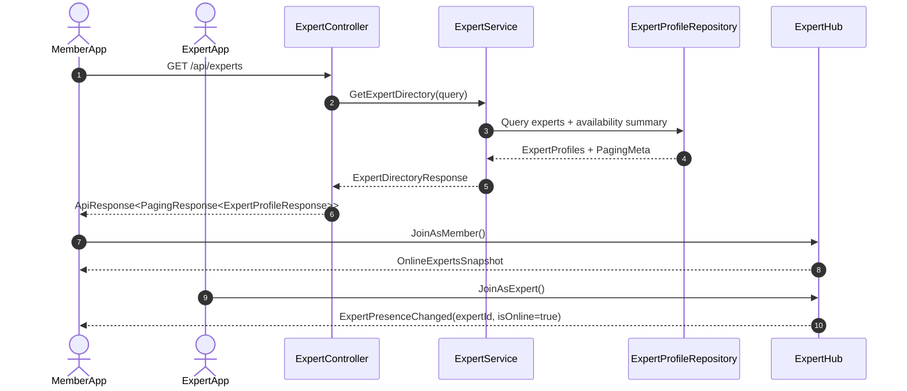
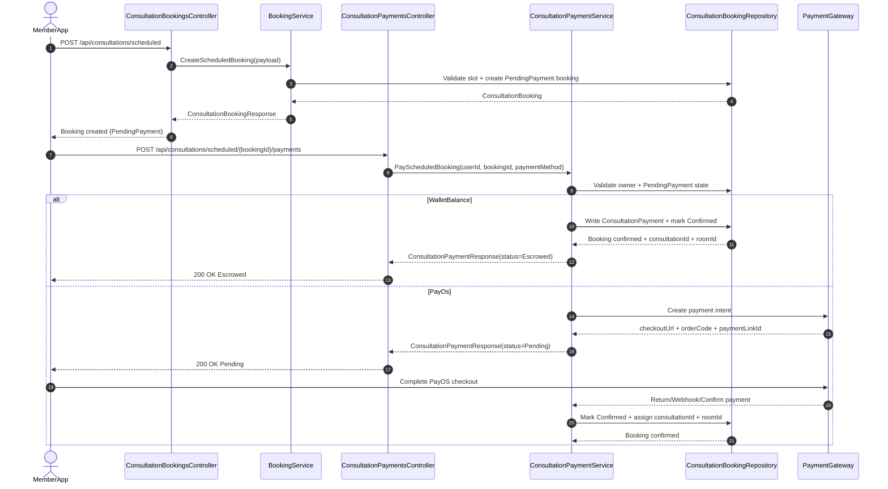
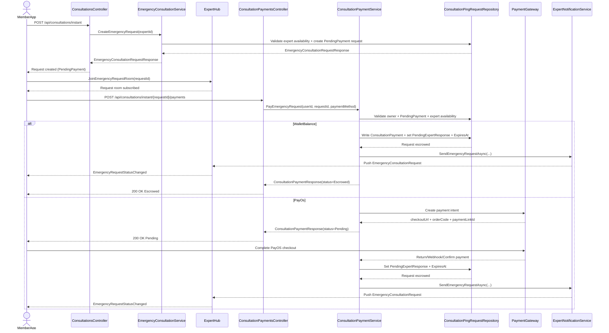
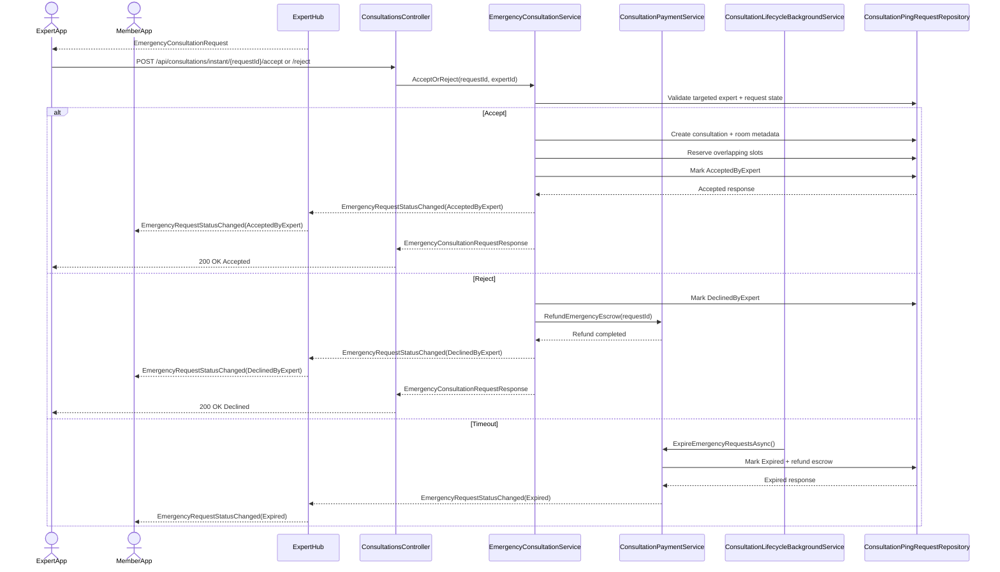
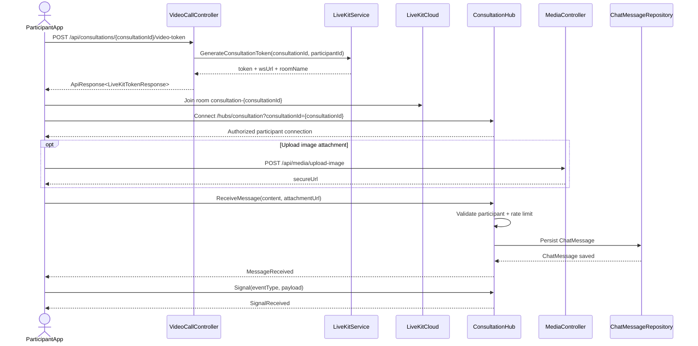
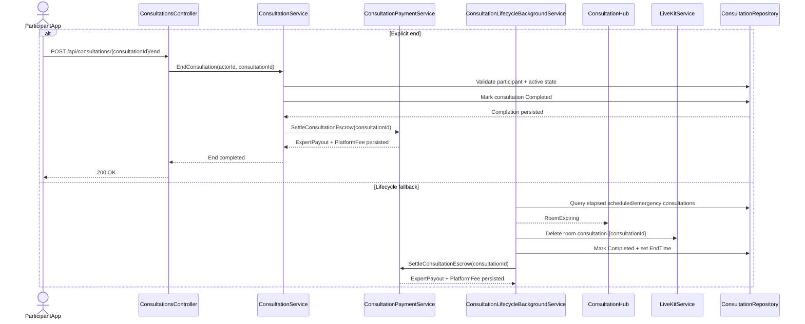
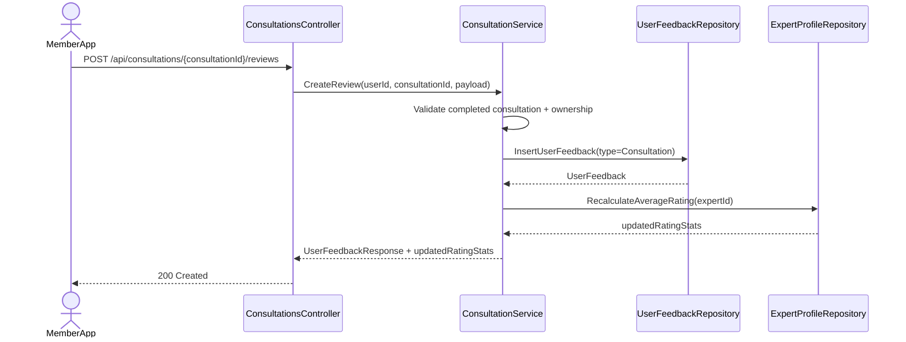

![][image1]

**CAPSTONE PROJECT REPORT**

**Report 4 – Software Design Document**

– Hanoi, August 2019 –

**Table of Contents**
[I. Record of Changes	3](#i.-record-of-changes)

[II. Software Design Document	4](#ii.-software-design-document)

[1\. System Design	4](#1.-system-design)

[1.1 System Architecture	4](#1.1-system-architecture)

[1.2 Package Diagram	4](#1.2-package-diagram)

[2\. Database Design	4](#2.-database-design)

[3\. Detailed Design	5](#3.-detailed-design)

[3.1 \<Feature/Function Name1\>	5](#3.1-\<feature/function-name1\>)

[3.2 \<Feature/Function Name2\>	6](#3.2-snake-capture)

[3.3 Consultation	7](#3.3-consultation)

# **I. Record of Changes**

| Date | A\*
M, D | In charge | Change Description |
| ---- | -------- | --------- | ------------------ |
|      |          |           |                    |
|      |          |           |                    |
|      |          |           |                    |
|      |          |           |                    |
|      |          |           |                    |
|      |          |           |                    |
|      |          |           |                    |
|      |          |           |                    |
|      |          |           |                    |
|      |          |           |                    |
|      |          |           |                    |
|      |          |           |                    |
|      |          |           |                    |

\*A \- Added M \- Modified D \- Deleted

# **II. Software Design Document**

## **1\. System Design**

### **1.1 System Architecture**

*\[The content of this section includes the overall diagram which includes the sub-systems, the external systems, and the relationship/connection among them. You need also provide the explanation for each of the diagram components (modules, sub-systems, external systems, etc.)\].*

### **1.2 Package Diagram**

*\[Provide the package diagram for each sub-system. The content of this section includes overall package diagram(s) and the explanation for each package (or namespace). Please see the sample and description table format below\]*

![][image2]

***Package Descriptions***

| No | Package          | Description                    |
| :-: | ---------------- | ------------------------------ |
| 01 | \<Package name\> | \<Description of the package\> |
| 02 |                  |                                |

## **2\. Database Design**

*\[Provide the files description, database table relationship & table descriptions like example below\]*

***Table Descriptions***

| No     | Table               | Description                                                                                                                              |
| :----- | :------------------ | :--------------------------------------------------------------------------------------------------------------------------------------- |
| *01* | *\<Table name\>*  | *\<Description of the table\> \- Primary keys: \<\<list of primary key fields\>\> \- Foreign keys: \<\<list of foreign key fields\>\>* |
| *02* | *\<Table name2\>* | *…*                                                                                                                                   |

## **3\. Detailed Design**

### **3.1 \<Feature/Function Name1\>**

*\[Provide the detailed design for the feature \<Feature Name1\>. It includes Class Diagram, Class Specifications, and Sequence Diagram(s); **For the features/functions with the same structure of class & sequence diagrams, you need to provide the diagrams once for one feature/function and refer to those diagrams from other features/functions**\]*

#### ***3.1.1 Class Diagram***

*\[This part presents the class diagram for the relevant feature\]*

![][image3]

***3.1.2 \<Sequence Diagram Name1\>***

*\[Provide the sequence diagram(s) for the feature, see the sample below\]*
![][image4]

#### ***3.1.3 \<Sequence Diagram Name2\>***

#### ***3.1.4 …***

### **3.2 Snake Capture**

#### ***3.2.1 Class Diagram***

#### ***3.2.2 Sequence Diagram Create new SnakeCatchingrequest***

#### ***3.2.3 Sequence Diagram Confirm SnakeCatchingRequest***

#### ***3.2.3 Sequence Diagram Assign SnakeCatchingRequest***

#### ***3.2.4 Sequence Diagram Cancel SnakeCatchingRequest***

#### ***3.2.5 Sequence Diagram View List SnakeCatchingRequest***

#### ***3.2.6 Sequence Diagram View Detail SnakeCatchingRequest***

#### ***3.2.6 Sequence Diagram Start SnakeCatchingMission***

#### ***3.2.7 Sequence Diagram Mark as Arrived SnakeCatchingMission***

#### ***3.2.8 Sequence Diagram Complete SnakeCatchingMission***

### **3.3 Consultation**

Consultation module supports two primary business modes:

- Scheduled Consultation: user books a future time slot, pays, joins room at slot time, ends consultation, and leaves review.
- Emergency Consultation: user creates instant request, pays first, waits for expert accept/reject, then joins room if accepted.

The module also includes in-room real-time capabilities (chat, attachment, signal events), LiveKit token generation, and settlement lifecycle handling.

Canonical business states used in this feature:

- Booking: PendingPayment, Confirmed, Completed.
- Emergency Request: PendingPayment, PendingExpertResponse, AcceptedByExpert, DeclinedByExpert, Expired.

#### ***3.3.1 Class Diagram***

***Class Specifications***

| No | Component/Class                                              | Responsibility                                                                          |
| :-: | :----------------------------------------------------------- | :-------------------------------------------------------------------------------------- |
| 01 | ExpertController                                             | Exposes expert directory, profile, review, time-slot, and expert consultation history APIs. |
| 02 | ConsultationScheduledController                              | Handles scheduled booking creation plus user/expert scheduled booking retrieval.        |
| 03 | ConsultationInstantController                                | Handles emergency request create, accept, and reject entry points.                      |
| 04 | ConsultationPaymentsController                               | Handles scheduled/emergency payment and PayOS manual confirm entry points.              |
| 05 | ConsultationsController                                      | Handles consultation end, member consultation history, review create, and review read.  |
| 06 | VideoCallController                                          | Generates consultation-scoped LiveKit tokens and processes LiveKit webhook callbacks.   |
| 07 | ExpertService                                                | Implements expert settings, weekly slot generation, directory/profile/review loading, and available-slot queries. |
| 08 | BookingService                                               | Creates scheduled bookings, returns booking inbox/history, and auto-completes elapsed consultations. |
| 09 | EmergencyConsultationService                                 | Creates emergency requests and executes accept/reject state transitions.                |
| 10 | ConsultationService                                          | Ends consultations, orchestrates reviews, and loads member/expert consultation history. |
| 11 | ConsultationPaymentService                                   | Orchestrates Wallet/PayOS payment, confirm/webhook, refund, expiry, and escrow settlement. |
| 12 | LiveKitService                                               | Generates access token and manages LiveKit room lifecycle and webhook validation.       |
| 13 | ExpertHub                                                    | Provides expert presence, member presence subscription, and emergency request room subscription. |
| 14 | ConsultationHub                                              | Authorizes room connection, persists chat messages, and broadcasts chat/UI signals.     |
| 15 | ConsultationLifecycleBackgroundService                       | Runs periodic lifecycle sweep for expired emergency requests and elapsed consultation auto-complete. |
| 16 | Consultation                                                 | Core consultation session entity with caller/callee, room, type, and lifecycle status. |
| 17 | ConsultationBooking                                          | Scheduled booking aggregate with price, payment deadline, status, and linked consultation. |
| 18 | ConsultationPingRequest                                      | Emergency request aggregate with responder state, expiry, and linked consultation.      |
| 19 | ChatMessage                                                  | In-room persisted message entity with sender, content, timestamp, and attachment URL.   |
| 20 | Transaction                                                  | Ledger record used for consultation payment, refund, expert payout, and platform fee.   |

#### ***3.3.2 Sequence Diagram View List Experts and Presence***

Main flow:

1. Member App calls GET /api/experts.
2. ExpertController delegates query/filter/paging to ExpertService.
3. ExpertService loads experts and availability summary from repository.
4. API returns expert list to Member App.
5. Member App connects ExpertHub and invokes JoinAsMember.
6. Member App receives OnlineExpertsSnapshot and ExpertPresenceChanged events for live status update.

Output: Expert list with real-time online/offline synchronization.

#### ***3.3.3 Sequence Diagram Create and Pay Scheduled Booking***

Main flow:

1. Member App calls POST /api/consultations/scheduled with timeSlotId and problemDescription.
2. BookingService validates slot availability and concurrency version.
3. BookingService creates ConsultationBooking in PendingPayment state.
4. API returns ConsultationBookingResponse and booking waits for payment.
5. Member App calls POST /api/consultations/scheduled/{bookingId}/payments.
6. ConsultationPaymentService validates booking ownership and PendingPayment state.
7. Branch A - WalletBalance:
	1. Service charges user wallet and writes ConsultationPayment transaction to the ledger.
	2. Booking moves to Confirmed and consultationId + roomId are generated.
	3. API returns ConsultationPaymentResponse with status Escrowed.
8. Branch B - PayOS:
	1. Service creates a pending payment transaction and returns checkoutUrl/orderCode/paymentLinkId with status Pending.
	2. User completes checkout; backend confirms payment via PayOS return/webhook, or client-triggered fallback POST /api/consultations/payments/confirm.
	3. After confirmed payment, booking moves to Confirmed and consultationId + roomId are generated; payment status becomes Escrowed.

Output: Booking becomes ready for consultation only after payment is Escrowed. WalletBalance is immediate; PayOS requires a confirm step after Pending.

#### ***3.3.4 Sequence Diagram Create, Pay, and Notify Emergency Consultation Request***

Main flow:

1. Member App calls POST /api/consultations/instant with expertId.
2. EmergencyConsultationService validates target expert availability.
3. Service creates emergency request in PendingPayment state.
4. Member joins request room via JoinEmergencyRequestRoom(requestId).
5. Emergency request is created and requester is subscribed for request status updates.
6. Member App calls POST /api/consultations/instant/{requestId}/payments.
7. ConsultationPaymentService validates request ownership, PendingPayment state, and expert availability.
8. Branch A - WalletBalance:
	1. Service charges wallet and writes ConsultationPayment transaction.
	2. Payment result is Escrowed.
9. Branch B - PayOS:
	1. Service creates pending transaction and returns checkoutUrl/orderCode/paymentLinkId with status Pending.
	2. User completes checkout; backend confirms via PayOS return/webhook, or client-triggered fallback POST /api/consultations/payments/confirm.
	3. Payment result becomes Escrowed after confirm.
10. After payment is Escrowed (both branches), request transitions to PendingExpertResponse and ExpiresAt (TTL 2 minutes) is set.
11. ConsultationPaymentService completes the payment flow, then the notification layer pushes EmergencyConsultationRequest to the targeted expert via ExpertHub.
12. Member receives EmergencyRequestStatusChanged event for the subscribed request room.

Output: Request enters expert decision queue only after payment reaches Escrowed.

#### ***3.3.5 Sequence Diagram Expert Accept or Reject Emergency Request***

Main flow:

1. Expert receives EmergencyConsultationRequest event.
2. Expert App calls accept or reject endpoint.
3. EmergencyConsultationService validates targeted expert and request state.

Alternative A - Accept:

1. Create consultation session and room metadata.
2. Reserve overlapping slots (Slot Paradox guard).
3. Update request status to AcceptedByExpert.

Alternative B - Reject:

1. Update request status to DeclinedByExpert.
2. Trigger escrow refund to member wallet.

Alternative C - Timeout (No Expert Response):

1. ConsultationLifecycleBackgroundService detects ExpiresAt elapsed while request is still PendingExpertResponse.
2. Update request status to Expired.
3. Trigger escrow refund to member wallet.

Common completion (expert decision):

1. Push EmergencyRequestStatusChanged to member room.
2. Return EmergencyConsultationRequestResponse to expert client.

Timeout completion:

1. Push EmergencyRequestStatusChanged to member room with status Expired.

Output: Request reaches terminal state (AcceptedByExpert, DeclinedByExpert, or Expired), and member is informed in real time.

#### ***3.3.6 Sequence Diagram Join Consultation Room and In-Room Interaction***

Main flow:

1. Participant calls POST /api/consultations/{consultationId}/video-token.
2. Controller verifies caller is consultation participant.
3. LiveKitService generates token for room consultation-{consultationId}.
4. API returns token, wsUrl, and roomName.
5. Client joins LiveKit room.
6. Client connects ConsultationHub at /hubs/consultation?consultationId={consultationId}; OnConnectedAsync verifies participant authorization.
7. Sender uploads image via media API (optional) and receives secureUrl.
8. Sender invokes ConsultationHub.ReceiveMessage(content, attachmentUrl).
9. Hub validates participant and applies message rate limit.
10. Hub persists ChatMessage.
11. Hub broadcasts MessageReceived to both participants.
12. Client can also send UI signal through ConsultationHub.Signal.

Output: Authenticated participant can enter consultation video room, exchange text/media messages, and send real-time UI signals.

#### ***3.3.7 Sequence Diagram End Consultation and Settlement (Narrative)***

Main flow:

1. Participant calls POST /api/consultations/{consultationId}/end.
2. ConsultationService validates participant and active consultation state.
3. Consultation status is updated to Completed.
4. ConsultationPaymentService performs settlement from escrow to ExpertPayout and PlatformFee.

Lifecycle fallback:

1. ConsultationLifecycleBackgroundService periodically checks elapsed consultations.
2. If consultation is elapsed and still open (Scheduled: slot end reached; Emergency: StartTime + 30 minutes reached), service sends RoomExpiring signal via ConsultationHub.
3. Service deletes LiveKit room consultation-{consultationId} to disconnect participants.
4. Service updates consultation status to Completed and sets EndTime (Scheduled uses slot end; Emergency uses current UTC time).
5. ConsultationPaymentService performs settlement from escrow to ExpertPayout and PlatformFee.

Output: Consultation is closed consistently and money flow is finalized.

#### ***3.3.8 Sequence Diagram Create Consultation Review (Narrative)***

Main flow:

1. User calls POST /api/consultations/{consultationId}/reviews.
2. ConsultationService validates completed consultation and ownership.
3. UserFeedback record is created.
4. Expert aggregate rating (average/count) is recalculated.

Output: Post-consultation feedback is persisted and reflected in expert profile statistics.
