![][image1]

**CAPSTONE PROJECT REPORT**

**Report 4 – Software Design Document**

– Hanoi, August 2019 –

**Table of Contents**
[I. Record of Changes	3](#i.-record-of-changes)

[II. Software Design Document	4](#ii.-software-design-document)

[1\. System Design	4](#1.-system-design)

[1.1 System Architecture	4](#1.1-system-architecture)

[1.2 Package Diagram	4](#1.2-package-diagram)

[2\. Database Design	4](#2.-database-design)

[3\. Detailed Design	5](#3.-detailed-design)

[3.1 \<Feature/Function Name1\>	5](#3.1-\<feature/function-name1\>)

[3.2 \<Feature/Function Name2\>	6](#3.2-snake-capture)

[3.3 Consultation	7](#3.3-consultation)

# **I. Record of Changes**

| Date | A\*M, D | In charge | Change Description |
| ---- | -------- | --------- | ------------------ |
|      |          |           |                    |
|      |          |           |                    |
|      |          |           |                    |
|      |          |           |                    |
|      |          |           |                    |
|      |          |           |                    |
|      |          |           |                    |
|      |          |           |                    |
|      |          |           |                    |
|      |          |           |                    |
|      |          |           |                    |
|      |          |           |                    |
|      |          |           |                    |

\*A \- Added M \- Modified D \- Deleted

# **II. Software Design Document**

## **1\. System Design**

### **1.1 System Architecture**

*\[The content of this section includes the overall diagram which includes the sub-systems, the external systems, and the relationship/connection among them. You need also provide the explanation for each of the diagram components (modules, sub-systems, external systems, etc.)\].*

### **1.2 Package Diagram**

*\[Provide the package diagram for each sub-system. The content of this section includes overall package diagram(s) and the explanation for each package (or namespace). Please see the sample and description table format below\]*

![][image2]

***Package Descriptions***

| No | Package          | Description                    |
| :-: | ---------------- | ------------------------------ |
| 01 | \<Package name\> | \<Description of the package\> |
| 02 |                  |                                |

## **2\. Database Design**

*\[Provide the files description, database table relationship & table descriptions like example below\]*

***Table Descriptions***

| No     | Table               | Description                                                                                                                              |
| :----- | :------------------ | :--------------------------------------------------------------------------------------------------------------------------------------- |
| *01* | *\<Table name\>*  | *\<Description of the table\> \- Primary keys: \<\<list of primary key fields\>\> \- Foreign keys: \<\<list of foreign key fields\>\>* |
| *02* | *\<Table name2\>* | *…*                                                                                                                                   |

## **3\. Detailed Design**

### **3.1 \<Feature/Function Name1\>**

*\[Provide the detailed design for the feature \<Feature Name1\>. It includes Class Diagram, Class Specifications, and Sequence Diagram(s); **For the features/functions with the same structure of class & sequence diagrams, you need to provide the diagrams once for one feature/function and refer to those diagrams from other features/functions**\]*

#### ***3.1.1 Class Diagram***

*\[This part presents the class diagram for the relevant feature\]*

![][image3]

***3.1.2 \<Sequence Diagram Name1\>***

*\[Provide the sequence diagram(s) for the feature, see the sample below\]*
![][image4]

#### ***3.1.3 \<Sequence Diagram Name2\>***

#### ***3.1.4 …***

### **3.2 Snake Capture**

#### ***3.2.1 Class Diagram***

#### ***3.2.2 Sequence Diagram Create new SnakeCatchingrequest***

#### ***3.2.3 Sequence Diagram Confirm SnakeCatchingRequest***

#### ***3.2.3 Sequence Diagram Assign SnakeCatchingRequest***

#### ***3.2.4 Sequence Diagram Cancel SnakeCatchingRequest***

#### ***3.2.5 Sequence Diagram View List SnakeCatchingRequest***

#### ***3.2.6 Sequence Diagram View Detail SnakeCatchingRequest***

#### ***3.2.6 Sequence Diagram Start SnakeCatchingMission***

#### ***3.2.7 Sequence Diagram Mark as Arrived SnakeCatchingMission***

#### ***3.2.8 Sequence Diagram Complete SnakeCatchingMission***

### **3.3 Consultation**

Consultation module supports two primary business modes:

- Scheduled Consultation: user books a future time slot, pays, joins room at slot time, ends consultation, and leaves review.
- Emergency Consultation: user creates instant request, pays first, waits for expert accept/reject, then joins room if accepted.

The module also includes in-room real-time capabilities (chat, attachment, signal events), LiveKit token generation, and settlement lifecycle handling.

Canonical business states used in this feature:

- Booking: PendingPayment, Confirmed, Completed.
- Emergency Request: PendingPayment, PendingExpertResponse, AcceptedByExpert, DeclinedByExpert, Expired.

#### ***3.3.1 Class Diagram***

Diagram reference: [drawio/consultation-class-diagram.drawio](drawio/consultation-class-diagram.drawio)

Note: draw.io class diagram artifact is pending. Use the class specifications and sequence narratives in this section as the canonical source for diagram authoring.

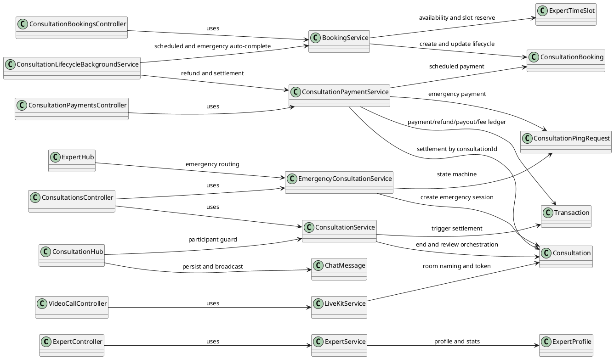
```plantuml
@startuml
left to right direction

class ExpertController
class ConsultationBookingsController
class ConsultationsController
class ConsultationPaymentsController
class VideoCallController

class ExpertService
class BookingService
class EmergencyConsultationService
class ConsultationService
class ConsultationPaymentService
class LiveKitService

class ExpertHub
class ConsultationHub
class ConsultationLifecycleBackgroundService

class Consultation
class ConsultationBooking
class ConsultationPingRequest
class ExpertProfile
class ExpertTimeSlot
class ChatMessage
class Transaction

ExpertController --> ExpertService : uses
ConsultationBookingsController --> BookingService : uses
ConsultationsController --> EmergencyConsultationService : uses
ConsultationsController --> ConsultationService : uses
ConsultationPaymentsController --> ConsultationPaymentService : uses
VideoCallController --> LiveKitService : uses

ExpertHub --> EmergencyConsultationService : emergency routing
ConsultationHub --> ConsultationService : participant guard
ConsultationHub --> ChatMessage : persist and broadcast

BookingService --> ConsultationBooking : create and update lifecycle
BookingService --> ExpertTimeSlot : availability and slot reserve
EmergencyConsultationService --> ConsultationPingRequest : state machine
EmergencyConsultationService --> Consultation : create emergency session
ConsultationService --> Consultation : end and review orchestration
ConsultationService --> Transaction : trigger settlement
ConsultationPaymentService --> ConsultationBooking : scheduled payment
ConsultationPaymentService --> ConsultationPingRequest : emergency payment
ConsultationPaymentService --> Consultation : settlement by consultationId
ConsultationPaymentService --> Transaction : payment/refund/payout/fee ledger
LiveKitService --> Consultation : room naming and token
ConsultationLifecycleBackgroundService --> BookingService : scheduled and emergency auto-complete
ConsultationLifecycleBackgroundService --> ConsultationPaymentService : refund and settlement

ExpertService --> ExpertProfile : profile and stats
@enduml
```

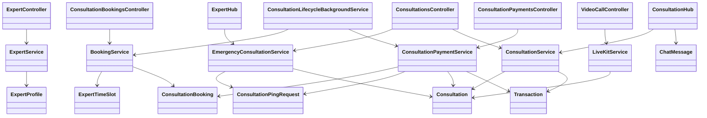
```mermaid
classDiagram

class ExpertController
class ConsultationBookingsController
class ConsultationsController
class ConsultationPaymentsController
class VideoCallController
class ExpertService
class BookingService
class EmergencyConsultationService
class ConsultationService
class ConsultationPaymentService
class LiveKitService
class ExpertHub
class ConsultationHub
class ConsultationLifecycleBackgroundService
class Consultation
class ConsultationBooking
class ConsultationPingRequest
class ExpertProfile
class ExpertTimeSlot
class ChatMessage
class Transaction

ExpertController --> ExpertService
ConsultationBookingsController --> BookingService
ConsultationsController --> EmergencyConsultationService
ConsultationsController --> ConsultationService
ConsultationPaymentsController --> ConsultationPaymentService
VideoCallController --> LiveKitService
ExpertHub --> EmergencyConsultationService
ConsultationHub --> ConsultationService
ConsultationHub --> ChatMessage
BookingService --> ExpertTimeSlot
BookingService --> ConsultationBooking
EmergencyConsultationService --> ConsultationPingRequest
EmergencyConsultationService --> Consultation
ConsultationService --> Consultation
ConsultationService --> Transaction
ConsultationPaymentService --> ConsultationBooking
ConsultationPaymentService --> ConsultationPingRequest
ConsultationPaymentService --> Consultation
ConsultationPaymentService --> Transaction
LiveKitService --> Consultation
ConsultationLifecycleBackgroundService --> BookingService
ConsultationLifecycleBackgroundService --> ConsultationPaymentService
ExpertService --> ExpertProfile
```

***Class Specifications***

| No | Component/Class                                              | Responsibility                                                                          |
| :-: | :----------------------------------------------------------- | :-------------------------------------------------------------------------------------- |
| 01 | ExpertController                                             | Exposes expert directory, profile, reviews, and availability APIs.                      |
| 02 | ConsultationBookingsController                               | Handles scheduled booking creation and booking retrieval for user/expert.               |
| 03 | ConsultationsController                                      | Handles emergency request create/accept/reject, end consultation, and review APIs.      |
| 04 | ConsultationPaymentsController                               | Handles scheduled and emergency consultation payment entry points.                      |
| 05 | VideoCallController                                          | Generates LiveKit token and validates participant authorization.                        |
| 06 | ExpertService                                                | Implements expert listing/profile/slot logic and mapping for client responses.          |
| 07 | BookingService                                               | Creates scheduled booking, validates slot availability, and updates booking lifecycle.  |
| 08 | EmergencyConsultationService                                 | Creates and transitions emergency request state machine.                                |
| 09 | ConsultationService                                          | Handles consultation end, status updates, and review orchestration.                     |
| 10 | ConsultationPaymentService                                   | Handles Wallet/PayOS payment orchestration, escrow, refund, and settlement transitions. |
| 11 | LiveKitService                                               | Creates token and manages room-level integration with LiveKit Cloud.                    |
| 12 | ExpertHub / ConsultationHub                                  | Provides SignalR real-time channels for presence, emergency routing, chat, and signals. |
| 13 | ConsultationLifecycleBackgroundService                       | Handles emergency expiry and consultation auto-complete with periodic sweep.            |
| 14 | Consultation / ConsultationBooking / ConsultationPingRequest | Core domain entities for consultation session, booking, and emergency request.          |
| 15 | ChatMessage / Transaction                                    | Stores room messages and financial transactions for escrow/refund/payout flow.          |

#### ***3.3.2 Sequence Diagram View List Experts and Presence***

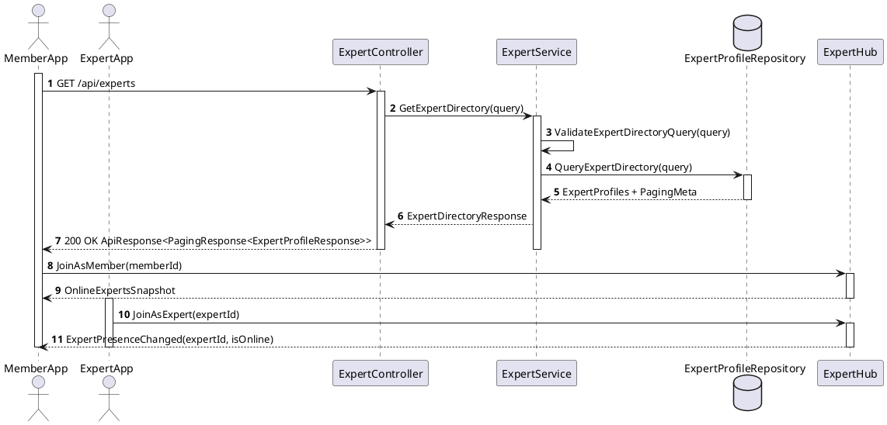
```plantuml
@startuml
autonumber
actor MemberApp
actor ExpertApp
participant ExpertController
participant ExpertService
database ExpertProfileRepository
participant ExpertHub

activate MemberApp
MemberApp -> ExpertController : GET /api/experts
activate ExpertController
ExpertController -> ExpertService : GetExpertDirectory(query)
activate ExpertService

ExpertService -> ExpertService : ValidateExpertDirectoryQuery(query)

ExpertService -> ExpertProfileRepository : QueryExpertDirectory(query)
activate ExpertProfileRepository
ExpertProfileRepository --> ExpertService : ExpertProfiles + PagingMeta
deactivate ExpertProfileRepository

ExpertService --> ExpertController : ExpertDirectoryResponse
ExpertController --> MemberApp : 200 OK ApiResponse<PagingResponse<ExpertProfileResponse>>
deactivate ExpertService
deactivate ExpertController

MemberApp -> ExpertHub : JoinAsMember(memberId)
activate ExpertHub
ExpertHub --> MemberApp : OnlineExpertsSnapshot
deactivate ExpertHub

activate ExpertApp
ExpertApp -> ExpertHub : JoinAsExpert(expertId)
activate ExpertHub
ExpertHub --> MemberApp : ExpertPresenceChanged(expertId, isOnline)
deactivate ExpertHub
deactivate ExpertApp
deactivate MemberApp
@enduml
```

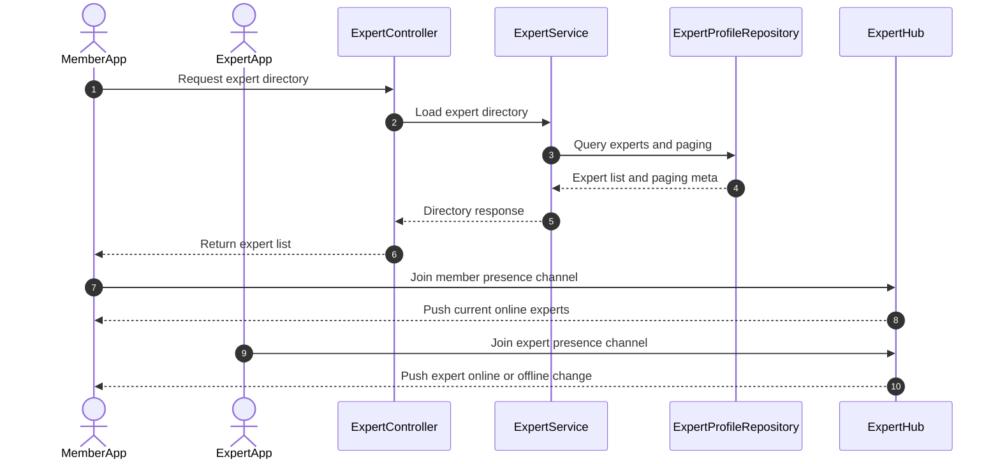
```mermaid
sequenceDiagram
    autonumber
    actor MemberApp
    actor ExpertApp
    participant ExpertController
    participant ExpertService
    participant ExpertProfileRepository
    participant ExpertHub

    MemberApp->>ExpertController: Request expert directory
    ExpertController->>ExpertService: Load expert directory
    ExpertService->>ExpertProfileRepository: Query experts and paging
    ExpertProfileRepository-->>ExpertService: Expert list and paging meta
    ExpertService-->>ExpertController: Directory response
    ExpertController-->>MemberApp: Return expert list

    MemberApp->>ExpertHub: Join member presence channel
    ExpertHub-->>MemberApp: Push current online experts

    ExpertApp->>ExpertHub: Join expert presence channel
    ExpertHub-->>MemberApp: Push expert online or offline change
```

Main flow:

1. Member App calls GET /api/experts.
2. ExpertController delegates query/filter/paging to ExpertService.
3. ExpertService loads experts and availability summary from repository.
4. API returns expert list to Member App.
5. Member App connects ExpertHub and invokes JoinAsMember.
6. Member App receives OnlineExpertsSnapshot and ExpertPresenceChanged events for live status update.

Output: Expert list with real-time online/offline synchronization.

#### ***3.3.3 Sequence Diagram Create Scheduled Booking***

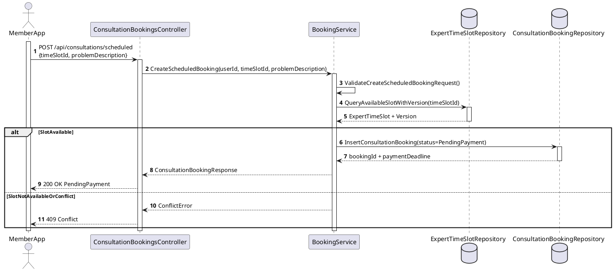
```plantuml
@startuml
autonumber
actor MemberApp
participant ConsultationBookingsController
participant BookingService
database ExpertTimeSlotRepository
database ConsultationBookingRepository

activate MemberApp
MemberApp -> ConsultationBookingsController : POST /api/consultations/scheduled\n{timeSlotId, problemDescription}
activate ConsultationBookingsController
ConsultationBookingsController -> BookingService : CreateScheduledBooking(userId, timeSlotId, problemDescription)
activate BookingService

BookingService -> BookingService : ValidateCreateScheduledBookingRequest()
BookingService -> ExpertTimeSlotRepository : QueryAvailableSlotWithVersion(timeSlotId)
activate ExpertTimeSlotRepository
ExpertTimeSlotRepository --> BookingService : ExpertTimeSlot + Version
deactivate ExpertTimeSlotRepository

alt SlotAvailable
    BookingService -> ConsultationBookingRepository : InsertConsultationBooking(status=PendingPayment)
    activate ConsultationBookingRepository
    ConsultationBookingRepository --> BookingService : bookingId + paymentDeadline
    deactivate ConsultationBookingRepository

    BookingService --> ConsultationBookingsController : ConsultationBookingResponse
    ConsultationBookingsController --> MemberApp : 200 OK PendingPayment
else SlotNotAvailableOrConflict
    BookingService --> ConsultationBookingsController : ConflictError
    ConsultationBookingsController --> MemberApp : 409 Conflict
end

deactivate BookingService
deactivate ConsultationBookingsController
deactivate MemberApp
@enduml
```

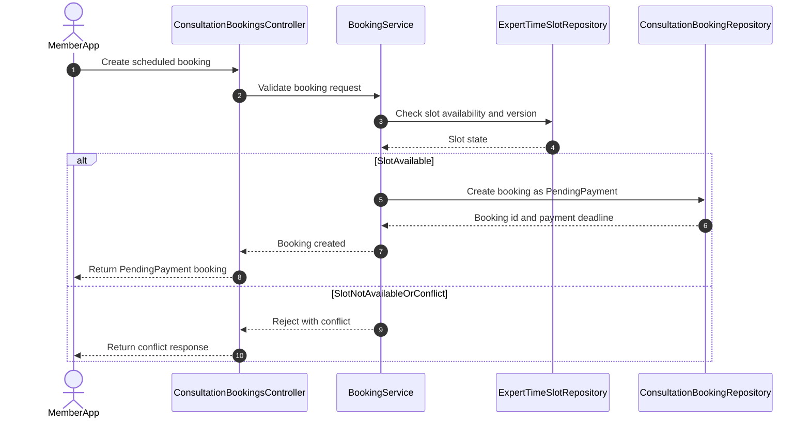
```mermaid
sequenceDiagram
    autonumber
    actor MemberApp
    participant ConsultationBookingsController
    participant BookingService
    participant ExpertTimeSlotRepository
    participant ConsultationBookingRepository

    MemberApp->>ConsultationBookingsController: Create scheduled booking
    ConsultationBookingsController->>BookingService: Validate booking request
    BookingService->>ExpertTimeSlotRepository: Check slot availability and version
    ExpertTimeSlotRepository-->>BookingService: Slot state

    alt SlotAvailable
        BookingService->>ConsultationBookingRepository: Create booking as PendingPayment
        ConsultationBookingRepository-->>BookingService: Booking id and payment deadline
        BookingService-->>ConsultationBookingsController: Booking created
        ConsultationBookingsController-->>MemberApp: Return PendingPayment booking
    else SlotNotAvailableOrConflict
        BookingService-->>ConsultationBookingsController: Reject with conflict
        ConsultationBookingsController-->>MemberApp: Return conflict response
    end
```

Main flow:

1. Member App calls POST /api/consultations/scheduled with timeSlotId and problemDescription.
2. BookingService validates slot availability and concurrency version.
3. BookingService creates ConsultationBooking in PendingPayment state.
4. API returns ConsultationBookingResponse.

Output: Booking is created, waiting for payment.

#### ***3.3.4 Sequence Diagram Pay Scheduled Booking***

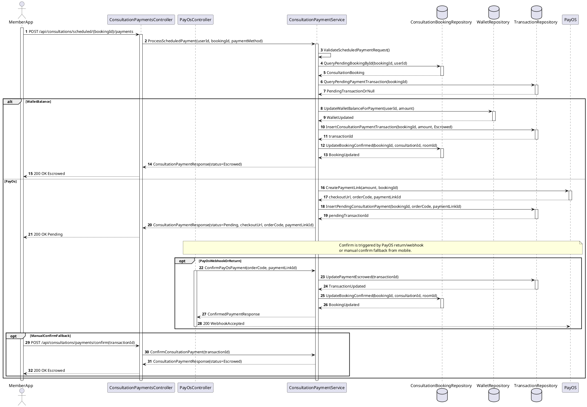
```plantuml
@startuml
autonumber
actor MemberApp
participant ConsultationPaymentsController
participant PayOsController
participant ConsultationPaymentService
database ConsultationBookingRepository
database WalletRepository
database TransactionRepository
participant PayOS

activate MemberApp
MemberApp -> ConsultationPaymentsController : POST /api/consultations/scheduled/{bookingId}/payments
activate ConsultationPaymentsController
ConsultationPaymentsController -> ConsultationPaymentService : ProcessScheduledPayment(userId, bookingId, paymentMethod)
activate ConsultationPaymentService

ConsultationPaymentService -> ConsultationPaymentService : ValidateScheduledPaymentRequest()
ConsultationPaymentService -> ConsultationBookingRepository : QueryPendingBookingById(bookingId, userId)
activate ConsultationBookingRepository
ConsultationBookingRepository --> ConsultationPaymentService : ConsultationBooking
deactivate ConsultationBookingRepository
ConsultationPaymentService -> TransactionRepository : QueryPendingPaymentTransaction(bookingId)
activate TransactionRepository
TransactionRepository --> ConsultationPaymentService : PendingTransactionOrNull
deactivate TransactionRepository

alt WalletBalance
    ConsultationPaymentService -> WalletRepository : UpdateWalletBalanceForPayment(userId, amount)
    activate WalletRepository
    WalletRepository --> ConsultationPaymentService : WalletUpdated
    deactivate WalletRepository
    ConsultationPaymentService -> TransactionRepository : InsertConsultationPaymentTransaction(bookingId, amount, Escrowed)
    activate TransactionRepository
    TransactionRepository --> ConsultationPaymentService : transactionId
    deactivate TransactionRepository
    ConsultationPaymentService -> ConsultationBookingRepository : UpdateBookingConfirmed(bookingId, consultationId, roomId)
    activate ConsultationBookingRepository
    ConsultationBookingRepository --> ConsultationPaymentService : BookingUpdated
    deactivate ConsultationBookingRepository

    ConsultationPaymentService --> ConsultationPaymentsController : ConsultationPaymentResponse(status=Escrowed)
    ConsultationPaymentsController --> MemberApp : 200 OK Escrowed
else PayOs
    ConsultationPaymentService -> PayOS : CreatePaymentLink(amount, bookingId)
    activate PayOS
    PayOS --> ConsultationPaymentService : checkoutUrl, orderCode, paymentLinkId
    deactivate PayOS
    ConsultationPaymentService -> TransactionRepository : InsertPendingConsultationPayment(bookingId, orderCode, paymentLinkId)
    activate TransactionRepository
    TransactionRepository --> ConsultationPaymentService : pendingTransactionId
    deactivate TransactionRepository

    ConsultationPaymentService --> ConsultationPaymentsController : ConsultationPaymentResponse(status=Pending, checkoutUrl, orderCode, paymentLinkId)
    ConsultationPaymentsController --> MemberApp : 200 OK Pending

    note over PayOS, PayOsController
    Confirm is triggered by PayOS return/webhook
    or manual confirm fallback from mobile.
    end note

    opt PayOsWebhookOrReturn
        PayOsController -> ConsultationPaymentService : ConfirmPayOsPayment(orderCode, paymentLinkId)
        activate PayOsController
        ConsultationPaymentService -> TransactionRepository : UpdatePaymentEscrowed(transactionId)
        activate TransactionRepository
        TransactionRepository --> ConsultationPaymentService : TransactionUpdated
        deactivate TransactionRepository
        ConsultationPaymentService -> ConsultationBookingRepository : UpdateBookingConfirmed(bookingId, consultationId, roomId)
        activate ConsultationBookingRepository
        ConsultationBookingRepository --> ConsultationPaymentService : BookingUpdated
        deactivate ConsultationBookingRepository
        ConsultationPaymentService --> PayOsController : ConfirmedPaymentResponse
        PayOsController --> PayOS : 200 WebhookAccepted
        deactivate PayOsController
    end

    opt ManualConfirmFallback
        MemberApp -> ConsultationPaymentsController : POST /api/consultations/payments/confirm(transactionId)
        ConsultationPaymentsController -> ConsultationPaymentService : ConfirmConsultationPayment(transactionId)
        ConsultationPaymentService --> ConsultationPaymentsController : ConsultationPaymentResponse(status=Escrowed)
        ConsultationPaymentsController --> MemberApp : 200 OK Escrowed
    end
end

deactivate ConsultationPaymentService
deactivate ConsultationPaymentsController
deactivate MemberApp
@enduml
```

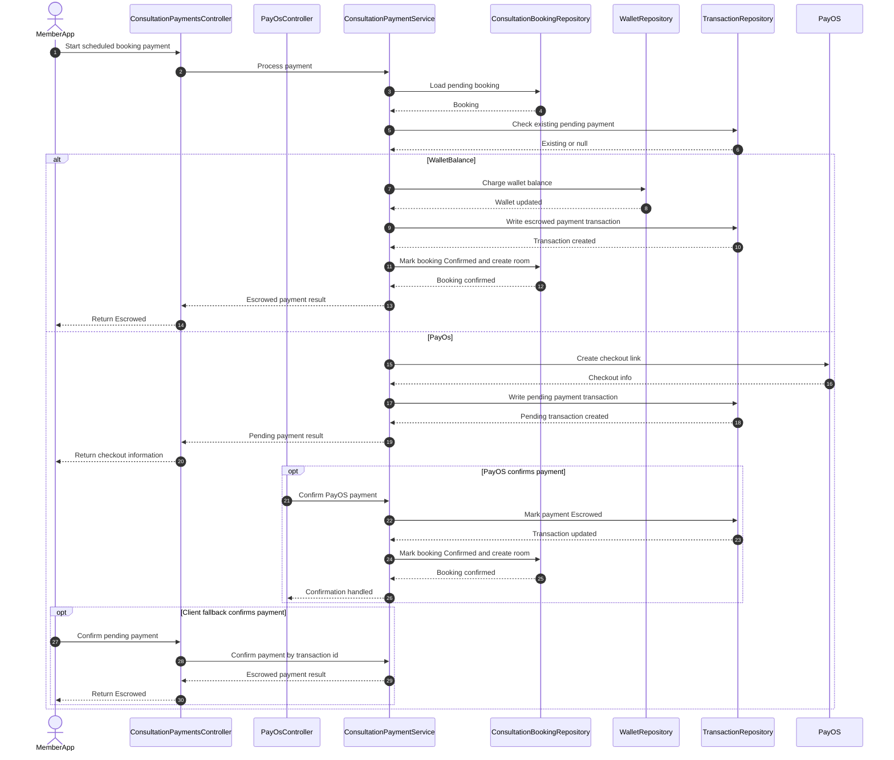
```mermaid
sequenceDiagram
    autonumber
    actor MemberApp
    participant ConsultationPaymentsController
    participant PayOsController
    participant ConsultationPaymentService
    participant ConsultationBookingRepository
    participant WalletRepository
    participant TransactionRepository
    participant PayOS

    MemberApp->>ConsultationPaymentsController: Start scheduled booking payment
    ConsultationPaymentsController->>ConsultationPaymentService: Process payment
    ConsultationPaymentService->>ConsultationBookingRepository: Load pending booking
    ConsultationBookingRepository-->>ConsultationPaymentService: Booking
    ConsultationPaymentService->>TransactionRepository: Check existing pending payment
    TransactionRepository-->>ConsultationPaymentService: Existing or null

    alt WalletBalance
        ConsultationPaymentService->>WalletRepository: Charge wallet balance
        WalletRepository-->>ConsultationPaymentService: Wallet updated
        ConsultationPaymentService->>TransactionRepository: Write escrowed payment transaction
        TransactionRepository-->>ConsultationPaymentService: Transaction created
        ConsultationPaymentService->>ConsultationBookingRepository: Mark booking Confirmed and create room
        ConsultationBookingRepository-->>ConsultationPaymentService: Booking confirmed
        ConsultationPaymentService-->>ConsultationPaymentsController: Escrowed payment result
        ConsultationPaymentsController-->>MemberApp: Return Escrowed
    else PayOs
        ConsultationPaymentService->>PayOS: Create checkout link
        PayOS-->>ConsultationPaymentService: Checkout info
        ConsultationPaymentService->>TransactionRepository: Write pending payment transaction
        TransactionRepository-->>ConsultationPaymentService: Pending transaction created
        ConsultationPaymentService-->>ConsultationPaymentsController: Pending payment result
        ConsultationPaymentsController-->>MemberApp: Return checkout information

        opt PayOS confirms payment
            PayOsController->>ConsultationPaymentService: Confirm PayOS payment
            ConsultationPaymentService->>TransactionRepository: Mark payment Escrowed
            TransactionRepository-->>ConsultationPaymentService: Transaction updated
            ConsultationPaymentService->>ConsultationBookingRepository: Mark booking Confirmed and create room
            ConsultationBookingRepository-->>ConsultationPaymentService: Booking confirmed
            ConsultationPaymentService-->>PayOsController: Confirmation handled
        end

        opt Client fallback confirms payment
            MemberApp->>ConsultationPaymentsController: Confirm pending payment
            ConsultationPaymentsController->>ConsultationPaymentService: Confirm payment by transaction id
            ConsultationPaymentService-->>ConsultationPaymentsController: Escrowed payment result
            ConsultationPaymentsController-->>MemberApp: Return Escrowed
        end
    end
```

Main flow:

1. Member App calls POST /api/consultations/scheduled/{bookingId}/payments.
2. ConsultationPaymentService validates booking ownership and PendingPayment state.
3. Branch A - WalletBalance:
	1. Service charges user wallet and writes ConsultationPayment transaction to the ledger.
	2. Booking moves to Confirmed and consultationId + roomId are generated.
	3. API returns ConsultationPaymentResponse with status Escrowed.
4. Branch B - PayOS:
	1. Service creates a pending payment transaction and returns checkoutUrl/orderCode/paymentLinkId with status Pending.
	2. User completes checkout; backend confirms payment via PayOS return/webhook, or client-triggered fallback POST /api/consultations/payments/confirm.
	3. After confirmed payment, booking moves to Confirmed and consultationId + roomId are generated; payment status becomes Escrowed.

Output: Booking becomes ready for consultation only after payment is Escrowed. WalletBalance is immediate; PayOS requires a confirm step after Pending.

#### ***3.3.5 Sequence Diagram Create Emergency Consultation Request***

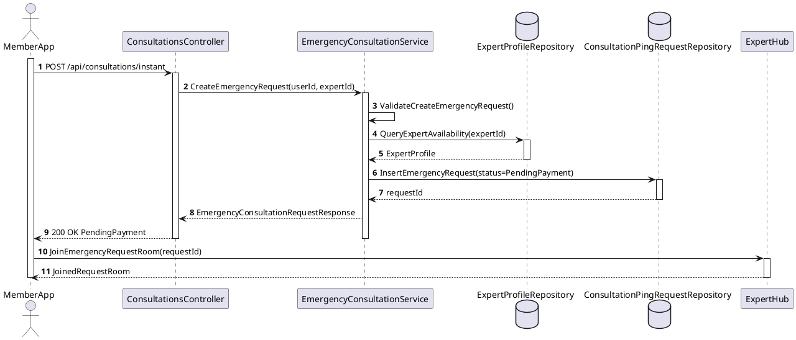
```plantuml
@startuml
autonumber
actor MemberApp
participant ConsultationsController
participant EmergencyConsultationService
database ExpertProfileRepository
database ConsultationPingRequestRepository
participant ExpertHub

activate MemberApp
MemberApp -> ConsultationsController : POST /api/consultations/instant
activate ConsultationsController
ConsultationsController -> EmergencyConsultationService : CreateEmergencyRequest(userId, expertId)
activate EmergencyConsultationService

EmergencyConsultationService -> EmergencyConsultationService : ValidateCreateEmergencyRequest()
EmergencyConsultationService -> ExpertProfileRepository : QueryExpertAvailability(expertId)
activate ExpertProfileRepository
ExpertProfileRepository --> EmergencyConsultationService : ExpertProfile
deactivate ExpertProfileRepository

EmergencyConsultationService -> ConsultationPingRequestRepository : InsertEmergencyRequest(status=PendingPayment)
activate ConsultationPingRequestRepository
ConsultationPingRequestRepository --> EmergencyConsultationService : requestId
deactivate ConsultationPingRequestRepository

EmergencyConsultationService --> ConsultationsController : EmergencyConsultationRequestResponse
ConsultationsController --> MemberApp : 200 OK PendingPayment
deactivate EmergencyConsultationService
deactivate ConsultationsController

MemberApp -> ExpertHub : JoinEmergencyRequestRoom(requestId)
activate ExpertHub
ExpertHub --> MemberApp : JoinedRequestRoom
deactivate ExpertHub

deactivate MemberApp
@enduml
```

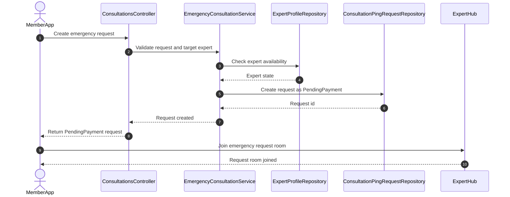
```mermaid
sequenceDiagram
    autonumber
    actor MemberApp
    participant ConsultationsController
    participant EmergencyConsultationService
    participant ExpertProfileRepository
    participant ConsultationPingRequestRepository
    participant ExpertHub

    MemberApp->>ConsultationsController: Create emergency request
    ConsultationsController->>EmergencyConsultationService: Validate request and target expert
    EmergencyConsultationService->>ExpertProfileRepository: Check expert availability
    ExpertProfileRepository-->>EmergencyConsultationService: Expert state
    EmergencyConsultationService->>ConsultationPingRequestRepository: Create request as PendingPayment
    ConsultationPingRequestRepository-->>EmergencyConsultationService: Request id
    EmergencyConsultationService-->>ConsultationsController: Request created
    ConsultationsController-->>MemberApp: Return PendingPayment request
    MemberApp->>ExpertHub: Join emergency request room
    ExpertHub-->>MemberApp: Request room joined
```

Main flow:

1. Member App calls POST /api/consultations/instant with expertId.
2. EmergencyConsultationService validates target expert availability.
3. Service creates emergency request in PendingPayment state.
4. Member joins request room via JoinEmergencyRequestRoom(requestId).

Output: Emergency request is created and requester is subscribed for request status updates.

#### ***3.3.6 Sequence Diagram Pay Emergency Request and Notify Expert***

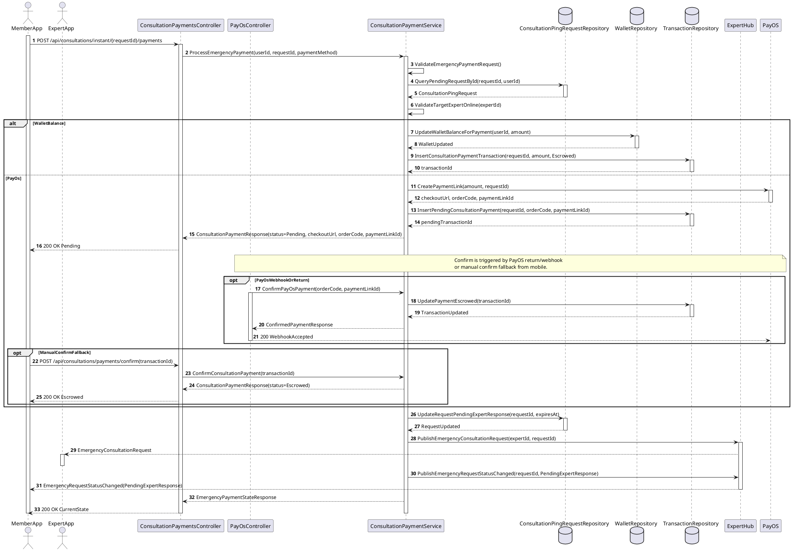
```plantuml
@startuml
autonumber
actor MemberApp
actor ExpertApp
participant ConsultationPaymentsController
participant PayOsController
participant ConsultationPaymentService
database ConsultationPingRequestRepository
database WalletRepository
database TransactionRepository
participant ExpertHub
participant PayOS

activate MemberApp
MemberApp -> ConsultationPaymentsController : POST /api/consultations/instant/{requestId}/payments
activate ConsultationPaymentsController
ConsultationPaymentsController -> ConsultationPaymentService : ProcessEmergencyPayment(userId, requestId, paymentMethod)
activate ConsultationPaymentService

ConsultationPaymentService -> ConsultationPaymentService : ValidateEmergencyPaymentRequest()
ConsultationPaymentService -> ConsultationPingRequestRepository : QueryPendingRequestById(requestId, userId)
activate ConsultationPingRequestRepository
ConsultationPingRequestRepository --> ConsultationPaymentService : ConsultationPingRequest
deactivate ConsultationPingRequestRepository
ConsultationPaymentService -> ConsultationPaymentService : ValidateTargetExpertOnline(expertId)

alt WalletBalance
    ConsultationPaymentService -> WalletRepository : UpdateWalletBalanceForPayment(userId, amount)
    activate WalletRepository
    WalletRepository --> ConsultationPaymentService : WalletUpdated
    deactivate WalletRepository
    ConsultationPaymentService -> TransactionRepository : InsertConsultationPaymentTransaction(requestId, amount, Escrowed)
    activate TransactionRepository
    TransactionRepository --> ConsultationPaymentService : transactionId
    deactivate TransactionRepository
else PayOs
    ConsultationPaymentService -> PayOS : CreatePaymentLink(amount, requestId)
    activate PayOS
    PayOS --> ConsultationPaymentService : checkoutUrl, orderCode, paymentLinkId
    deactivate PayOS
    ConsultationPaymentService -> TransactionRepository : InsertPendingConsultationPayment(requestId, orderCode, paymentLinkId)
    activate TransactionRepository
    TransactionRepository --> ConsultationPaymentService : pendingTransactionId
    deactivate TransactionRepository

    ConsultationPaymentService --> ConsultationPaymentsController : ConsultationPaymentResponse(status=Pending, checkoutUrl, orderCode, paymentLinkId)
    ConsultationPaymentsController --> MemberApp : 200 OK Pending

    note over PayOS, PayOsController
    Confirm is triggered by PayOS return/webhook
    or manual confirm fallback from mobile.
    end note

    opt PayOsWebhookOrReturn
        PayOsController -> ConsultationPaymentService : ConfirmPayOsPayment(orderCode, paymentLinkId)
        activate PayOsController
        ConsultationPaymentService -> TransactionRepository : UpdatePaymentEscrowed(transactionId)
        activate TransactionRepository
        TransactionRepository --> ConsultationPaymentService : TransactionUpdated
        deactivate TransactionRepository
        ConsultationPaymentService --> PayOsController : ConfirmedPaymentResponse
        PayOsController --> PayOS : 200 WebhookAccepted
        deactivate PayOsController
    end

    opt ManualConfirmFallback
        MemberApp -> ConsultationPaymentsController : POST /api/consultations/payments/confirm(transactionId)
        ConsultationPaymentsController -> ConsultationPaymentService : ConfirmConsultationPayment(transactionId)
        ConsultationPaymentService --> ConsultationPaymentsController : ConsultationPaymentResponse(status=Escrowed)
        ConsultationPaymentsController --> MemberApp : 200 OK Escrowed
    end
end

ConsultationPaymentService -> ConsultationPingRequestRepository : UpdateRequestPendingExpertResponse(requestId, expiresAt)
activate ConsultationPingRequestRepository
ConsultationPingRequestRepository --> ConsultationPaymentService : RequestUpdated
deactivate ConsultationPingRequestRepository
ConsultationPaymentService -> ExpertHub : PublishEmergencyConsultationRequest(expertId, requestId)
activate ExpertHub
ExpertHub --> ExpertApp : EmergencyConsultationRequest
activate ExpertApp
deactivate ExpertApp
ConsultationPaymentService -> ExpertHub : PublishEmergencyRequestStatusChanged(requestId, PendingExpertResponse)
ExpertHub --> MemberApp : EmergencyRequestStatusChanged(PendingExpertResponse)
deactivate ExpertHub

ConsultationPaymentService --> ConsultationPaymentsController : EmergencyPaymentStateResponse
ConsultationPaymentsController --> MemberApp : 200 OK CurrentState
deactivate ConsultationPaymentService
deactivate ConsultationPaymentsController
deactivate MemberApp
@enduml
```

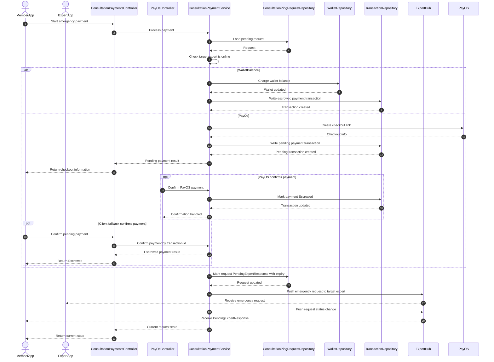
```mermaid
sequenceDiagram
    autonumber
    actor MemberApp
    actor ExpertApp
    participant ConsultationPaymentsController
    participant PayOsController
    participant ConsultationPaymentService
    participant ConsultationPingRequestRepository
    participant WalletRepository
    participant TransactionRepository
    participant ExpertHub
    participant PayOS

    MemberApp->>ConsultationPaymentsController: Start emergency payment
    ConsultationPaymentsController->>ConsultationPaymentService: Process payment
    ConsultationPaymentService->>ConsultationPingRequestRepository: Load pending request
    ConsultationPingRequestRepository-->>ConsultationPaymentService: Request
    ConsultationPaymentService->>ConsultationPaymentService: Check target expert is online

    alt WalletBalance
        ConsultationPaymentService->>WalletRepository: Charge wallet balance
        WalletRepository-->>ConsultationPaymentService: Wallet updated
        ConsultationPaymentService->>TransactionRepository: Write escrowed payment transaction
        TransactionRepository-->>ConsultationPaymentService: Transaction created
    else PayOs
        ConsultationPaymentService->>PayOS: Create checkout link
        PayOS-->>ConsultationPaymentService: Checkout info
        ConsultationPaymentService->>TransactionRepository: Write pending payment transaction
        TransactionRepository-->>ConsultationPaymentService: Pending transaction created
        ConsultationPaymentService-->>ConsultationPaymentsController: Pending payment result
        ConsultationPaymentsController-->>MemberApp: Return checkout information

        opt PayOS confirms payment
            PayOsController->>ConsultationPaymentService: Confirm PayOS payment
            ConsultationPaymentService->>TransactionRepository: Mark payment Escrowed
            TransactionRepository-->>ConsultationPaymentService: Transaction updated
            ConsultationPaymentService-->>PayOsController: Confirmation handled
        end

        opt Client fallback confirms payment
            MemberApp->>ConsultationPaymentsController: Confirm pending payment
            ConsultationPaymentsController->>ConsultationPaymentService: Confirm payment by transaction id
            ConsultationPaymentService-->>ConsultationPaymentsController: Escrowed payment result
            ConsultationPaymentsController-->>MemberApp: Return Escrowed
        end
    end

    ConsultationPaymentService->>ConsultationPingRequestRepository: Mark request PendingExpertResponse with expiry
    ConsultationPingRequestRepository-->>ConsultationPaymentService: Request updated
    ConsultationPaymentService->>ExpertHub: Push emergency request to target expert
    ExpertHub-->>ExpertApp: Receive emergency request
    ConsultationPaymentService->>ExpertHub: Push request status change
    ExpertHub-->>MemberApp: Receive PendingExpertResponse
    ConsultationPaymentService-->>ConsultationPaymentsController: Current request state
    ConsultationPaymentsController-->>MemberApp: Return current state
```

Main flow:

1. Member App calls POST /api/consultations/instant/{requestId}/payments.
2. ConsultationPaymentService validates request ownership, PendingPayment state, and expert availability.
3. Branch A - WalletBalance:
	1. Service charges wallet and writes ConsultationPayment transaction.
	2. Payment result is Escrowed.
4. Branch B - PayOS:
	1. Service creates pending transaction and returns checkoutUrl/orderCode/paymentLinkId with status Pending.
	2. User completes checkout; backend confirms via PayOS return/webhook, or client-triggered fallback POST /api/consultations/payments/confirm.
	3. Payment result becomes Escrowed after confirm.
5. After payment is Escrowed (both branches), request transitions to PendingExpertResponse and ExpiresAt (TTL 2 minutes) is set.
6. EmergencyConsultationService pushes EmergencyConsultationRequest to targeted expert via ExpertHub.
7. Member receives EmergencyRequestStatusChanged event.

Output: Request enters expert decision queue only after payment reaches Escrowed.

#### ***3.3.7 Sequence Diagram Expert Accept or Reject Emergency Request***

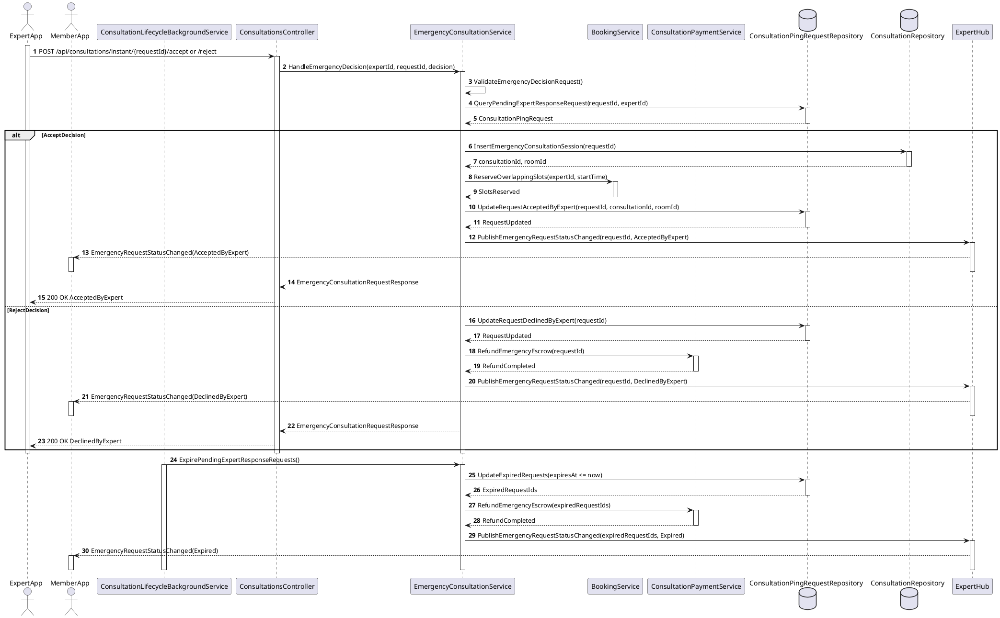
```plantuml
@startuml
autonumber
actor ExpertApp
actor MemberApp
participant ConsultationLifecycleBackgroundService
participant ConsultationsController
participant EmergencyConsultationService
participant BookingService
participant ConsultationPaymentService
database ConsultationPingRequestRepository
database ConsultationRepository
participant ExpertHub

activate ExpertApp
ExpertApp -> ConsultationsController : POST /api/consultations/instant/{requestId}/accept or /reject
activate ConsultationsController
ConsultationsController -> EmergencyConsultationService : HandleEmergencyDecision(expertId, requestId, decision)
activate EmergencyConsultationService

EmergencyConsultationService -> EmergencyConsultationService : ValidateEmergencyDecisionRequest()
EmergencyConsultationService -> ConsultationPingRequestRepository : QueryPendingExpertResponseRequest(requestId, expertId)
activate ConsultationPingRequestRepository
ConsultationPingRequestRepository --> EmergencyConsultationService : ConsultationPingRequest
deactivate ConsultationPingRequestRepository

alt AcceptDecision
    EmergencyConsultationService -> ConsultationRepository : InsertEmergencyConsultationSession(requestId)
    activate ConsultationRepository
    ConsultationRepository --> EmergencyConsultationService : consultationId, roomId
    deactivate ConsultationRepository
    EmergencyConsultationService -> BookingService : ReserveOverlappingSlots(expertId, startTime)
    activate BookingService
    BookingService --> EmergencyConsultationService : SlotsReserved
    deactivate BookingService
    EmergencyConsultationService -> ConsultationPingRequestRepository : UpdateRequestAcceptedByExpert(requestId, consultationId, roomId)
    activate ConsultationPingRequestRepository
    ConsultationPingRequestRepository --> EmergencyConsultationService : RequestUpdated
    deactivate ConsultationPingRequestRepository
    EmergencyConsultationService -> ExpertHub : PublishEmergencyRequestStatusChanged(requestId, AcceptedByExpert)
    activate ExpertHub
    ExpertHub --> MemberApp : EmergencyRequestStatusChanged(AcceptedByExpert)
    activate MemberApp
    deactivate MemberApp
    deactivate ExpertHub

    EmergencyConsultationService --> ConsultationsController : EmergencyConsultationRequestResponse
    ConsultationsController --> ExpertApp : 200 OK AcceptedByExpert
else RejectDecision
    EmergencyConsultationService -> ConsultationPingRequestRepository : UpdateRequestDeclinedByExpert(requestId)
    activate ConsultationPingRequestRepository
    ConsultationPingRequestRepository --> EmergencyConsultationService : RequestUpdated
    deactivate ConsultationPingRequestRepository
    EmergencyConsultationService -> ConsultationPaymentService : RefundEmergencyEscrow(requestId)
    activate ConsultationPaymentService
    ConsultationPaymentService --> EmergencyConsultationService : RefundCompleted
    deactivate ConsultationPaymentService
    EmergencyConsultationService -> ExpertHub : PublishEmergencyRequestStatusChanged(requestId, DeclinedByExpert)
    activate ExpertHub
    ExpertHub --> MemberApp : EmergencyRequestStatusChanged(DeclinedByExpert)
    activate MemberApp
    deactivate MemberApp
    deactivate ExpertHub

    EmergencyConsultationService --> ConsultationsController : EmergencyConsultationRequestResponse
    ConsultationsController --> ExpertApp : 200 OK DeclinedByExpert
end

deactivate ExpertApp
deactivate EmergencyConsultationService
deactivate ConsultationsController

ConsultationLifecycleBackgroundService -> EmergencyConsultationService : ExpirePendingExpertResponseRequests()
activate ConsultationLifecycleBackgroundService
activate EmergencyConsultationService
EmergencyConsultationService -> ConsultationPingRequestRepository : UpdateExpiredRequests(expiresAt <= now)
activate ConsultationPingRequestRepository
ConsultationPingRequestRepository --> EmergencyConsultationService : ExpiredRequestIds
deactivate ConsultationPingRequestRepository
EmergencyConsultationService -> ConsultationPaymentService : RefundEmergencyEscrow(expiredRequestIds)
activate ConsultationPaymentService
ConsultationPaymentService --> EmergencyConsultationService : RefundCompleted
deactivate ConsultationPaymentService
EmergencyConsultationService -> ExpertHub : PublishEmergencyRequestStatusChanged(expiredRequestIds, Expired)
activate ExpertHub
ExpertHub --> MemberApp : EmergencyRequestStatusChanged(Expired)
activate MemberApp
deactivate MemberApp
deactivate ExpertHub
deactivate EmergencyConsultationService
deactivate ConsultationLifecycleBackgroundService
@enduml
```

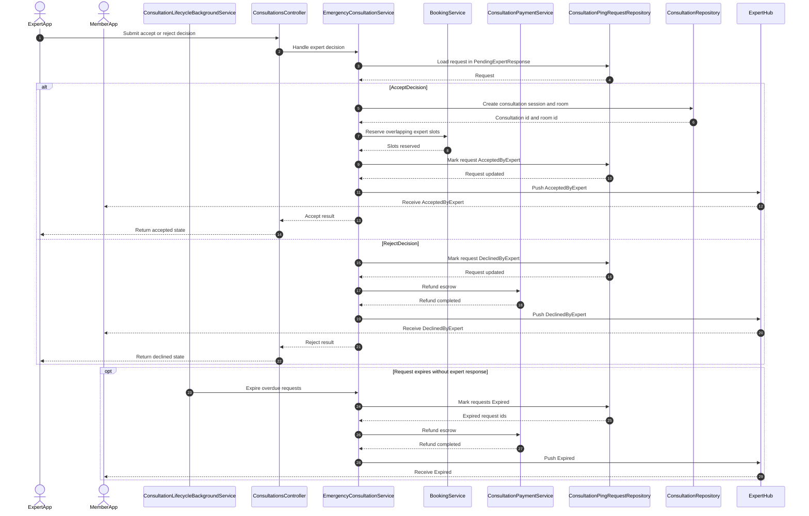
```mermaid
sequenceDiagram
    autonumber
    actor ExpertApp
    actor MemberApp
    participant ConsultationLifecycleBackgroundService
    participant ConsultationsController
    participant EmergencyConsultationService
    participant BookingService
    participant ConsultationPaymentService
    participant ConsultationPingRequestRepository
    participant ConsultationRepository
    participant ExpertHub

    ExpertApp->>ConsultationsController: Submit accept or reject decision
    ConsultationsController->>EmergencyConsultationService: Handle expert decision
    EmergencyConsultationService->>ConsultationPingRequestRepository: Load request in PendingExpertResponse
    ConsultationPingRequestRepository-->>EmergencyConsultationService: Request

    alt AcceptDecision
        EmergencyConsultationService->>ConsultationRepository: Create consultation session and room
        ConsultationRepository-->>EmergencyConsultationService: Consultation id and room id
        EmergencyConsultationService->>BookingService: Reserve overlapping expert slots
        BookingService-->>EmergencyConsultationService: Slots reserved
        EmergencyConsultationService->>ConsultationPingRequestRepository: Mark request AcceptedByExpert
        ConsultationPingRequestRepository-->>EmergencyConsultationService: Request updated
        EmergencyConsultationService->>ExpertHub: Push AcceptedByExpert
        ExpertHub-->>MemberApp: Receive AcceptedByExpert
        EmergencyConsultationService-->>ConsultationsController: Accept result
        ConsultationsController-->>ExpertApp: Return accepted state
    else RejectDecision
        EmergencyConsultationService->>ConsultationPingRequestRepository: Mark request DeclinedByExpert
        ConsultationPingRequestRepository-->>EmergencyConsultationService: Request updated
        EmergencyConsultationService->>ConsultationPaymentService: Refund escrow
        ConsultationPaymentService-->>EmergencyConsultationService: Refund completed
        EmergencyConsultationService->>ExpertHub: Push DeclinedByExpert
        ExpertHub-->>MemberApp: Receive DeclinedByExpert
        EmergencyConsultationService-->>ConsultationsController: Reject result
        ConsultationsController-->>ExpertApp: Return declined state
    end

    opt Request expires without expert response
        ConsultationLifecycleBackgroundService->>EmergencyConsultationService: Expire overdue requests
        EmergencyConsultationService->>ConsultationPingRequestRepository: Mark requests Expired
        ConsultationPingRequestRepository-->>EmergencyConsultationService: Expired request ids
        EmergencyConsultationService->>ConsultationPaymentService: Refund escrow
        ConsultationPaymentService-->>EmergencyConsultationService: Refund completed
        EmergencyConsultationService->>ExpertHub: Push Expired
        ExpertHub-->>MemberApp: Receive Expired
    end
```

Main flow:

1. Expert receives EmergencyConsultationRequest event.
2. Expert App calls accept or reject endpoint.
3. EmergencyConsultationService validates targeted expert and request state.

Alternative A - Accept:

1. Create consultation session and room metadata.
2. Reserve overlapping slots (Slot Paradox guard).
3. Update request status to AcceptedByExpert.

Alternative B - Reject:

1. Update request status to DeclinedByExpert.
2. Trigger escrow refund to member wallet.

Alternative C - Timeout (No Expert Response):

1. ConsultationLifecycleBackgroundService detects ExpiresAt elapsed while request is still PendingExpertResponse.
2. Update request status to Expired.
3. Trigger escrow refund to member wallet.

Common completion (expert decision):

1. Push EmergencyRequestStatusChanged to member room.
2. Return EmergencyConsultationRequestResponse to expert client.

Timeout completion:

1. Push EmergencyRequestStatusChanged to member room with status Expired.

Output: Request reaches terminal state (AcceptedByExpert, DeclinedByExpert, or Expired), and member is informed in real time.

#### ***3.3.8 Sequence Diagram Generate Video Token and Join Room***

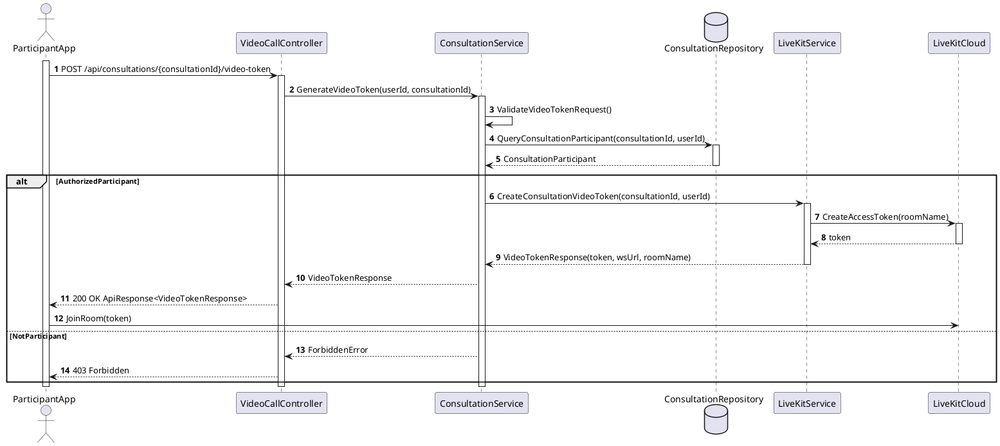
```plantuml
@startuml
autonumber
actor ParticipantApp
participant VideoCallController
participant ConsultationService
database ConsultationRepository
participant LiveKitService
participant LiveKitCloud

activate ParticipantApp
ParticipantApp -> VideoCallController : POST /api/consultations/{consultationId}/video-token
activate VideoCallController
VideoCallController -> ConsultationService : GenerateVideoToken(userId, consultationId)
activate ConsultationService

ConsultationService -> ConsultationService : ValidateVideoTokenRequest()
ConsultationService -> ConsultationRepository : QueryConsultationParticipant(consultationId, userId)
activate ConsultationRepository
ConsultationRepository --> ConsultationService : ConsultationParticipant
deactivate ConsultationRepository

alt AuthorizedParticipant
    ConsultationService -> LiveKitService : CreateConsultationVideoToken(consultationId, userId)
    activate LiveKitService
    LiveKitService -> LiveKitCloud : CreateAccessToken(roomName)
    activate LiveKitCloud
    LiveKitCloud --> LiveKitService : token
    deactivate LiveKitCloud
    LiveKitService --> ConsultationService : VideoTokenResponse(token, wsUrl, roomName)
    deactivate LiveKitService

    ConsultationService --> VideoCallController : VideoTokenResponse
    VideoCallController --> ParticipantApp : 200 OK ApiResponse<VideoTokenResponse>
    ParticipantApp -> LiveKitCloud : JoinRoom(token)
else NotParticipant
    ConsultationService --> VideoCallController : ForbiddenError
    VideoCallController --> ParticipantApp : 403 Forbidden
end

deactivate ConsultationService
deactivate VideoCallController
deactivate ParticipantApp
@enduml
```

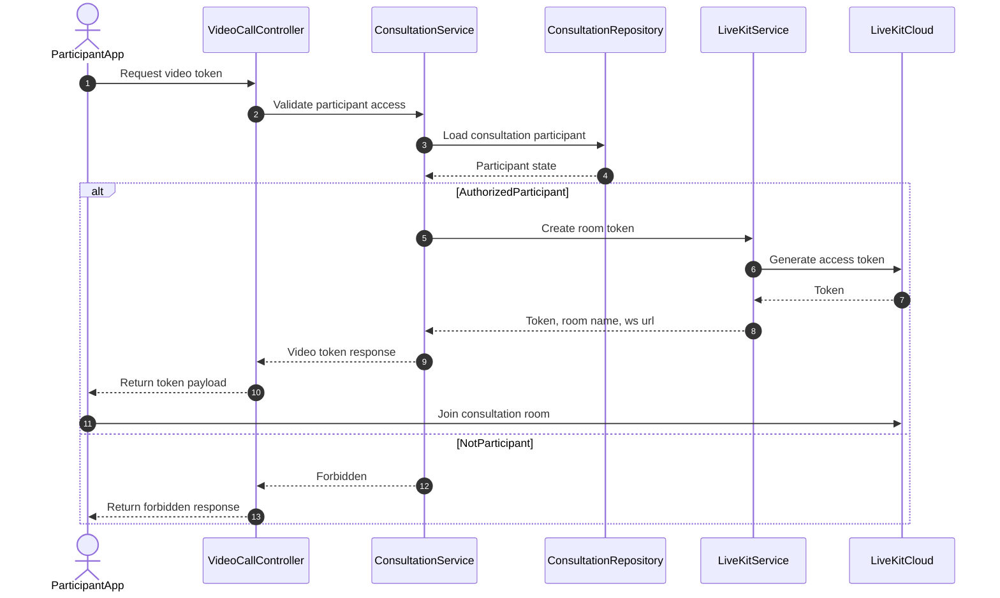
```mermaid
sequenceDiagram
    autonumber
    actor ParticipantApp
    participant VideoCallController
    participant ConsultationService
    participant ConsultationRepository
    participant LiveKitService
    participant LiveKitCloud

    ParticipantApp->>VideoCallController: Request video token
    VideoCallController->>ConsultationService: Validate participant access
    ConsultationService->>ConsultationRepository: Load consultation participant
    ConsultationRepository-->>ConsultationService: Participant state

    alt AuthorizedParticipant
        ConsultationService->>LiveKitService: Create room token
        LiveKitService->>LiveKitCloud: Generate access token
        LiveKitCloud-->>LiveKitService: Token
        LiveKitService-->>ConsultationService: Token, room name, ws url
        ConsultationService-->>VideoCallController: Video token response
        VideoCallController-->>ParticipantApp: Return token payload
        ParticipantApp->>LiveKitCloud: Join consultation room
    else NotParticipant
        ConsultationService-->>VideoCallController: Forbidden
        VideoCallController-->>ParticipantApp: Return forbidden response
    end
```

Main flow:

1. Participant calls POST /api/consultations/{consultationId}/video-token.
2. Controller verifies caller is consultation participant.
3. LiveKitService generates token for room consultation-{consultationId}.
4. API returns token, wsUrl, and roomName.
5. Client joins LiveKit room.

Output: Authenticated participant can enter consultation video room.

#### ***3.3.9 Sequence Diagram In-Room Chat with Attachment***

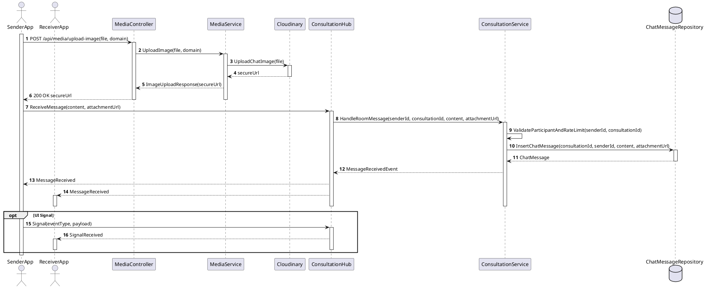
```plantuml
@startuml
autonumber
actor SenderApp
actor ReceiverApp
participant MediaController
participant MediaService
participant Cloudinary
participant ConsultationHub
participant ConsultationService
database ChatMessageRepository

activate SenderApp

    SenderApp -> MediaController : POST /api/media/upload-image(file, domain)
    activate MediaController
    MediaController -> MediaService : UploadImage(file, domain)
    activate MediaService
    MediaService -> Cloudinary : UploadChatImage(file)
    activate Cloudinary
    Cloudinary --> MediaService : secureUrl
    deactivate Cloudinary
    MediaService --> MediaController : ImageUploadResponse(secureUrl)
    MediaController --> SenderApp : 200 OK secureUrl
    deactivate MediaService
    deactivate MediaController

SenderApp -> ConsultationHub : ReceiveMessage(content, attachmentUrl)
activate ConsultationHub
ConsultationHub -> ConsultationService : HandleRoomMessage(senderId, consultationId, content, attachmentUrl)
activate ConsultationService

ConsultationService -> ConsultationService : ValidateParticipantAndRateLimit(senderId, consultationId)

ConsultationService -> ChatMessageRepository : InsertChatMessage(consultationId, senderId, content, attachmentUrl)
activate ChatMessageRepository
ChatMessageRepository --> ConsultationService : ChatMessage
deactivate ChatMessageRepository
ConsultationService --> ConsultationHub : MessageReceivedEvent

ConsultationHub --> SenderApp : MessageReceived
ConsultationHub --> ReceiverApp : MessageReceived
activate ReceiverApp
deactivate ReceiverApp
deactivate ConsultationService
deactivate ConsultationHub

opt UI Signal
    SenderApp -> ConsultationHub : Signal(eventType, payload)
    activate ConsultationHub
    ConsultationHub --> ReceiverApp : SignalReceived
    activate ReceiverApp
    deactivate ReceiverApp
    deactivate ConsultationHub
end

deactivate SenderApp
@enduml
```

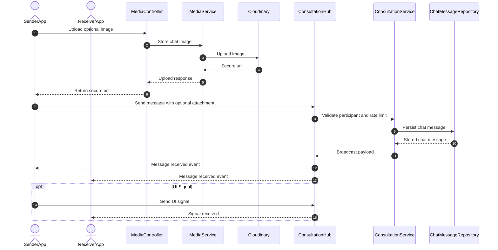
```mermaid
sequenceDiagram
    autonumber
    actor SenderApp
    actor ReceiverApp
    participant MediaController
    participant MediaService
    participant Cloudinary
    participant ConsultationHub
    participant ConsultationService
    participant ChatMessageRepository

    SenderApp->>MediaController: Upload optional image
    MediaController->>MediaService: Store chat image
    MediaService->>Cloudinary: Upload image
    Cloudinary-->>MediaService: Secure url
    MediaService-->>MediaController: Upload response
    MediaController-->>SenderApp: Return secure url

    SenderApp->>ConsultationHub: Send message with optional attachment
    ConsultationHub->>ConsultationService: Validate participant and rate limit
    ConsultationService->>ChatMessageRepository: Persist chat message
    ChatMessageRepository-->>ConsultationService: Stored chat message
    ConsultationService-->>ConsultationHub: Broadcast payload
    ConsultationHub-->>SenderApp: Message received event
    ConsultationHub-->>ReceiverApp: Message received event

    opt UI Signal
        SenderApp->>ConsultationHub: Send UI signal
        ConsultationHub-->>ReceiverApp: Signal received
    end
```

Main flow:

1. Sender uploads image via media API (optional) and receives secureUrl.
2. Sender invokes ConsultationHub.ReceiveMessage(content, attachmentUrl).
3. Hub validates participant and applies message rate limit.
4. Hub persists ChatMessage.
5. Hub broadcasts MessageReceived to both participants.
6. Client can also send UI signal through ConsultationHub.Signal.

Output: Real-time text/media communication is delivered and stored for consultation context.

#### ***3.3.10 Sequence Diagram End Consultation and Settlement (Narrative)***

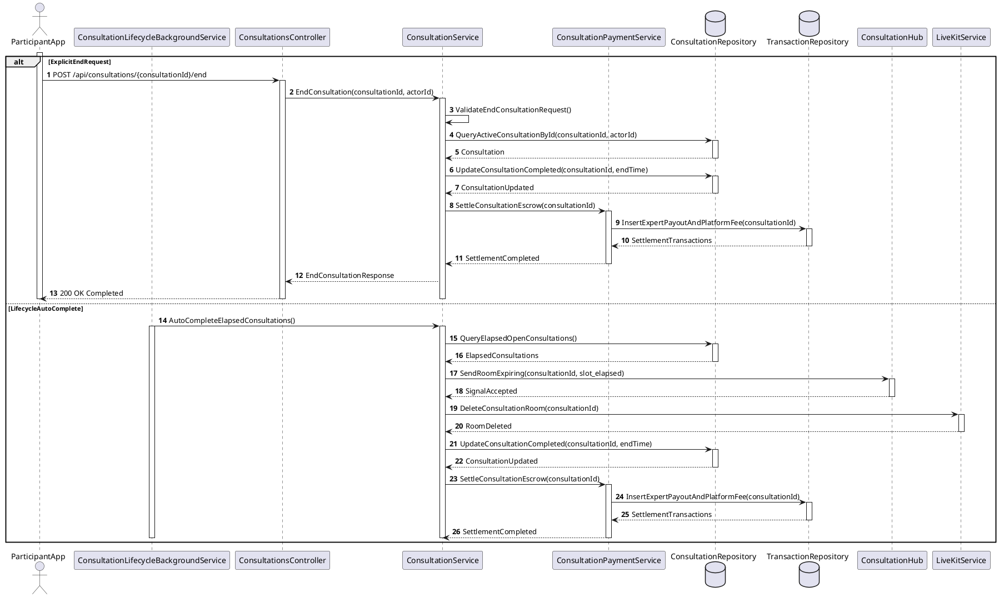
```plantuml
@startuml
autonumber
actor ParticipantApp
participant ConsultationLifecycleBackgroundService
participant ConsultationsController
participant ConsultationService
participant ConsultationPaymentService
database ConsultationRepository
database TransactionRepository
participant ConsultationHub
participant LiveKitService

alt ExplicitEndRequest
    activate ParticipantApp
    ParticipantApp -> ConsultationsController : POST /api/consultations/{consultationId}/end
    activate ConsultationsController
    ConsultationsController -> ConsultationService : EndConsultation(consultationId, actorId)
    activate ConsultationService

    ConsultationService -> ConsultationService : ValidateEndConsultationRequest()
    ConsultationService -> ConsultationRepository : QueryActiveConsultationById(consultationId, actorId)
    activate ConsultationRepository
    ConsultationRepository --> ConsultationService : Consultation
    deactivate ConsultationRepository

    ConsultationService -> ConsultationRepository : UpdateConsultationCompleted(consultationId, endTime)
    activate ConsultationRepository
    ConsultationRepository --> ConsultationService : ConsultationUpdated
    deactivate ConsultationRepository
    ConsultationService -> ConsultationPaymentService : SettleConsultationEscrow(consultationId)
    activate ConsultationPaymentService
    ConsultationPaymentService -> TransactionRepository : InsertExpertPayoutAndPlatformFee(consultationId)
    activate TransactionRepository
    TransactionRepository --> ConsultationPaymentService : SettlementTransactions
    deactivate TransactionRepository
    ConsultationPaymentService --> ConsultationService : SettlementCompleted
    deactivate ConsultationPaymentService

    ConsultationService --> ConsultationsController : EndConsultationResponse
    ConsultationsController --> ParticipantApp : 200 OK Completed
    deactivate ParticipantApp
    deactivate ConsultationService
    deactivate ConsultationsController
else LifecycleAutoComplete
    ConsultationLifecycleBackgroundService -> ConsultationService : AutoCompleteElapsedConsultations()
    activate ConsultationLifecycleBackgroundService
    activate ConsultationService

    ConsultationService -> ConsultationRepository : QueryElapsedOpenConsultations()
    activate ConsultationRepository
    ConsultationRepository --> ConsultationService : ElapsedConsultations
    deactivate ConsultationRepository

    ConsultationService -> ConsultationHub : SendRoomExpiring(consultationId, slot_elapsed)
    activate ConsultationHub
    ConsultationHub --> ConsultationService : SignalAccepted
    deactivate ConsultationHub
    ConsultationService -> LiveKitService : DeleteConsultationRoom(consultationId)
    activate LiveKitService
    LiveKitService --> ConsultationService : RoomDeleted
    deactivate LiveKitService
    ConsultationService -> ConsultationRepository : UpdateConsultationCompleted(consultationId, endTime)
    activate ConsultationRepository
    ConsultationRepository --> ConsultationService : ConsultationUpdated
    deactivate ConsultationRepository
    ConsultationService -> ConsultationPaymentService : SettleConsultationEscrow(consultationId)
    activate ConsultationPaymentService
    ConsultationPaymentService -> TransactionRepository : InsertExpertPayoutAndPlatformFee(consultationId)
    activate TransactionRepository
    TransactionRepository --> ConsultationPaymentService : SettlementTransactions
    deactivate TransactionRepository
    ConsultationPaymentService --> ConsultationService : SettlementCompleted
    deactivate ConsultationPaymentService

    deactivate ConsultationService
    deactivate ConsultationLifecycleBackgroundService
end
@enduml
```

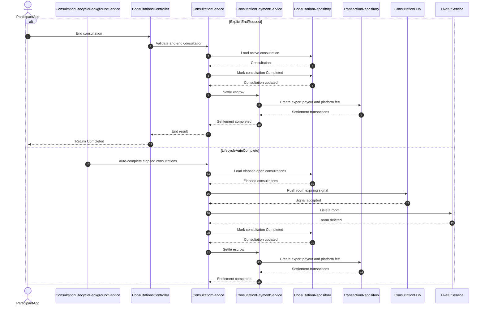
```mermaid
sequenceDiagram
    autonumber
    actor ParticipantApp
    participant ConsultationLifecycleBackgroundService
    participant ConsultationsController
    participant ConsultationService
    participant ConsultationPaymentService
    participant ConsultationRepository
    participant TransactionRepository
    participant ConsultationHub
    participant LiveKitService

    alt ExplicitEndRequest
        ParticipantApp->>ConsultationsController: End consultation
        ConsultationsController->>ConsultationService: Validate and end consultation
        ConsultationService->>ConsultationRepository: Load active consultation
        ConsultationRepository-->>ConsultationService: Consultation
        ConsultationService->>ConsultationRepository: Mark consultation Completed
        ConsultationRepository-->>ConsultationService: Consultation updated
        ConsultationService->>ConsultationPaymentService: Settle escrow
        ConsultationPaymentService->>TransactionRepository: Create expert payout and platform fee
        TransactionRepository-->>ConsultationPaymentService: Settlement transactions
        ConsultationPaymentService-->>ConsultationService: Settlement completed
        ConsultationService-->>ConsultationsController: End result
        ConsultationsController-->>ParticipantApp: Return Completed
    else LifecycleAutoComplete
        ConsultationLifecycleBackgroundService->>ConsultationService: Auto-complete elapsed consultations
        ConsultationService->>ConsultationRepository: Load elapsed open consultations
        ConsultationRepository-->>ConsultationService: Elapsed consultations
        ConsultationService->>ConsultationHub: Push room expiring signal
        ConsultationHub-->>ConsultationService: Signal accepted
        ConsultationService->>LiveKitService: Delete room
        LiveKitService-->>ConsultationService: Room deleted
        ConsultationService->>ConsultationRepository: Mark consultation Completed
        ConsultationRepository-->>ConsultationService: Consultation updated
        ConsultationService->>ConsultationPaymentService: Settle escrow
        ConsultationPaymentService->>TransactionRepository: Create expert payout and platform fee
        TransactionRepository-->>ConsultationPaymentService: Settlement transactions
        ConsultationPaymentService-->>ConsultationService: Settlement completed
    end
```

Main flow:

1. Participant calls POST /api/consultations/{consultationId}/end.
2. ConsultationService validates participant and active consultation state.
3. Consultation status is updated to Completed.
4. ConsultationPaymentService performs settlement from escrow to ExpertPayout and PlatformFee.

Lifecycle fallback:

1. ConsultationLifecycleBackgroundService periodically checks elapsed consultations.
2. If consultation is elapsed and still open (Scheduled: slot end reached; Emergency: StartTime + 30 minutes reached), service sends RoomExpiring signal via ConsultationHub.
3. Service deletes LiveKit room consultation-{consultationId} to disconnect participants.
4. Service updates consultation status to Completed and sets EndTime (Scheduled uses slot end; Emergency uses current UTC time).
5. ConsultationPaymentService performs settlement from escrow to ExpertPayout and PlatformFee.

Output: Consultation is closed consistently and money flow is finalized.

#### ***3.3.11 Sequence Diagram Create Consultation Review (Narrative)***

```plantuml
@startuml
autonumber
actor MemberApp
participant ConsultationsController
participant ConsultationService
database UserFeedbackRepository
database ExpertProfileRepository

activate MemberApp
MemberApp -> ConsultationsController : POST /api/consultations/{consultationId}/reviews
activate ConsultationsController
ConsultationsController -> ConsultationService : CreateReview(userId, consultationId, payload)
activate ConsultationService

ConsultationService -> ConsultationService : ValidateReviewRequest()

alt ValidReviewRequest
    ConsultationService -> UserFeedbackRepository : InsertUserFeedback(type=Consultation)
    activate UserFeedbackRepository
    UserFeedbackRepository --> ConsultationService : UserFeedback
    deactivate UserFeedbackRepository
    ConsultationService -> ExpertProfileRepository : RecalculateAverageRating(expertId)
    activate ExpertProfileRepository
    ExpertProfileRepository --> ConsultationService : updatedRatingStats
    deactivate ExpertProfileRepository

    ConsultationService --> ConsultationsController : UserFeedbackResponse + updatedRatingStats
    ConsultationsController --> MemberApp : 200 Created
else NotCompletedOrNotOwned
    ConsultationService --> ConsultationsController : ReviewValidationError
    ConsultationsController --> MemberApp : 403 Forbidden
end

deactivate ConsultationService
deactivate ConsultationsController
deactivate MemberApp
@enduml
```

```mermaid
sequenceDiagram
    autonumber
    actor MemberApp
    participant ConsultationsController
    participant ConsultationService
    participant UserFeedbackRepository
    participant ExpertProfileRepository

    MemberApp->>ConsultationsController: Create consultation review
    ConsultationsController->>ConsultationService: Validate review request

    alt ValidReviewRequest
        ConsultationService->>UserFeedbackRepository: Create feedback record
        UserFeedbackRepository-->>ConsultationService: Feedback saved
        ConsultationService->>ExpertProfileRepository: Recalculate expert rating
        ExpertProfileRepository-->>ConsultationService: Updated rating stats
        ConsultationService-->>ConsultationsController: Review result
        ConsultationsController-->>MemberApp: Return created response
    else NotCompletedOrNotOwned
        ConsultationService-->>ConsultationsController: Reject review
        ConsultationsController-->>MemberApp: Return forbidden response
    end
```

Main flow:

1. User calls POST /api/consultations/{consultationId}/reviews.
2. ConsultationService validates completed consultation and ownership.
3. UserFeedback record is created.
4. Expert aggregate rating (average/count) is recalculated.

Output: Post-consultation feedback is persisted and reflected in expert profile statistics.
