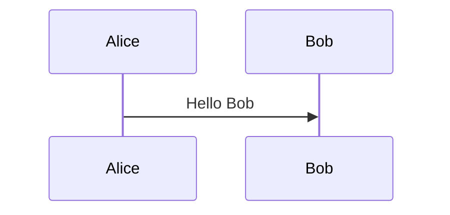

# SnakeAid Docs

Documentation for the SnakeAid project, powered by Docsify. Use the sidebar to browse the existing markdown files for introductions, requirements, architecture, and UI designs.

## Preview locally

Run Docsify from the repository root:

```bash
npx docsify-cli@latest serve Docs
```

Then open the served URL (defaults to `http://localhost:3000`) in your browser.

If you prefer a reusable install, run `npm install -g docsify-cli` once, then use `docsify serve Docs`.

## What’s enabled

- Theme: `docsify-themeable` (simple theme)
- Navigation: sidebar, pagination
- Search: built-in docsify search
- Code UX: copy-code buttons
- Diagrams: PlantUML (via Kroki) and Mermaid

## PlantUML diagrams

PlantUML code blocks render automatically. Use triple backticks with the `plantuml` language hint:


## Mermaid diagrams

Use `mermaid` code fences:



## Key sections

- [Introduction](00-Introduction/Introduction.md)
- [Requirements](01-Requirements/Main-Flow/Main-Flow.md)
- [Architecture Design](02-Architecture-Design/Context-Diagram.md)
- [UI Design](02-UI-Design/UI-Design-Overview.md)
